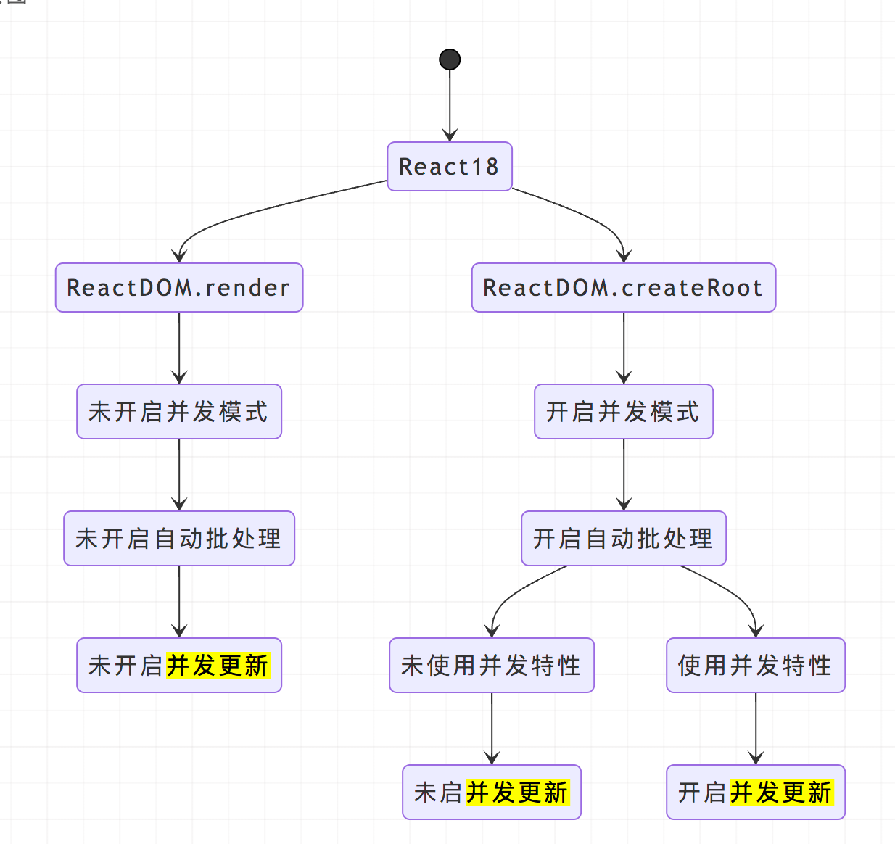

## 常用的React Hooks

Hooks 是 React 16.8 新增的特性，它可以让你在不编写 class 的情况下使用 state 以及其他的 React 特性。

如果在编写函数组建并且需要添加一些state，以前的做法是将其转成类组件，现在可以直接在函数组件使用Hooks。

### 类组件的不足

- **状态逻辑难复用**。在组件之间复用状态逻辑很难，可能要用到 **render props** （**渲染属性**）或者 **HOC**（**高阶组件**），但无论是渲染属性，还是高阶组件，都会在原先的组件外包裹一层父容器（一般都是 div 元素），**导致层级冗余**
- **趋向复杂难以维护**
  - 在生命周期函数中混杂不相干的逻辑（如：在 `componentDidMount` 中注册事件以及其他的逻辑，在 `componentWillUnmount` 中卸载事件，这样分散不集中的写法，很容易写出 bug ）
  - 类组件中到处都是对状态的访问和处理，导致组件难以拆分成更小的组件
- **this 指向问题**
  - 父组件给子组件传递函数时，必须绑定 this。
  - this绑定没处理好，很容易影响性能。

### Hooks优势

- 能优化类组件的三大问题
- 能在无需修改组件结构的情况下复用状态逻辑（自定义 Hooks ）
- 能将组件中相互关联的部分拆分成更小的函数（比如设置订阅或请求数据）
- **副作用的关注点分离**：**副作用指那些没有发生在数据向视图转换过程中的逻辑，如 `ajax` 请求、访问原生`dom` 元素、本地持久化缓存、绑定/解绑事件、添加订阅、设置定时器、记录日志等**。以往这些副作用都是写在类组件生命周期函数中的。而 `useEffect` 在全部渲染完毕后才会执行，`useLayoutEffect` 会在浏览器 `layout` 之后，`painting` 之前执行。

### useState

在函数组件定义状态。

### useEffect

`useEffect`又称副作用`hooks`。作用：给没有生命周期的组件，添加结束渲染的信号。执行时机：在渲染结束之后执行。

什么是副作用？

- 副作用 ( side effect ): 数据获取，数据订阅，以及手动更改 React 组件中的 DOM 都属于副作用
- 因为我们渲染出的页面都是静态的，任何在其之后的操作都会对他产生影响，所以称之为副作用

使用：

1. 如果没有第二个参数，第一次渲染完成之后和每次更新渲染页面的时候，都会调用`useEffect`的回调函数。
2. 第二个参数传入一个数组，这个数组表示的是更新执行所依赖的列表，只有依赖列表改变时，才会触发回调函数。
3. 简单的回调函数不需要清除，但是有一些副作用是需要清除的。例如绑定一些`DOM`事件，在这种情况下，清除工作是非常重要的，可以防止引起内存泄露，如果不清除会导致dom绑定多个DOM事件。

### useLayoutEffect

一般将`useLayoutEffect`称为有`DOM`操作的副作用`hooks`。作用是在`DOM`更新完成之后执行某个操作。执行时机：在`DOM`更新之后执行（此时DOM还没有渲染到页面）。

区别

1. `useEffect` 是异步执行的，而`useLayoutEffect`是同步执行的。
2. `useEffect` 的执行时机是浏览器完成渲染之后，而 `useLayoutEffect` 的执行时机是浏览器把内容真正渲染到界面之前，和 `componentDidMount` 等价。
3. `useLayoutEffect`是同步执行可以解决一些页面闪烁问题。

> 下面例子，使用useEffect会导致，页面从hello world闪烁到world hello。而使用useLayoutEffect就不会出现闪烁。
>
> 原因：`useEffect` 是渲染完之后异步执行的，所以会导致 hello world 先被渲染到了屏幕上，再变成 world hello，就会出现闪烁现象。而`useLayoutEffect` 是渲染之前同步执行的，所以会等它执行完再渲染上去，就避免了闪烁现象。

```jsx
import React, { useEffect, useLayoutEffect, useState } from 'react';
import logo from './logo.svg';
import './App.css';

function App() {
  const [state, setState] = useState("hello world")

  useEffect(() => {
    let i = 0;
    while(i <= 100000000) {
      i++;
    };
    setState("world hello");
  }, []);

  // useLayoutEffect(() => {
  //   let i = 0;
  //   while(i <= 100000000) {
  //     i++;
  //   };
  //   setState("world hello");
  // }, []);

  return (
    <>
      <div>{state}</div>
    </>
  );
}

export default App;
```

### useMemo

useMemo 和 useCallback 是 React 的内置 Hook，通常作为优化性能的手段被使用。他们可以用来缓存函数、组件、变量，以避免两次渲染间的重复计算。

useMemo用来缓存函数执行的结果。

使用`useMemo`可以传递一个**创建函数**和依赖项，创建函数会需要返回一个值，只有在依赖项发生改变的时候，才会重新调用此函数，返回一个新的值。简单来说，作用是让组件中的函数跟随状态更新（即优化函数组件中的功能函数）。

使用：

1. 复杂计算逻辑优化使用场景

```js
const [num, setNum] = useState(1)
const [age, setAge] = useState(18)

const getDoubleNum = useMemo( () => {
    console.log(`获取双倍Num${num}`)
    return 2 * num  //	假设为复杂计算逻辑
},[num] )

return (
    <div onClick={ () => { setAge( age => age+1 ) }  }>
        <br></br>
        这是一个函数式组件————num：{  getDoubleNum }  //  注意这里没括号，因为是返回值
        <br></br>
        age的值为————{ age }
        <br></br>
    </div>
)
```

2. 父子组件重复渲染问题优化使用场景。

### useCallback

useCallback用来缓存函数的。

### useCallback和useMemo用法总结

- 在子组件不需要父组件的值和函数的情况下，只需要使用`memo`函数包裹子组件即可
- 如果有函数传递给子组件，使用`useCallback`
- 缓存一个组件内的复杂计算逻辑需要返回值时，使用`useMemo`
- 如果有值传递给子组件，使用`useMemo`

### useRef

useRef 返回一个可变的 ref 对象，其 .current 属性被初始化为传入的参数（initialValue）。返回的 ref 对象在组件的整个生命周期内保持不变。

useRef变化不会主动使页面渲染。current属性的值发生变化，不会跟`useState`或者`useReducer`一样触发页面变化。

使用场景：

1. 用于获取并存放组件的 dom 节点, 以便直接对 dom 节点进行原生的事件操作，如监听事件或进行大小测量。

```js
import React, { useRef } from 'react'

export default function InputFocus() {
    const inputRef = useRef()

    return <div>
        <input name="input" ref={inputRef}></input>
        <button onClick={() => {
				// 通过 .current 拿到当前 dom 元素
				// 可使用原生 dom 事件
            inputRef.current.focus()
            console.log('ref', inputRef.current)
        }}>
            focus
        </button>
    </div>
}
```

2. 利用 useRef 解决由于 hooks 函数式组件产生闭包时无法获取最新 state 的问题。

下图为在 setTimeout 中进行弹窗并显示 state 和 ref.current 的值, 可以看到 state 的数字由于闭包拿到的是上一个版本的 state, 而 ref 的值更新了。

```js
import React, { useState, useEffect, useRef } from "react"

const RefComponent = () => {
	  // 使用 useState 存放和改变展示的 number
    const [stateNumber, setStateNumber] = useState(0)
	  // 使用 useRef 生成一个独立的 ref 对象
	  // 在它的 current 属性单独存放一个展示的 number, 初始值为 0
    const numRef = useRef(0)

    function incrementAndDelayLogging() {
		  // 点击按钮 stateNumber + 1
        setStateNumber(stateNumber + 1)
		  // 同时 ref 对象的 current 属性值也 + 1
        numRef.current++
		  // 定时器函数中产生了闭包, 这里 stateNumber 的是组件更新前的 stateNumber 对象, 所以值一直会滞后 1
        setTimeout(
            () => alert(`state: ${stateNumber} | ref: ${numRef.current}`),
            1000
        )
    }
	  // 直接渲染的组件是正常情况, 可以获取到最新的 state,
	  // 所以 ref.current 和 state 存储的值显示一致
    return (
        <div>
            <h1>solving closure by useRef</h1>
            <button onClick={incrementAndDelayLogging}>alert in setTimeout</button>
            <h4>state: {stateNumber}</h4>
            <h4>ref: {numRef.current}</h4>
        </div>
    )
}

export default RefComponent
```

3. 存放想要持久化( instant )的数据, 该数据不和 react 组件树的渲染绑定。该数据可以是任何类型，数字、数组、对象、函数，都可以。

可以在任何我们需要的时候更新 ref.current , **并且不会由于它的更新造成 rerender**, 所以在下例中可以用它来计算组件更新次数。

```js
import React, { useRef } from 'React'

export const RenderCount() {
	const renders = useRef(0)
	console.log('renders:': renders.current++)	// 组件每次渲染更新次数
	return <div>Hello</div>
}
```

### useContext

`useContext`是让子孙组件之间共享父组件传入的状态的。

如果很多子组件使用父组件的传入的状态，一个一个状态添加比较麻烦。(如下图)

```js
function StateFunction () {
    const [num, setNum] = useState(1)

    return (
        <div>
            <button onClick={ ()=> setNum(num => num+1) }>增加num的值+1</button>
            <br></br>
            这是一个函数式组件——num:{  num }
            <Item1 num={num}></Item1>
            <Item2 num={num}></Item2>
            //	......
        </div>
    )
}

function Item1 (props) {
    return (
        <div>
            子组件1 num：{ props.num }
        </div>
    )
}

function Item2 (props) {
    return (
        <div>
            子组件2 num：{ props.num }
        </div>
    )
}
```

使用useContext可以简化父组件像子组件传入props。

```js
const Context = createContext(null)

function StateFunction () {
    const [num, setNum] = useState(1)

    return (
        <div>
            <button onClick={ ()=> setNum(num => num+1) }>增加num的值+1</button>
            <br></br>
            这是一个函数式组件——num:{  num }
            <Context.Provider value={num}>
                <Item3></Item3>
                <Item4></Item4>
            </Context.Provider>
        </div>
    )
}

function Item3 () {
    const num = useContext(Context)

    return (
        <div>
            子组件3: { num }
        </div>
    )
}

function Item4 () {
    const num = useContext(Context)

    return (
        <div>
            子组件4: { num+2 }
        </div>
    )
}
```

### useReducer

单来说 reducer是一个函数`(state, action) => newState`：接收当前应用的state和触发的动作action，计算并返回最新的state。

`reducer`本质是一个纯函数（，没有任何UI和副作用。这意味着相同的输入（state、action），reducer函数无论执行多少遍始终会返回相同的输出（newState）。因此通过reducer函数很容易推测state的变化，并且也更加容易单元测试。

`reducer`是一个利用`action`提供的信息，将`state`从A转换到B的一个纯函数

语法：(state, action) => newState

Immutable：每次都返回一个newState， 永远不要直接修改state对象

Action：一个常规的Action对象通常有type和payload（可选）组成

- type： 本次操作的类型，也是 reducer 条件判断的依据
- payload： 提供操作附带的数据信息

```js
    const initState = {
        name: '',
        pwd: '',
        isLoading: false,
        error: '',
        isLoggedIn: false,
    }
    function loginReducer(state, action) {
        switch(action.type) {
            case 'login':
                return {
                    ...state,
                    isLoading: true,
                    error: '',
                }
            case 'success':
                return {
                    ...state,
                    isLoggedIn: true,
                    isLoading: false,
                }
            case 'error':
                return {
                    ...state,
                    error: action.payload.error,
                    name: '',
                    pwd: '',
                    isLoading: false,
                }
            default: 
                return state;
        }
    }
    function LoginPage() {
        const [state, dispatch] = useReducer(loginReducer, initState);
        const { name, pwd, isLoading, error, isLoggedIn } = state;
        const login = (event) => {
            event.preventDefault();
            dispatch({ type: 'login' });
            login({ name, pwd })
                .then(() => {
                    dispatch({ type: 'success' });
                })
                .catch((error) => {
                    dispatch({
                        type: 'error'
                        payload: { error: error.message }
                    });
                });
        }
        return ( 
            //  返回页面JSX Element
        )
    }
```

地址：https://juejin.cn/post/6916317848386142216#heading-20

## 纯函数

1. **如果函数的调用参数相同，则永远返回相同的结果**。

2. 该函数不会产生任何可观察的副作用，例如网络请求

## 高阶函数

高阶函数是指**使用其他函数作为参数、或者返回一个函数作为结果的函数**

## Hoc（高阶组件）

高阶组件是参数为组件，返回值为新组件的函数。

## 父组件调用子组件方法

### 类组件

1. 使用`React.createRef()`,通过ref指向。（无法解决使用了HOC的子组件）
2. 使用props自定义onRef属性。

### 函数组件、Hook组件

1. useImperativeHandle（解决子组件嵌套了HOC，也可以指向真实子组件）
2. 使用forwardRef抛出子组件的ref解决子组件嵌套了HOC，也可以指向真实子组件）

地址：https://juejin.cn/post/6977367229960552455

## 为什么不能在条件判断和循环中使用 hooks

因为 [hooks](https://so.csdn.net/so/search?q=hooks&spm=1001.2101.3001.7020) 为了在函数组件中引入状态，维护了一个有序表。

这样每次执行才能保证状态能对应上。

比如第一次执行函数组件时，我们拿到状态 count（通过[useState](https://so.csdn.net/so/search?q=useState&spm=1001.2101.3001.7020)，初始值为 0 ）和 bool（通过 useState，初始值为 false），它们其实被保存到一个有序表中，它们的值会记录下来： [0, false] 。

第二次执行函数组件， 会 **按顺序** 从这个表中拿出 0 和false，赋值给 count 和 bool。

如果你把 hook 写到判断条件下，导致某个 useState 不执行了，这里我们假设 count 的 useState 因为判断条件没有执行，会发生什么？结果是 bool 拿到了 0，发生了**错位**。

函数本身不能保存状态，我们需要额外维护一个有序的表，在执行 useState 之类的 hook 时，将它们保存到这个表里。

这要求每次函数组件的 hook 执行的位置相同，数量正确，否则会导致错位，不能拿到预期的状态值。

```js
import { useState } from 'react';
const App = () => {
  if (true) {
    const [count, setCount] = useState(0)
    console.log(123)//123
  }
  const [bool, setBool] = useState(false)
  console.log(bool)//false
  console.log(count)//count is not defined
  return (
    <>
    </>
  );
};
export default App;
```

## 父组件如何向子孙组件传值

1. 父传子 通过props
2. 子传父 通过父传子的props（回调）
3. 爷传孙 可以通过useContext传入value
4. 孙传爷 可以通过useContext传入（回调）

## 子孙组件中如何修改通过 useContext 获取到的值

可以将useState的回调函数也存放在context里。

## context 封装的值如果改变了, 会触发组件的重新渲染吗

会重新渲染。并且会导致useContext重渲染。当某个子组件只依赖Context中某一个值，Context其他值更改了，这个子组件也会更新。

因此如何实现组件根据依赖的值，进行重渲染。

1. 使用`React.memo`。`React.memo`可用于`props`的变更检查，当`props`没有发生改变时，那么该组件就不会渲染，那么`Child`组件可拆分为两个组件

```jsx
const InnerChild = React.memo(({ top }) => (
  <span>
    top: {top}; random: {Math.random()}
  </span>
));
function Child() {
  const store = useContext(AppContext);
  return <InnerChild top={store.top} />;
}
```

使用`React.memo`包裹组件，因为父组件只会更改`left`的值，所以`top`始终不会发生更改，那么当前组件也就不会重新渲染

2. 使用`useMemo`进行缓存组件

```jsx
// child
 const store = useContext(AppContext);
 return useMemo(() => <span>random: {Math.random()}</span>, [store.top]);
```

3. 拆分Context。通过发布订阅模式，实现子组件对于依赖数据的订阅。

地址：https://juejin.cn/post/6869340244954513421#heading-6

## React 批处理

指React将多个状态更新分组到一个重新渲染中以获得更好的性能。

## React18更新

#### setState自动批处理。

在react17中，只有react事件会进行批处理，原生js事件、promise，setTimeout、setInterval不会

react18，将所有事件都进行批处理，即多次setState会被合并为1次执行，提高了性能，在数据层，将多个状态更新合并成一次处理.

第一个代码片段在React17和18都只更新一次；第二个代码片段在React17更新两次。

```js
function App() {
  const [count, setCount] = useState(0);
  const [flag, setFlag] = useState(false);

  function handleClick() {
    setCount(c => c + 1); // 还没有重新渲染
    setFlag(f => !f); // 还没有重新渲染
    // React 只会在最后重新渲染一次（这是批处理！）
  }

  return (
    <div>
      <button onClick={handleClick}>Next</button>
      <h1 style={{ color: flag ? "blue" : "black" }}>{count}</h1>
    </div>
  );
}
```

```js
function App() {
  const [count, setCount] = useState(0);
  const [flag, setFlag] = useState(false);

  function handleClick() {
    fetchSomething().then(() => {
      // React 17 and earlier does NOT batch these because
      // they run *after* the event in a callback, not *during* it
      setCount(c => c + 1); // Causes a re-render
      setFlag(f => !f); // Causes a re-render
    });
  }

  return (
    <div>
      <button onClick={handleClick}>Next</button>
      <h1 style={{ color: flag ? "blue" : "black" }}>{count}</h1>
    </div>
  );
}
```

#### 引入新的root Api。

```jsx
//React 17
import React from "react"
import ReactDOM from "react-dom"
import App from "./App"

const root = document.getElementById("root")
ReactDOM.render(<App/>,root)

// 卸载组件
ReactDOM.unmountComponentAtNode(root)  

// React 18
import React from "react"
import ReactDOM from "react-dom/client"
import App from "./App"
const root = document.getElementById("root")
ReactDOM.createRoot(root).render(<App/>)

// 卸载组件
root.unmount()  

```

#### new concurrent render（并发模式渲染）

并发渲染机制主要目标是根据用户的设备性能和网速对渲染过程进行适当的调整，帮助应用始终保持可响应，也就是说它能够保证 React 应用在长时间的渲染过程中依旧保持可交互性，能优先执行高优先级变更，避免页面出现卡顿或无响应的情况，从而提升用户体验。

地址：https://zhuanlan.zhihu.com/p/454322233

4. 基于new concurrent render  useDeferredValue

如果说某些渲染比较消耗性能，比如存在实时计算和反馈，我们可以使用这个`Hook`降低其计算的优先级，使得避免整个应用变得卡顿。

比如说百度在搜索的过程中，输入拼音，可能你还在选择汉字，但是搜索框的拼音（英文）已经被百度进行搜索了，这个过程就拜拜浪费资源了。useDeferredValue就可以包裹这个值，使它更新的优先级降低，可能多次更新后再更新渲染页面，有点类似防抖的作用。（但是和防抖还是有比较大的区别的，防抖是那么不论机器快慢，网络情况如何，始终会在用户停止输入后的固定之间才执行）

`timeoutMs`这个参数的含义是延迟的值允许延迟多久，事实上网络和设备允许的情况下，`React`会尝试使用更低的延迟。


> 地址：https://juejin.cn/post/7075268366478344199

4. 基于new concurrent render useTransition

useTransition可以将某些更新标记为`可中断的`和`非紧急的`-也就是所谓的`transitions`。

比如说：在输入框中输入一个字符串，输入框下面输出模糊匹配字符串的名字。那么这个过程中，输入框接受字符串认为是高优先级的，显示模糊字符串列表是低优先级的。

用法：

`const [isPending, startTransition] = useTransitionHook()`返回一个具有两个成员的数组：

- `isPending`: 指明这个`transition`正在加载中(`pending`)
- `startTransition(回调)`: 允许用户将`回调`中的任何UI更新标记为`transitions`.

地址：https://juejin.cn/post/7020621789172613157

5. 去掉了对IE浏览器的支持，react18引入的新特性全部基于现代浏览器，如需支持需要退回到react17版本。
6. 批量更新是一个破坏性的更新，如果想退出批量更新，可以使用flushSync。

```jsx
import React,{useState} from "react"
import {flushSync} from "react-dom"

const App=()=>{
  const [count,setCount]=useState(0)
  const [count2,setCount2]=useState(0)

  return (
    <div className="App">
      <button onClick=(()=>{
        // 第一次更新
        flushSync(()=>{
          setCount(count=>count+1)
        })
        // 第二次更新
        flushSync(()=>{
          setCount2(count2=>count2+1)
        })
      })>点击</button>
      <span>count:{count}</span>
      <span>count2:{count2}</span>	
    </div>	
  )
}
export default App

```

6. react组件返回值更新

- 在react17中，返回空组件只能返回null，显式返回undefined会报错
- 在react18中，支持null和undefined返回

7. strict mode 更新

当你使用严格模式时，React会对每个组件返回两次渲染，以便你观察一些意想不到的结果,在react17中去掉了一次渲染的控制台日志，以便让日志容易阅读。react18取消了这个限制，第二次渲染会以浅灰色出现在控制台日志

8. Suspense不再需要fallback捕获。

原来callback为空的时候，会跳过，现在有默认值null和undefined。

更新前：

```jsx
// React 17
const App = () => {
  return (
    <Suspense fallback={<Loading />}> // <--- 这个边界被使用，显示 Loading 组件
      <Suspense>                      // <--- 这个边界被跳过，没有 fallback 属性
        <Page />
      </Suspense>
    </Suspense>
  );
};

export default App;
```

更新后：

```jsx
// React 18
const App = () => {
  return (
    <Suspense fallback={<Loading />}> // <--- 使用
      <Suspense>                      // <--- 这个边界被使用，将 fallback 渲染为 null
        <Page />
      </Suspense>
    </Suspense>
  );
};

```

9. 新增useId Api。
10. 新增 useSyncExternalStore Api。

原名：useMutableSource。`useSyncExternalStore` 一般是三方状态管理库使用，我们在日常业务中不需要关注。因为 `React` 自身的 `useState` 已经原生的解决的并发特性下的 `tear（撕裂）`问题。`useSyncExternalStore` 主要对于框架开发者，比如 `redux`，它在控制状态时可能并非直接使用的 `React` 的 `state`，而是自己在外部维护了一个 `store` 对象，用`发布订阅模式`实现了数据更新，脱离了 `React` 的管理，也就无法依靠 `React` 自动解决撕裂问题。因此 `React` 对外提供了这样一个 API。

原因：在 Concurrent Mode 下，React 一次渲染会分片执行（以 fiber 为单位），中间可能穿插优先级更高的更新。假如在高优先级的更新中改变了公共数据（比如 redux 中的数据），那之前低优先的渲染必须要重新开始执行，否则就会出现前后状态不一致的情况。

11. 新增 useInsertionEffect Api。

这个 Hooks 只建议 `css-in-js` 库来使用。 这个 Hooks 执行时机在 `DOM` 生成之后，`useLayoutEffect` 之前，它的工作原理大致和 `useLayoutEffect` 相同，只是此时无法访问 `DOM` 节点的引用，一般用于提前注入 `<style>` 脚本。

12. 


## React渲染两次和useEffect执行两次

1. React渲染两次是为了检测意外的副作用。因为函数组件可以定义为结果只与props和state有关，y=fn(prop,state)。同样的prop和state执行结果一样，如果两次执行不一样，说明有意外副作用（side effect）。
2. useEffect执行两次是为了模拟立即卸载组件和重新挂载组件，为了帮助开发者提前发现重复挂载造成的 Bug 的代码。 

## React.Suspense

- `Suspense` 让子组件在渲染之前进行等待，并在等待时显示 fallback 的内容
- `Suspense` 内的组件子树比组件树的其他部分拥有更低的优先级

执行流程

- 在 `render` 函数中可以使用异步请求数据
- `react` 会从我们的缓存中读取
- 如果缓存命中，直接进行 `render`
- 如果没有缓存，会抛出一个 `promise` 异常
- 当 `promise` 完成后，`react` 会重新进行 `render`，把数据展示出来
- 完全同步写法，没有任何异步 `callback`


作用：

1. 代码拆分

打包的时候可以使用lazy试试路由懒加载，等切换到改路由，再去发送加载对应代码。可以有效的将主包切割成多个小包，减少主包体积，缩短首页渲染的时间。

而当路由切换时，加载新的组件代码，代码加载是异步的过程，此时suspense就会进如`fallback`，那我们看到的就是loading，显式的告诉用户正在加载，当代码加载完成就会展示`A`组件的内容，整个loading状态不用开发者去控制。

```js
const A = React.lazy(() => import('./A'))

return (
  <Suspense fallback={<p>loading</p>}>
    <Route component={A} path="/a">
  </Suspense>
)

```

2. 请求数据时解决loading问题（**先请求完毕，后渲染**）。fallbac会对错误进程监听，如果错误的类型是Promise，会对使用state对promise进行监听，当state不为Promise，就加载完毕，为promise就加载loading。

```jsx
let status = "pending";
let result;
const data = new Promise(resolve => setTimeout(() => resolve("结果"), 1000));

function wrapPromise(promise) {
  let suspender = promise.then(
    r => {
      status = "success";
      result = r;
    },
    e => {
      status = "error";
      result = e;
    }
  );
  if (status === "pending") {
     throw suspender;
  } else if (status === "error") {
    throw result;
  } else if (status === "success") {
    return result;
  }
}


function App(){
    const state = wrapPromise(data);
    
  return (<div>{state}</div>);
}

function Loading(){
    return <div>..loading</div>
}

class TodoApp extends React.Component {
  
  render() {
    return (
      <React.Suspense fallback={<Loading></Loading>}> 
        <App />
      </React.Suspense>
    )
  }
}

ReactDOM.render(<TodoApp />, document.querySelector("#app"))
```

3. 上面的例子非常反人类，使用react-cache。

react-cache不推荐在线上项目使用。

```jsx
import React, { Suspense } from "react";
import { unstable_createResource as createResource } from "react-cache";

const mockApi = () => {
  return new Promise((resolve, reject) => {
    setTimeout(() => resolve("Hello"), 1000);
  });
};

const resource = createResource(mockApi);

const Greeting = () => {
  const result = resource.read();

  return <div>{result} world</div>;
};

const SuspenseDemo = () => {
  return (
    <Suspense fallback={<div>loading...</div>}>
      <Greeting />
    </Suspense>
  );
};

export default SuspenseDemo;
```

4. 配合ConcurrentMode解决loading的闪现问题。

loading的闪现问题主要是因为api接口时间短，loading不该出现，需要对接口速度进行判断。

```jsx
class TodoApp extends React.Component {
  
  render() {
    return (
      <Suspense fallback={<Loading></Loading>} maxDuration={500}> 
        <Test />
      </Suspense>
    )
  }
}

const rootElement = document.getElementById("root");

createRoot(rootElement).render(
  <ConcurrentMode>
    <TodoApp />
  </ConcurrentMode>
);
```

地址：https://juejin.cn/post/6844904106289528846#heading-3

## setState第二个参数

第二个参数是state更新，才进行调用的回调函数。

```js
//1.设置代码
this.setState({
   myState: 'doubi'
   }, function() {
     // stateFunction是需要立即用到
     this.stateFunction()
   })

//2.在函数中直接调用
stateFunction() {
   console.log('doubi', this.state.myState)
}
```

## useId

作用：生成唯一ID。


以前使用Math.random()。

如果应用是`CSR`（客户端渲染），`id`是稳定的，`App`组件没有问题。

但如果应用是`SSR`（服务端渲染），那么`App.tsx`会经历：

1. `React`在服务端渲染，生成随机`id`（假设为`0.1234`），这一步叫`dehydrate`（脱水）
2. `<div id="0.12345">Hello</div>`作为`HTML`传递给客户端，作为首屏内容
3. `React`在客户端渲染，生成随机`id`（假设为`0.6789`），这一步叫`hydrate`（注水）（到了客户端之后，React 还需要对该组件重新激活，用于参与新的渲染更新等过程中）

客户端、服务端生成的`id`不匹配！

```jsx
// App.tsx
const id = Math.random();

export default function App() {
  return <div id={id}>Hello</div>
}

```

以前使用**自增的全局计数变量**`作为`id(可以解决`Math.random()`问题)

```jsx
// 全局通用的计数变量
let globalIdIndex = 0;


export default function App() {
  const id = useState(() => globalIdIndex++);
  return <div id={id}>Hello</div>
}
```

只要`React`在服务端、客户端的运行流程一致，那么双端产生的`id`就是对应的。

随着`React Fizz`（`React`新的服务端流式渲染器）的到来，渲染顺序不再一定。

有个特性叫 `Selective Hydration`，可以根据用户交互改变`hydrate`的顺序。

当下图左侧部分在`hydrate`时，用户点击了右下角部分：


此时`React`会优先对右下角部分`hydrate`：


如果应用中使用`自增的全局计数变量`作为`id`，那么显然先`hydrate`的组件`id`会更小，所以`id`是不稳定的。

那么，有没有什么是服务端、客户端都稳定的标记呢？

答案是：组件的层次结构

**假设应用的组件树如下图：**


不管`B`和`C`谁先`hydrate`，他们的层级结构是不变的，所以**层级**本身就能作为服务端、客户端之间不变的标识。

比如`B`可以使用`2-1`作为`id`，`C`使用`2-2`作为`id`：

```jsx
function B() {
  // id为"2-1"
  const id = useId();
  return <div id={id}>B</div>;
}
```

1. 如果在同一个组件中，我们需要多个 id，那么一定不要重复的使用 `useId`，而是基于一个 id 来创建不同的[身份标识](https://cloud.tencent.com/solution/tb-digitalid?from=10680)。额外添加不同的字符串即可。

```jsx
function NameFields() {
  const id = useId();
  return (
    <div>
      <label htmlFor={id + '-firstName'}>First Name</label>
      <div>
        <input id={id + '-firstName'} type="text" />
      </div>
      <label htmlFor={id + '-lastName'}>Last Name</label>
      <div>
        <input id={id + '-lastName'} type="text" />
      </div>
    </div>
  );
}
```

2. 跳过没有使用useId的组件.


如果组件`A`、`D`使用了`useId`，`B`、`C`没有使用，那么只需要为`A`、`D`划定层级，这样就能**减少需要表示层级**。

在`useId`的实际实现中，层级被表示为**32进制**的数。

地址：https://segmentfault.com/a/1190000041020566

地址：https://cloud.tencent.com/developer/article/1977997

## Concurrent Mode（并发模式）

Concurrent Mode（以下简称 `CM`）翻译叫并发模式。CM 本身并不是一个功能，而是一个底层设计。

并发模式可帮助应用保持响应，并根据用户的设备性能和网速进行适当的调整，该模式通过使渲染可中断来修复`阻塞渲染`限制。在 `Concurrent` 模式中，`React` 可以同时更新多个状态。

`React 17` 和 `React 18` 的区别就是：从`同步不可中断更新`变成了`异步可中断更新`。

开启并发模式：

在 `React 18` 中，提供了新的 `root api`，我们只需要把 `render` 升级成 `createRoot(root).render(<App />)` 就可以开启并发模式了。

React17中，开启`并发模式`就是开启了`并发更新`。

React18中，开启并发模式，并不一定开启了`并发更新`，**而是以`是否使用并发特性`作为`是否开启并发更新`的依据**。

`并发特性`指开启`并发模式`后才能使用的特性，比如：

- `useDeferredValue`
- `useTransition`



结论：

- 并发更新的意义就是`交替执行`不同的任务，当预留的时间不够用时，`React` 将线程控制权交还给浏览器，等待下一帧时间到来，然后继续被中断的工作

- `并发模式`是实现`并发更新`的基本前提

- `时间切片`是实现`并发更新`的具体手段

- 上面所有的东西都是基于 `fiber` 架构实现的，`fiber`为状态更新提供了可中断的能力

## React的设计思想

- 组件化

每个组件都符合开放-封闭原则。

封闭：针对渲染工作流，组件内部的状态都由自身维护，只处理内部的渲染逻辑。

开放：针对组件通信，指的是不同组件可以通过props（单项数据流）进行数据交互。

- 数据驱动

UI=f(state,prop)

通过上面这个公式得出，如果要渲染界面，不应该直接操作DOM，而是通过修改数据(state或prop)，数据驱动视图更新

- 虚拟DOM

虚拟DOM是对真实DOM的映射，React通过新旧虚拟DOM对比，得到需要更新的部分，实现数据的增量更新。

## JSX是什么和JS有什么区别？

JSX是react的语法糖，它允许在html中写JS，它不能被浏览器直接识别，需要通过webpack、babel之类的编译工具转换为JS执行。

1. JS可以被打包工具直接编译，不需要额外转换，jsx需要通过babel编译，它是React.createElement的语法糖，使用jsx等价于React.createElement
2. jsx是js的语法扩展，允许在html中写JS；JS是原生写法，需要通过script标签引入

## 为什么文件没有使用React，也要在顶部import

只要使用了jsx，就需要引用react，因为jsx本质就是React.createElement

## **为什么React自定义组件首字母要大写**

jsx通过babel转义时，调用了React.createElement函数，它接收三个参数，分别是type元素类型，props元素属性，children子元素。

- 组件首字母小写，会当作是html的一个标签。
- 组件首字母为大写，它会当成一个变量进行传递

```jsx
<app>lyllovelemon</app>
// 转义后
React.createElement("app",null,"lyllovelemon")

<App>lyllovelemon</App>
// 转义后
React.createElement(App,null,lyllovelemon)
```

### **React组件为什么不能返回多个元素**

1. React组件最后会编译为render函数，函数的返回值只能是1个，如果不用单独的根节点包裹，就会并列返回多个值，这在js中是不允许的
2. react的虚拟DOM是一个树状结构，树的根节点只能是1个，如果有多个根节点，无法确认是在哪棵树上进行更新

## React组件怎样可以返回多个组件

使用React.Fragment,可以让你将元素列表加到一个分组中，而且不会创建额外的节点（类似vue的template)

```jsx
renderList(){
  this.state.list.map((item,key)=>{
    return (<React.Fragment>
      <tr key={item.id}>
        <td>{item.name}</td>
        <td>{item.age}</td>
        <td>{item.address}</td>
      </tr>	
    </React.Fragment>)
  })
}
```

## React生命周期

生命周期指的是组件实例从创建到销毁的流程，函数组件没有生命周期，只有类组件才有，因为只有class组件会创建组件实例

React生命周期主要有三个阶段

- 创新阶段

  - constructor

    > 通常的操作为初始化`state`状态或者在`this`上挂载方法

  - getDerivedStateFromProps

    > 静态方法。
    >
    > 执行时机：组件创建和更新阶段，不论是`props`变化还是`state`变化，也会调用。
    >
    > 作用：在每次`render`方法前调用，第一个参数为即将更新的`props`，第二个参数为上一个状态的`state`，可以比较`props` 和 `state`来加一些限制条件，防止无用的state更新。该方法需要返回一个新的对象作为新的`state`或者返回`null`表示`state`状态不需要更新

  - render

    > 类组件必须实现的方法，用于渲染`DOM`结构，可以访问组件`state`与`prop`属性
    >
    > 注意： 不要在 `render` 里面 `setState`, 否则会触发死循环导致内存崩溃.

  - componentDidMount

    > 组件挂载到真实`DOM`节点后执行，其在`render`方法之后执行
    >
    > 此方法多用于执行一些数据获取，事件监听等操作

- 更新阶段

  - getDerivedStateFromProps
  - shouldComponentUpdate

  > 包含两个参数，第一个是即将更新的 props 值，第二个是即将跟新后的 state 值，可以根据更新前后的 props 或 state 来比较加一些限制条件，决定是否更新，进行性能优化

  - render
  - getSnapshotBeforeUpdate

  > 在最近一次的渲染输出被提交之前调用。也就是说，在 render 之后，即将对组件进行挂载时调用。

  - componentDidUpdate

  > 会在更新后会被立即调用。首次渲染不会执行

- 卸载阶段

  > 在组件即将被卸载或销毁时进行调用
  >
  > 此生命周期是**取消网络请求**、移除**监听事件**、**清理 DOM 元素**、**清理定时器**等操作的好时机


## virtual dom和diff

### virtual dom

**什么是virtual dom？**

Virtual DOM 本质上是JavaScript对象，是对真实DOM的的一种描述方式。

React是通过JSX来创建虚拟DOM，本质是调用React.createElement创建虚拟DOM。

**为什么需要virtual dom？**

保证性能下限：虚拟DOM可以保证性能的下限，虚拟DOM可以根据diff算法，对比找到需要修改的虚拟DOM，最后映射到真实DOM。Virtual DOM单次操作DOM肯定没有原生DOM快，但是大量的DOM的操作情况下，Virtual只需要在内存中找出需要更新的节点；而真实DOM，需要不断的调用硬件，同时真实DOM频繁操作，容易导致浏览器的重绘与回流。

跨平台：虚拟DOM本质是JavaScript对象，而DOM是与浏览器平台强相关的，相比之下虚拟DOM可以进行更方便地跨平台操作。

无需手动操作：虚拟DOM的diff和patch都是在一次更新中自动进行的，无需我们手动操作DOM。

**虚拟DOM的操作举例**

虚拟DOM是将`所有`的操作聚集到一块，计算出所有的变化后，`统一更新`一次虚拟DOM。比如说：一个个页面如果有500次变化，没有虚拟DOM的就会渲染500次，而虚拟DOM只需要渲染一次。

**虚拟DOM一定提高性能吗**？

虚拟DOM虽然可以减少DOM操作，但是无法避免DOM操作，如果说就单独创建一个元素，那么虚拟DOM很明显没有真实DOM操作快。因为虚拟DOM还需要调用React.createElement，而真实DOM只需要调用document.createElement。虚拟DOM的优势在于**diff算法**和**批量处理策略**（更新）。

### diff

React会维护两个虚拟DOM。通过diff算法找出两个虚拟DOM的差异，然后进行更新。

**传统diff算法**

对比两个树形结构差异时间复杂度为O（n^3)


左树每个节点与右树每个节点进行遍历对比(A->A、A->D、A->B、A->C ......)时间复杂度O(n^2)，查找对比差异后计算最小的转换方式，最终时间复杂度为O(n3)。

**React diff算法**

React diff 基于三大策略，将diff的事件复杂度从**O(n^ 3)** 转化为**O(n)** 。

1. 对UI层的**DOM节点跨层的操作**进行忽略
2. 拥有相同*类*的两个组件生成相似的树形结构，拥有不同*类*的两个组件会生成不同的树形结构
3. 对于同一层级的一组子节点，它们可以通过唯一 id 进行区分

- tree diff（树对比）

  - Web UI 中跨层级操作特别少，因此，tree diff是在同层级进行比较。两颗树只对同一层级节点进行比较，只要该节点不存在，那么该节点与其所有子节点会被*完全删除*,不在进行进一步比较。

  - 只需要遍历一次，便完成对整个DOM树的比较。
  - 只有删除、创建操作，没有移动操作

  

  `react`发现新树中，R节点下没有了A，那么直接删除A，在D节点下创建A以及下属节点

- component diff（组件对比）

  - 如果是同一个类型的组件，则会继续往下tree diff。
  - 如果不是同一类型的组件，则将其判断为dirty component**（脏组件）**，从而替换整个组件下的所有子节点

  > 同一个类型的组件，经过virtual dom比较后，可能没有发生变化，React运行用户通过shouldComponentUpdate()是否需要进行diff算法。


当`component D`换成了`component G` 后，即使两者的结构非常类似，也会将`D`删除再重新创建`G`

- element diff（元素对比）

当所有节点处以同一层级时，`React` 提供了三种节点操作：`插入（INSERT_MARKUP）`、`移动（MOVE_EXISTING）`、`删除（REMOVE_NODE）`


流程：

1. 根据key判断是否存在相同的节点
2. 如果存在相同节点，移动前需要将当前节点在老集合中的位置与 lastIndex 进行比较，`if (child._mountIndex < lastIndex)`，则进行节点移动操作，否则不执行该操作。，判断是否进行移动操作。
3. 如果不存在相同节点，就插入新的节点。
4. 判断是否存在在新集合但不在老集合的节点，如果发现，则删除。

> 地址：https://tsejx.github.io/react-guidebook/infrastructure/old/diffing-algorithm/

### 为什么建议绑定key？key不建议用index

**不添加key，key都是undefined，默认相同。**

D复用C，C复用B，B复用A，添加了A。 **4次渲染**


**加key，但是key绑定的是index(key不建议用index)**

D复用C，C复用B，B复用A，添加了A。 **4次渲染**

```js
	之前的数据                              			之后的数据

key:undefined index: 0 name:'C'		key:undefined index:0 name:'D'
key:undefined index: 1 name:'B'		key:undefined index:1 name:'C'
key:undefined index: 2 name:'A'		key:undefined index:2 name:'B'
																	key:undefined index:3 name:'A'


```

**加key，key绑定item**（一次渲染）

```js
	之前的数据                              			之后的数据

key:3 index: 0 name:'王五'				key:4 index:0 name:'赵六'
key:2 index: 1 name:'李四'				key:3 index:1 name:'王五'
key:1 index: 2 name:'赵六'				key:2 index:2 name:'李四'
										  					 key:1 index:3 name:'张三'
```

## React预防XSS

### 自动转义

React在渲染HTML内容时会自动转义。例如将恶意代码

` `

转义成

`&lt;img src=&quot;empty.png&quot; onerror =&quot;**alert**(&#x27;xss&#x27;)&quot;&gt; `

### JSX语法

JSX语法实际就是React.createElement()的语法糖。例如下面h1标签代码Hello world

```jsx
const element = (
  <h1 className="greeting">
      Hello, world!
  </h1>
);
```

会渲染成*ReactElement*。即在children属性里面。通过向children注入JSON字符串，进行XSS攻击不能生效。`$$typeof`标记对象是一个`ReactElement`属性，在渲染时候会对该属性进行校验，进行JSON转换后的Symbol值会丢失。

```jsx
const element = {
  $$typeof: Symbol('react.element'),
  type: 'h1',
  key: null,
  props: {
    children: 'Hello, world!',
        className: 'greeting'   
  }
  ...
}
```

## React路由

React Router对应的`hash`模式和`history`模式对应的组件为：

- HashRouter
- BrowserRouter

```jsx
// 1.import { BrowserRouter as Router } from "react-router-dom";
// 2.import { HashRouter as Router } from "react-router-dom";

import React from 'react';
import {
  BrowserRouter as Router,
  // HashRouter as Router  
  Switch,
  Route,
} from "react-router-dom";
import Home from './pages/Home';
import Login from './pages/Login';
import Backend from './pages/Backend';
import Admin from './pages/Admin';


function App() {
  return (
    <Router>
        <Route path="/login" component={Login}/>
        <Route path="/backend" component={Backend}/>
        <Route path="/admin" component={Admin}/>
        <Route path="/" component={Home}/>
    </Router>
  );
}

export default App;
```

### HashRouter

HashRouter通过`window.addEventListener('hashChange',callback)`监听`hash`值的变化，并传递给其嵌套的组件（通过Provider）。

```jsx
class HashRouter extends Component {
  constructor() {
    super()
    this.state = {
      location: {
        pathname: window.location.hash.slice(1) || '/'
      }
    }
  }
  // url路径变化 改变location
  componentDidMount() {
    window.location.hash = window.location.hash || '/'
    window.addEventListener('hashchange', () => {
      this.setState({
        location: {
          ...this.state.location,
          pathname: window.location.hash.slice(1) || '/'
        }
      }, () => console.log(this.state.location))
    })
  }
  render() {
    let value = {
      location: this.state.location
    }
    return (
      <Provider value={value}>
        {
          this.props.children
        }
      </Provider>
    );
  }
}

export default HashRouter;
```

Route通过HashRouter传来的值，与path进行匹配，决定最后渲染的组件。

```js
import React, { Component } from 'react';
import { Consumer } from './context'
const { pathToRegexp } = require("path-to-regexp");
class Route extends Component {
  render() {
    return (
      <Consumer>
        {
          state => {
            console.log(state)
            let {path, component: Component} = this.props
            let pathname = state.location.pathname
            let reg = pathToRegexp(path, [], {end: false})
            // 判断当前path是否包含pathname
            if(pathname.match(reg)) {
              return <Component></Component>
            }
            return null
          }
        }
      </Consumer>
    );
  }
}
export default Route;

```

### BrowserRouter

改变路由：history.**pushState**(state,title,path)

监听路由：

```js
window.addEventListener('popstate',function(e){
    /* 监听改变 */
})
```

### React路由传参

#### params传参

路由配置：

```js
{ path: '/detail/:id/:name', component: Detail },
```

路由跳转与获取路由参数：

```js
import { useHistory,useParams } from 'react-router-dom';
const history = useHistory();
// 跳转路由   地址栏：/detail/2/zora
history.push('/detail/2/zora')
// 获取路由参数
const params = useParams()  
console.log(params) // {id: "2",name:"zora"}
```

优点：刷新页面，参数不丢失

缺点：

1.只能传字符串，传值过多url会变得很长 

2. 参数必须在路由上配置

#### search传参

路由配置：

```js
{ path: '/detail', component: Detail },
```

路由跳转与获取路由参数：

```js
import { useHistory } from 'react-router-dom';
const history = useHistory();
// 路由跳转  地址栏：/detail?id=2
history.push('/detail?id=2')  
// 或者
history.push({pathname:'/detail',search:'?id=2'})


/**
    自定义hooks
*/
import { useLocation } from 'react-router-dom';
import qs from 'query-string';

export function useQuery<T = any>(): T {
  const { search } = useLocation();
  return (qs.parse(search) as unknown) as T;
}
const query = useQuery<IRouteQuery>();
const {id} = query

```

优点：刷新页面，参数不丢失

缺点：只能传字符串，传值过多url会变得很长，获取参数需要自定义hooks

#### State传参

路由配置：

```js
{ path: '/detail', component: Detail },
```

路由跳转与获取路由参数：

```js
import { useHistory,useLocation } from 'react-router-dom';
const history = useHistory();
const item = {id:1,name:"zora"}
// 路由跳转
history.push(`/user/role/detail`, { id: item });
// 参数获取
const {state} = useLocation()
console.log(state)  // {id:1,name:"zora"}

```

原理：使用history.location.state存储参数。

关键：

1. <HashRouter> 不支持 location.key 与 **location.state**，`<HashRouter>`通过`state`传递参数，刷新页面后参数丢失。
2. 建议使用<BrowserRouter>,页面刷新参数也不会丢失。

## React事件机制

React实现了一套自己的事件机制，包括**事件触发、事件冒泡、事件捕获、事件合成和事件派发**。

React事件的设计动机：

1. 在底层磨平了不同浏览器的差异，React实现了统一事件机制，我们不需要处理浏览器兼容问题。
2. React把握了事件机制的主动权，实现了对所有事件的中心化管控。
3. React引入事件池避免垃圾回收，事件池中获取或释放事件对象。即 React 事件对象不会被释放掉，而是存放进一个数组中，当事件触发，就从这个数组中弹出，避免频繁地去创建和销毁(垃圾回收)。

- React16的事件绑定在document上， React17以后事件绑定在container。
- React自身实现了一套冒泡机制，不能通过return false阻止冒泡
- 在 React 中，所有事件都是合成的，不是原生 DOM 事件，但可以通过 e.nativeEvent 属性获取 DOM 事件。

> https://blog.csdn.net/CRMEB/article/details/122918056


## React常用组件

### 错误边界

**ErrorBoundary**组件内部定义了getDerivedStateFromError或者componentDidCatch，前者展示降级UI，后者记录具体信息。

错误边界无法捕获自身的错误，也无法捕获事件处理、异步代码(setTimeout、requestAnimationFrame)、服务端渲染的错误

```jsx
import React from "react"
class ErrorBoundary extends React.Component{
  constructor(props){
    super(props)
    this.state={
      hasError:false
    }
  }
  staic getDerivedStateFromError(){
    return { hasError:true}
  }
  componentDidCatch(err,info){
    console.error(err,info)
  }
  render(){
    if(this.state.hasError){
      return <div>Oops,err</div>
    }
    return this.props.children
  }
}

// App.jsx
import React from "react"
import ErrorBoundary from "./components/ErrorBoundary"
import ComponentA from "./components/ComponentA"
export class App extends React.Component{
  render(){
    return (
      <ErrorBoundary>
        <ComponentA></ComponentA>
      </ErrorBoundary>
    )
  }
}
```

### Portals

Portal能够让子组件渲染在父组件以外的DOM节点。

```js
import React, { Component } from "react";
import ReactDOM from "react-dom";

export default class Portals extends Component {
  render() {
    return (
      <div
        onClick={() => {
          console.log("rooter click");
        }}
      >
        <p>我想出现在root中</p>
        <Test />
      </div>
    );
  }
}

function Test() {
  return ReactDOM.createPortal(
    <ChildA />,
    //     <h1>我想出现在container中</h1>,
    document.getElementById("container")
  );
}

function ChildA() {
  return <p>我是childA</p>;
}
```


一个 portal 的典型用例是当父组件有 overflow: hidden 或 z-index 样式时，但你需要子组件能够在视觉上“跳出”其容器。例如，对话框、悬浮卡以及提示框

### Fragment

使用React.Fragment,可以让你将元素列表加到一个分组中，而且不会创建额外的节点（类似vue的template)

```jsx
renderList(){
  this.state.list.map((item,key)=>{
    return (<React.Fragment>
      <tr key={item.id}>
        <td>{item.name}</td>
        <td>{item.age}</td>
        <td>{item.address}</td>
      </tr>	
    </React.Fragment>)
  })
}
```
### Context Suspense Transition


## 组件通信

1. 父组件向子组件通信

   1. **props传递**，利用React单向数据流的思想，通过props传递
   2. Instance Methods(ref)

   ```jsx
   class Child extends React.Component {
     myFunc() {
       return "hello"
     }
   }
   
   class Parent extends React.Component {
     componentDidMount() {
       var x = this.foo.myFunc()   // x is now 'hello'
     }
     render() {
       return (
         <Child
           ref={foo => {
             this.foo = foo
           }}
         />
       )
     }
   }
   ```

   

2. 子组件向父组件通信

   1. **回调函数**，父组件向子组件传递一个函数，通过函数回调，拿到子组件传过来的值
    2. 点击子组件的button按钮，事件会冒泡到父组件上，可以通过event.target获取子元素。

3. 兄弟组件通信
   1. 通过父组件作为中间层来实现数据互通。

4. 父组件向后代组件通信
   1. props不断传递
   2. context

5. 无关组件通信
   1. 观察者模式 EventBus（手写）。（javascript提供了现成的api来发送自定义事件: `CustomEvent`，我们可以直接利用起来。）
   2. Redux状态管理库。


## React架构

### Stack Reconciler(栈调和)

> 采用不可中断的`递归`方式更新的`Stack Reconciler`（老架构）

调和和diff的区别

- 调和指的是将虚拟 DOM映射到真实 DOM 的过程。
- diff是找出更新前后virtual dom的差异，diff是调和的一个环节。

> 由于diff 是 调和中最重要的一环，一般问调和就是考你对diff的理解。

在 React 16 之前的版本对比更新 VirtualDOM 的过程是采用 Stack 架构实现的，也就是循环加递归。其实指的就是React 16之前diff算法采用的是递归的方式进行对比。

### Fiber Reconciler(先看代码)


- 采用可中断的`遍历`方式更新的`Fiber Reconciler`（新架构）

## Redux

- Redux是全局数据状态管理工具。
- Redux和React没有关联。Redux支持Vue、React甚至JS。
- Redux使用单例模式，定义全局单一的数据Store。

### 三个基本原则

- **唯一数据源**：唯一数据源指的是应用的状态数据应该只存储在唯一的一个Store上。这个唯一Store上的状态，是一个树形的对象，每个组件往往只是用树形对象上一部分的数据。
- **保持状态只读**：保持状态只读，就是说不能去直接修改状态，要修改Store的状态，必须要通过派发一个action对象完成。
- **数据改变只能通过纯函数完成**：这里所说的纯函数就是Reducer。

### store、action和reducers

- store：store是保存数据state的地方，整个应用中只能有一个store。
- action：action 就是 JavaScript 普通对象。action 内必须使用一个字符串类型的 type 字段来表示将要执行的动作。
- reducers：是纯函数。reducers根据Store中的state和action，得到新的state。


流程：当组件需要改变store数据，就发送一个action到store，store接收到action，就调用相应的reducers函数，reducers返回一个新的对象来作为新的数据值回传给store。

action.js

```js
//actions.js  前文已经说过，action就是一个普通的对象，其中必须有type字段
const action={
  type:'ADD_TODO',
  payload:'redux原理'
}
export default action;
```

reducers.js

```js
//reducers.js 定义一个纯函数，用于处理store内的state
const reducer =(state={},action)=>{
  switch(action.type){
    case ADD_TODO:
      return newstate;
    default return state
  }
  export default reducer;
```

Store.js

```js
//store.js store就是整个项目保存数据的地方，并且只能有一个。创建store就是把reducer给它
import { createStore} from "redux";
//把定义的reducer引入进来
import reducer from "./reducer.js";
// 全局就管理一个store
const store = createStore(reducer)
export default store;
```

地址：https://www.cnblogs.com/sanhuamao/p/13773556.html

### React-redux

>  react-redux是一个react插件库,专门用来简化react应用中使用redux。
>
> redux**需要监听store变化更新视图**，利用`store.subscribe(() => { this.forceUpdate(); })`；react-redux不需要监听
>
> react-redux**将组件分为UI组件、容器组件**；关于redux的操作都在容器组件中，**单一职责原则**；并通过`connect(mapStateToProps, mapDispatchToProps)()`连接容器组件与UI组件。

`UI组件`负责UI的呈现，`容器组件`负责管理数据和逻辑。UI组件和容器组件使用props进行数据传递。如果一个组件既有UI又有业务逻辑，将它拆分成下面的结构：外面是一个容器组件，里面包了一个UI 组件。

常用方法：

1. connect
2. mapStateToProps
3. mapDispatchToProps
4. Provider

地址：https://juejin.cn/post/7062735963734147079

### useSelector useDispatch

随着`react hooks`越来越火，`react-redux` 也发布了useSelector useDispatch，用来替代Connect。

- `useSelector` 替代 `mapStateToProps`，**从store中提取state数据**
- `useDispatch` 替代 `mapDispatchToProps`，**从store中获取dispatch方法的引用**

## React 响应式

React 的响应式，是使用 diff 算法实现的。React 在 state 或 props 改变时，会调用 render() 方法，生成一个虚拟 DOM 树，React 会将这棵树与上一次生成的树进行比较，找出其中的差异，并更新差异的部分。

## React和Vue区别和相同点

### 区别

1. **理念不同**：React理念是All in JavaScript，通过 JavaScript 来生成 HTML，使用的是JSX。Vue 是单文件组件，可以把 HTML、CSS、JS 写到一个文件中，然后使用模版引擎转成html。

2. **响应式原理不同**：Vue是手动挡，React是自动挡。Vue 是响应式的，React 是手动setState。

   - Vue 会遍历 data 数据对象，使用 Object.defineProperty() 监听属性，属性发生变化的时候自动更新。

   - React 必须显式调用 setState() 方法更新状态，状态更新之后，组件也会重新渲染。

3. **出发点不同**：Vue和React核心思想不同。**Vue早期定位是尽可能的降低前端开发的门槛**（可以吸引用户），**React早期口号是Rethinking Best Practices**（背靠Facebook不缺流量）。

4. **Api数量不同**：`Vue定位简单易上手，基于template模板 + options API`，所以不可避免的有较多的概念和api。`React本质上核心只有一个Virtual DOM + Diff算法`，所以API非常少。
5. React 推荐使用不可变的数据（如果之前的props和state和本次一致就跳过渲染，一致的判断就是引用是否相等）；Vue使用的是可变数据。
6. React和Vue的diff算法略微不同（Vue diff算法比React diff算法优化）

> https://juejin.cn/post/6878892606307172365

### 相同点

1. 都使用Virtural DOM
2. 都使用组件化思想，流程基本一致
3. 都是响应式，推崇单向数据流
4. 都有成熟的社区，都支持服务端渲染

## React受控组件和非受控组件

### 受控组件

在HTML表单中，比如说Input标签，它维护自己一套state，并能够自动伴随用户的输入进行更新，这种行为是不被我们程序所管控的。而在React中，我们可以通过将React State绑定到value，并且通过onChange方法修改State，以这种方式控制表单的称为受控组件。

### 非受控组件

比如说Input标签，我们只需要表单元素的值，而不需要维护内部的状态。

地址：https://juejin.cn/post/6858276396968951822#heading-7


绝大部分时候推荐使用`受控组件`来实现表单，因为在受控组件中，表单数据由`React`组件负责处理；当然如果选择`受受控组件`的话，表单数据就由`DOM`本身处理。


## SetState是同步还是异步

**react18之前**

setState在不同情况下可以表现为异步或同步。

在Promise的状态更新、js原生事件、setTimeout、setInterval..中是同步的。

在react的合成事件中，是异步的。

**react18之后**

setState都会表现为异步（即批处理）

> 地址：https://fe.ecool.fun/topic-answer/36be973b-0351-4a18-b6b8-5e68023e7b96
