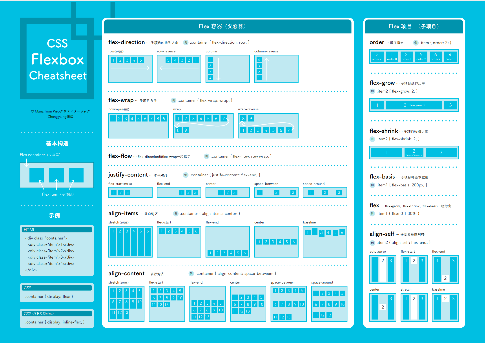
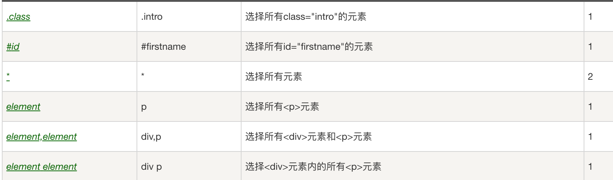

### typeScript泛型

```ts
function fuc<T>(arg: T): T{
  return arg;
}

let output = fuc<string>("myString")
```

### LRU


```js
/**
 * @param {number} capacity
 */
var Solution = function(capacity) {
    // write code here
    this.capacity = capacity
    this.map = new Map()
};

/** 
 * @param {number} key
 * @return {number}
 */
Solution.prototype.get = function(key) {
    // write code here
    if(!this.map.has(key)){
        return -1
    }
    const value = this.map.get(key)
    this.map.delete(key)
    this.map.set(key,value)
    return value
};

/** 
 * @param {number} key 
 * @param {number} value
 * @return {void}
 */
Solution.prototype.set = function(key, value) {
    // write code here
    if(this.map.has(key)){
        this.map.delete(key)
    }
    this.map.set(key,value)
    if(this.map.size > this.capacity){
        const delKey = this.map.keys().next().value
        this.map.delete(delKey)
    }
};

module.exports = {
    Solution : Solution
};

```


### 接雨水

```js
function maxWater( arr ) {
    // write code here
    let leftMax = 0, rightMax = 0, left = 0, right = arr.length - 1
    let res = 0
    while(left < right){
        leftMax = Math.max(leftMax, arr[left])
        rightMax = Math.max(rightMax, arr[right])
        if(arr[left] < arr[right]){
            res += leftMax - arr[left]
            left++
        }else{
            res += rightMax - arr[right]
            right--
        }
    }
    return res;
}
```

### 买卖股票

```js
function maxProfit( prices ) {
    // write code here
    let maxProfit = 0
    if(prices.length ===0) return 0
    let minPrice = prices[0]
    for(let i = 0; i < prices.length; i++){
        minPrice = Math.min(prices[i],minPrice)
        maxProfit = Math.max(maxProfit,prices[i] - minPrice)
    }
    return maxProfit
}
```


### 实现一个排序算法演示网站

```js
<!DOCTYPE html>
<html lang="en">
	<head>
		<meta charset="UTF-8" />
		<meta http-equiv="X-UA-Compatible" content="IE=edge" />
		<meta name="viewport" content="width=device-width, initial-scale=1.0" />
		<title>Document</title>
		<style>
			#container {
				display: flex;
				width: 100%;
				height: 200px;
			}
			#container > div {
				flex: 1;
				text-align: center;
			}
		</style>
	</head>
	<body>
		<div id="container"></div>
		<script>
			function arrSortAnimation(arr) {
				// 1.创建排序元素
				let container = document.getElementById("container");
				let elements = [];
				arr.forEach((item) => {
					const divElement = document.createElement("div");
					elements.push(divElement);
					divElement.innerText = item;
					container.appendChild(divElement);
				});
				// 2.记录交换的index
				let task = [];
				let bubbleSort = function (arr) {
					let len = arr.length;
					for (let i = 0; i < len; i++) {
						let isSwap = false;
						for (let j = 0; j < len - i - 1; j++) {
							if (arr[j] > arr[j + 1]) {
								task.push({ left: j, right: j + 1 });
								[arr[j], arr[j + 1]] = [arr[j + 1], arr[j]];
								isSwap = true;
							}
						}
						if (isSwap === false) {
							break;
						}
					}
					return arr;
				};

				bubbleSort(arr);

				// 3.将交换反映到真实dom
				task.forEach((item, index) => {
					setTimeout(() => {
						let temp = elements[item.left].innerText;
						elements[item.left].innerText = elements[item.right].innerText;
						elements[item.right].innerText = temp;
					}, index * 1000);
				});
			}
			arrSortAnimation([3, 1, 2, 8, 6, 12, 5, 7]);
		</script>
	</body>
</html>
```


### canvas + requestAnimationFrame 怎么实现动画效果

### Map 和 WeakMap


### JS 实现继承（手写版 + Es6 之后的实现）

```js
function Cat(name){
Animal.call(this);
this.name = name || 'Tom';
}
(function(){
// 创建一个没有实例方法的类
var Super = function(){};
Super.prototype = Animal.prototype;
//将实例作为子类的原型
Cat.prototype = new Super();
})();

// Test Code
var cat = new Cat();
console.log(cat.name);
console.log(cat.sleep());
console.log(cat instanceof Animal); // true
console.log(cat instanceof Cat); //true

感谢 @bluedrink 提醒，该实现没有修复constructor。

Cat.prototype.constructor = Cat; // 需要修复下构造函数
```


### async pool 手写

```js
			const delay = function delay(interval) {
				return new Promise((resolve, reject) => {
					setTimeout(() => {
						resolve(interval);
					}, interval);
				});
			};

			const delayErr = function delay(interval) {
				return new Promise((resolve, reject) => {
					setTimeout(() => {
						reject(interval);
					}, interval);
				});
			};

			let tasks = [
				() => {
					return delay(1000);
				},
				() => {
					return delayErr(1003);
				},
				() => {
					return delay(1005);
				},
				() => {
					return delay(1002);
				},
				() => {
					return delay(1004);
				},
				() => {
					return delay(1006);
				},
			];

			function createRequest(tasks, pool) {
				pool = pool || 5;
				let results = [];
				let together = new Array(pool).fill(null);
				let index = 0;
				together = together.map((item, i) => {
					return new Promise((resolve, reject) => {
						const run = function run() {
							if (index >= tasks.length) {
								resolve();
								return;
							}
							console.log(`第${i}个pool 第${index}task`);
							let old_index = index;
							// 从任务池拿任务，由于index是升级作用域的变量，所以多个Promise共享一个index
							//这样可以让一个数组里面的任务一次执行
							let task = tasks[index++];
							task()
								.then((result) => {
									// 将返回的结果放置在results里面，实现请求数据的集中存储。
									results[old_index] = {
										status: "fulfilled",
										value: result,
									};
									// 只有在上一个任务执行成功后才会执行一个异步任务
									run();
								})
								.catch((reason) => {
									results[old_index] = {
										status: "rejected",
										reason: reason,
									};
									run();
								});
						};
						run();
					});
				});
				// 多个promise同时处理，根据pool来限制同一时刻并发请求的个数
				return Promise.all(together).then(() => results);
			}

			createRequest(tasks, 3)
				.then((results) => {
					console.log("success->", results);
				})
				.catch((reason) => {
					console.log("fail->", reason);
				});
```

### HTTP1.0和HTTP1.1和HTTP2.0

http1.1/相比http1.0

- 默认开启长链接，http1.0需要 Connection： keep-alive开启。
- 支持管道化（pipeline）。只要第一个请求发出去了，不必等其回来，就可以发第二个请求出去，可以减少整体的响应时间。

http1.0队首阻塞：队首的事情没有处理完的时候，后面的人都要等着。

http1.1**管道化**队首阻塞：http1.1解决http1.0队首阻塞，但是响应需要按照请求的发送顺序来，导致服务器队首阻塞。

http2.0/相比http1.1

- 头部压缩。客户端和服务器同时维护一张头信息表，每次请求重复发送的请求头。
- 二进制格式。 HTTP/1.1 是纯文本形式的报文，HTTP2.0头信息和数据体都是二进制，并且统称为帧。
- 多路复用。HTTP2.0**并发多个请求或回应**，移除了 HTTP/1.1 中的串行请求，因此不会出现队首阻塞。
- 多个 HTTP 请求在复用一个 TCP 连接，下层的 TCP 协议是不知道有多少个 HTTP 请求的。所以一旦发生了丢包现象，就会触发 TCP 的重传机制，这样在一个 TCP 连接中的**所有的 HTTP 请求都必须等待这个丢了的包被重传回来**。（一旦发生丢包，就会阻塞住所有的 HTTP 请求。）

http3.0相比http2.0

- UDP是不管顺序，也不管丢包的，所以解决了队首阻塞和丢包阻塞问题。
- UDP 是不可靠传输的。但基于 UDP 的 **QUIC 协议** 可以实现类似 TCP 的可靠性传输
- QUIC 有自己的一套机制可以保证传输的可靠性的。当某个流发生丢包时，只会阻塞这个流，**其他流不会受到影响**。

### git规范和代码规范

Git commit 规范：Angular

Header：指明commit类型、范围和主题

Body：本次 commit 的详细描述

Footer：两种情况：**不兼容变动** 、**关闭 Issue**

husky+commitlint+EsLint（代码规范）+Prettier（代码格式化）+commitizen保证代码规范和Git 规范

在pre-commit阶段执行eslint，如果有Error可以执行 Eslint-fix

在commit-msg阶段校验Commit message

commitizen命令提示，编写规范的commit-message

Github action用于同步 Github代码到Gitee。

Gitee 配置WebHook，Gitee代码更新后，发消息到服务器，触发部署脚本。

### localStorage容量超过5M解决办法

localStorage最大容量5M的意思是每一个域名下的localStorage容量是5M。可以内嵌一个其他域名的frame，然后使用***\*window.postMessage()\**** 读写数据。

postMessage通信条件：它们的页面位于具有相同的协议（通常为https），端口号（443为https的默认值），以及主机  (两个页面的模数Document.domain设置为相同的值) 时，这两个脚本才能相互通信。

### 箭头函数和普通函数的区别

1. 没有自己的 `this`，只会从父作用域中继承 `this`

2. 无论如何调用箭头函数，其 `this` 指向都不会发生改变；箭头函数的`this`在定义的时候已经确定了；call()、apply()、bind()也无法改变箭头函数中this的指向。

3. 箭头函数没有自己的`arguments`对象，即使在箭头函数中调用`arguments`对象，引用的也只是父作用域中的`arguments`对象。可以使用ES6 `...args`获取。

4. 箭头函数没有原型prototype。
5. 箭头函数不能作为构造函数。


### var let const

- var

  var定义变量，存在变量提升

  var定义变量名，能够多次定义

  var定义在全局作用域变量，会直接添加到window下面

- let

  let定义变量，不存在变量提升

  let定义变量，存在块级作用域

  let会有暂时性死区

  let定义变量不会添加到window下面

  let的变量名，不允许重复定义

- const 

  const和let的用法差不多，但是const定义变量值不允许改变。

### Keep-alive

**能在组件切换过程中将状态保留在内存中， 防止重复渲染DOM** 

### DNS缓存

浏览器缓存>操作系统缓存> `hosts` 文件>本地DNS服务器缓存>根域名服务器缓

### git rebase和git merge区别

1. **merge 是合并的意思，rebase是复位基底的意思**
2. 可以看到merge操作会生成一个新的节点，之前提交分开显示。
3. rebase操作不会生成新的节点，是将两个分支融合成一个线性的操作。

### indexdb

1. 浏览器的非关系型数据库，数据以“键值对”的形式保存。
2. 异步：**：**IndexedDB操作时不会锁死浏览器，用户依然可以进行其他操作，这与LocalStorage形成对比，后者的操作是同步的。
3. 支持事物：IndexedDB支持事务。
4. **同源限制：**IndexedDB受同源限制，每一个数据库对应创建它的域名。
5. **存储空间大：**IndexedDB的存储空间比LocalStorage大得多，一般来说不少于250MB，甚至没有上限。
6. **支持二进制存储：**IndexedDB不仅可以存储二进制数据（ArrayBuffer对象和Blob对象）。

原子性：原子性是指事务包含的所有操作要么全部成功，要么全部失败回滚。

一致性：一致性状态变换到另一个一致性状态。A和用户B两者的钱加起来一共是5000，那么不管A和B之间如何转账，转几次账，事务结束后两个用户的钱相加起来应该还得是5000

隔离性：指的是不同事务在提交的时候，最终呈现出来的效果是串行的。

持久性：持久性是指一个事务一旦被提交了，那么对数据库中的数据的改变就是永久性的。

**读未提交：写数据时加上X锁，直到事务结束，读的时候不加锁**

**读已提交：写数据的时候加上X锁，直到事务结束，读的时候加上S锁，读完数据立刻释放**

**可重复读：写数据的时候加上X锁，直到事务结束，读数据的时候加S锁，直到事务结束**

**串行化：以上方法都无法解决幻读（Innodb可以解决），唯有加上串行化**

### 跨域

这里的“跨域”指的是不同源之间的资源访问。

### flex

Flex:**flex:1 1 auto*

flex-basis 为auto，子项占用宽度使用width 的宽度，width 为70px



### BFC和IFC

#### 什么是BFC

> - BFC 是块级格式化上下文
> - BFC可以看作元素的一个**属性**。
> - BFC可以看作成一个**容器**，拥有BFC属性的元素就相当于容器。
>   - 容器内部的元素会按照BFC的**规则**进行排布，
>   - 并且两个容器是相互**隔离**的，
>   - 此外容器的排布不受**外界**影响。

#### BFC创建条件

> - 根元素或者包含根元素
> - **浮动**元素 float=left | right inherit
> - 绝对**定位**元素  position= absolute或fixed
> - display = inline-block |flex
> - overflow = hidden | auto | scroll (#visible)

 #### BFC的特性

> BFC垂直的间距是靠margin决定，但是会发生**margin重叠问题**。
>
> BFC能够识别浮动元素，能够**清除浮动**。
>
> BFC会排斥**浮动元素**，即BFC Container不会和浮动元素重叠。

#### BFC的应用

> 解决margin重叠问题
>
> 清除浮动

### CSS权重


| 选择器                           | 权重    |
| -------------------------------- | ------- |
| 继承 或者 * （* 大于 继承）      | 0 0 0 0 |
| 元素选择器                       | 0 0 0 1 |
| 类选择器，伪类选择器，属性选择器 | 0 0 1 0 |
| ID 选择器                        | 0 1 0 0 |
| 行内样式                         | 1 0 0 0 |
| ！important                      | 无穷大  |

> 注意：
>
> - 选择器的权重的值**不可以进位**，例如ID选择器 永远大于 类选择器
> - 选择器的权重相等，那么后定义的选择器会成为最后规则
> - ***选择器**大于**继承选择器**大于**默认浏览器样式**

### CSS选择器



### setState是同步还是异步

#### react18之前

setState在不同情况下可以表现为异步或同步。

在Promise的状态更新、js原生事件、setTimeout、setInterval..中是同步的。

在react的合成事件中，是异步的。

#### react18之后

setState都会表现为异步（即批处理）。

### HTML5新特性

1. 语义化标签。通过**标签**本身的含义，搜索引擎能更好理解，使用**语义化标签**有助于提高页面关键词排名，减少SEO优化难度。
   - **header标签**
   - **nav标签**
   - **article标签**

2. **音频和视频**。能够使用audio和video。
3. **Canvas**
4. **SVG绘图**
5. **地理定位** getCurrentPosition()
6. **拖放API**
7. **Web Worker**
8. **Web Storage**
9. **WebSocket**

### CSS3新特性

1. 新增选择器：`nth-child(n)`
2. box-shadow `box-shadow: 10px 5px 5px red;`
3. clip-path `clip-path: polygon(50% 0, 100% 50%, 50% 100%, 0 50%);`
4. transition 过渡

```
transition： CSS属性，花费时间，效果曲线(默认ease)，延迟时间(默认0)
```

```
transition-property: width; 
transition-duration: 1s;
transition-timing-function: linear;
transition-delay: 2s;
```

5. transform
   - transform: translate(120px, 50%)：位移
   - transform: scale(2, 0.5)：缩放
   - transform: rotate(0.5turn)：旋转
   - transform: skew(30deg, 20deg)：倾斜
6. animation

```css
@keyframes change-background {
  0% {
    background: blue;
  }
  50% {
    background: green;
  }

  100% {
    background: orange;
  }
}

div {
  animation: change-background 3s linear 1s;
}
```

7. flex布局、grid布局

### ES6新特性

1. 解决原有语法的缺陷和不足

   1. let、const

2. 对原有语法进行增强

   1. 数组、对象的解构

   2. 模板字符串

   3. 字符串的扩展方法

      1、includes
      2、startWith
      3、endsWith

   4. 函数参数增强：参数默认值

   5. 箭头函数

3. 新增对象、全新的方法、全新的功能

   1. proxy
   2. Reflect： 封装操作对象的统一API
   3. Promise

4. 全新的数据结构和数据类型

   1. class 类
   2. set数据结构：可以理解为集合，不重复
   3. map数据结构
   4. Symbol新的数据结构，唯一值
   5. for ... of 遍历

### 括号匹配

```js
var isValid = function (s) {
    let stack = [];
    let map = { ")": "(", "}": "{", "]": "[" };
    for (let i = 0; i < s.length; i++) {
        if (s[i] === "(" || s[i] === "[" || s[i] === "{") {
            stack.push(s[i]);
        } else {
            let tmp = map[s[i]];
            if (stack[stack.length - 1] !== tmp) {
                return false;
            } else {
                stack.pop();
            }
        }
    }
    return stack.length === 0;
};
```

### 括号生成

```js
class Solution {
    public List<String> generateParenthesis(int n) {
        ArrayList<String> res = new ArrayList<>();
        ArrayList<Character> subRes = new ArrayList<>();
        generateParenthesisRecursion(n, n, res, subRes);
        return res;
    }

    public void generateParenthesisRecursion(int left, int right, List<String> res, ArrayList<Character> subRes) {
        if (left < 0 || right < 0) {
            return;
        }
        if (left > right) {
            return;
        }
        if (left == 0 && right == 0) {
            StringBuilder builder = new StringBuilder(subRes.size());
            for (Character ch : subRes) {
                builder.append(ch);
            }
            res.add(builder.toString());
        }
        subRes.add('(');
        this.generateParenthesisRecursion(left - 1, right, res, subRes);
        subRes.remove(subRes.size() - 1);
        subRes.add(')');
        this.generateParenthesisRecursion(left, right - 1, res, subRes);
        subRes.remove(subRes.size() - 1);
    }
}
```


### 8皇后

```js
function Nqueen( n ) {
  let count = 0;
   
  let arr = [];
  for(let i=0; i<n; i++){
    arr.push([]);
    for(let j=0; j<n; j++)
      arr[i][j] = 0;
  }
   
  function check(row,colomn){//arr[row][colomn]置为1是否合法
    for(let i=0; i<row; i++){
      let index = arr[i].indexOf(1);//index就是第i行的下标
      if (index == colomn)
        return false;
      if( Math.abs(i-row) == Math.abs(index-colomn) )
        return false;
    }
    return true;
  }
   
  function traceTrack(len){//len表示给第len行放置棋子
    if(len>=n){
      count++;
      return;
    }
       
    for(let i=0; i<n; i++){//i表示第i列
      if(check(len,i) == true){
        arr[len][i] = 1;
        traceTrack(len+1);
        arr[len][i] = 0;
      }
    }
  }
   
   
  traceTrack(0);
  return count;
}
```

###  给一个dom元素遍历所有节点名字


```js
			let parent = document.getElementById("container");
			let res = [];
			function traverse(dom) {
				if (dom === null) return;
				const children = dom.children;
				for (let i = 0; i < children.length; i++) {
					let child = children[i];
					res.push(child.tagName);
					traverse(child);
				}
			}
			traverse(parent);
			console.log(res);
```


### **红灯绿灯黄灯交错打印**

```js
let time = null;
const red = () => {
  const now = Date.now();
  console.log('red', Math.floor((now - time)/1000));
  time = Date.now();
}
const yellow = () => {
  const now = Date.now();
  console.log('yellow', Math.floor((now - time)/1000));
  time = Date.now();
}
const green = () => {
  const now = Date.now();
  console.log('green', Math.floor((now - time)/1000));
  time = Date.now();
}

const light = (time, callback) => {
  return new Promise((res, rej) => {
    const timer = setTimeout(() => {
      callback();
      res(timer);
    }, time);
  })
}

const stepByStep = async () => {
  const timer1 = await light(3000, red);
  const timer2 = await light(1000, green);
  const timer3 = await light(2000, yellow);
  clearTimeout(timer1);
  clearTimeout(timer2);
  clearTimeout(timer3);
  # 递归调用就可以
  stepByStep();
}

```


### **将数组对象转为树形对象**

```js
			const list = [
				{ id: 04, pid: 03 },
				{ id: 01, pid: null },
				{ id: 02, pid: null },
				{ id: 03, pid: 01 },
				{ id: 05, pid: 01 },
				{ id: 06, pid: 03 },
				{ id: 07, pid: 02 },
				{ id: 09, pid: 02 },
				{ id: 10, pid: 07 },
			];
			function toTree(data) {
				let result = [];
				let obj = {};
				data.forEach((item) => {
					obj[item.id] = Object.assign(item, obj[item.id] || {});
					if (item.pid) {
						let parent = obj[item.pid] || {};
						parent.child = parent.child || [];
						parent.child.push(item);
						obj[item.pid] = parent;
					} else {
						result.push(obj[item.id]);
					}
				});
				return result;
			}
```

### hash路由和history路由

- hash是\# 号以及后面的字符，来改变路由，也可以将id元素到可视区域。
- hash值发生变化，不会导致页面重新发生请求。
- hash路由传参是基于URL的，如果要传递复杂的数据，会有体积的限制。
- history是html5新特性，history 模式不仅可以在url里放参数，还可以将数据存放在特定对象。
- 通过 History 模式改变 URL 同样不会引起页面的刷新，只会更新浏览器的历史记录。
- 回车刷新： hash 可以加载到hash值对应页面 ； history一般就是404掉了

### React 和 Vue三种传参方式

#### Vue

1. parmas传参
   1. `params` 传参（显示参数）（参数在URL中，刷新后有参数）
   2. `params` 传参（不显示参数）（刷新后无参数）
2. `query` 传参（地址栏显示参数，刷新后有参数）

#### React

1. params传参

2. search传参
3. State传参

原理：使用history.location.state存储参数。

1. <HashRouter> 不支持 location.key 与 **location.state**，`<HashRouter>`通过`state`传递参数，刷新页面后参数丢失。
2. 建议使用<BrowserRouter>,页面刷新参数也不会丢失。
