## CSS预处理工具（Less Sass）和CSS后处理工具（POSTCSS）


Less/Sass/Stylus，这类工具都属于CSS 预处理工具。预处理指的是通过特殊的规则，将非 css 文本格式最终生成 css 文件，而 postcss 则是对 CSS 进行处理，最终生成CSS。

## POSTCSS

功能：

- 转换 css，这是我们最常使用的（例如postcss使用autoprefixer插件，自动处理浏览器前缀）
- 获取 css ast，当我们编写插件时需要掌握

您使用 webpack，只需要将 postcss 包装为 postcss-loader 即可。

词法分析->语法分析->AST->插件->AST->代码

地址：https://www.jianshu.com/p/183af77a51ec

地址：https://www.cnblogs.com/goloving/p/14078228.html

## CSS pxToRem 工具如何做的 px -> rem 实现原理

通过postCss将元素转成ast的时候，对元素的每个节点进行便利，根据根元素的font-size计算rem。

地址：https://segmentfault.com/a/1190000015619303

地址：https://www.jianshu.com/p/0306f073a5ba

## CSS移动端适配方案

1. css媒体查询
2. 使用rem单位

1. rem单位 + 动态html的font-size
   1. 动态修改font-size方法
      1. 媒体查询修改font-size
      2. 编写JavaScript代码
   2. px->rem方法
      1. 手动计算
      2. less/scss函数
      3. postcss插件 
2. vw单位+viewPort （postcss-px-to-viewport将px-2vw)
3. flex的弹性布局
4. Grid布局

地址：https://juejin.cn/post/7091688749578321950

## 视口问题

地址：https://www.jianshu.com/p/8ae759171cd7

地址：https://blog.csdn.net/leman314/article/details/111936863

**Layout viewport**：**document.documentElement.clientWidth**

> 默认是980px

**visual viewport**：**window.innerWidth**

> 用户放大网站，我们能看到的网站区域将缩小，此时视觉视口也变小了。不管用户如何缩放，都不会影响到布局视口的宽度

 **ideal viewport**：**window.screen.width**

> 布局视口的一个理想尺寸，只有当布局视口的尺寸等于设备屏幕的尺寸时，才是理想视口。

meta标签是设置layout viewport

缩放是相对于ideal viewport来缩放的，缩放值越大，当前viewport的宽度就会越小

width属性用于设置页面的布局视口宽度

initial-scale属性用于设置页面初始的缩放比例，缩放比例为`理想视口`与`视觉视口`的比值。

**visual viewport宽度 = ideal viewport宽度 / 当前缩放值**

nitial-scale修改视觉适口，width修改布局适口

视觉适口不能大于布局适口

## 1 px 问题

由于Retina屏幕一个Css像素=两个物理像素，所以1px的边框会看起来粗很多。

解决方案：https://zhuanlan.zhihu.com/p/535456539

- 0.5px实现
- 用图片代替边框
- background渐变
- box-shadow模拟边框实现
- 通过 viewport + rem 实现（推荐）
- 伪元素先放大后缩小（推荐）

## Js模块化

### 为什么需要模块化

原始的开发方式，随着项目复杂度提高，代码量越来越多，所需加载的文件也越来越多，这个时候就需要考虑如下几个问题:

- 命名问题：所有文件的方法都挂载到`window/global`上，会污染全局环境，并且需要考虑命名冲突问题
- 依赖问题：`script`是顺序加载的，如果各个文件文件有依赖，就得考虑`js`文件的加载顺序
- 网络问题：如果`js`文件过多，所需请求次数就会增多，增加加载时间

### JS模块化的4种规范

 `CommonJS`、`AMD`、`UMD`、`ESM`

### CommonJS

`CommonJS`是一个更偏向于服务器端的规范。`NodeJS`采用了这个规范。`CommonJS`的一个模块就是一个脚本文件。`require`命令**第一次加载该脚本时就会执行整个脚本，然后在内存中生成一个对象**。

```javascript
{
  id: '...',
  exports: { ... },
  loaded: true,
  ...
}
```

`id`是模块名，`exports`是该模块导出的接口，loaded表示模块是否加载完毕。

以后需要用到这个模块时，就会到`exports`属性上取值。**即使再次执行`require`命令，也不会再次执行该模块，而是到缓存中取值**。

```js
// module.js
module.exports = {
    name:'banana',
    age:18,
    eat:function(){
        console.log('I like eating bananas')
    }
}
module.exports.userName = 'admin'
```

```js
// app.js
const obj = require('./module.js')
console.log(obj) // { name: 'banana', age: 18, eat: [Function: eat], userName: 'admin' }

// 如果只想导入某个属性，可以使用解构赋值
const { name } = require('./module')
console.log(name) // 'banana'

```

- `CommonJS`是同步导入模块
- `CommonJS`模块不能直接在浏览器中运行，需要进行转换、打包
- `CommonJS`导入时，它会给你一个导入对象的副本

由于`CommonJS`是同步加载模块，这对于服务器端不是一个问题，因为所有的模块都放在本地硬盘。等待模块时间就是硬盘读取文件时间，很小。但是，对于浏览器而言，它需要从服务器加载模块，涉及到网速，代理等原因，一旦等待时间过长，浏览器处于”假死”状态。

所以在浏览器端，不适合于`CommonJS`规范。所以在浏览器端又出现了一个规范—-`AMD`。

### AMD

`AMD`(`Asynchronous Module Definition` - 异步加载模块定义)规范，一个单独的文件就是一个模块。它采用异步方式加载模块，模块的加载不影响它后面语句的运行。

**这里异步指的是不堵塞浏览器其他任务（`dom`构建，`css`渲染等），而加载内部是同步的（加载完模块后立即执行回调）**。

`AMD`的标准中，引入模块需要用到方法`require`，由于`window`对象上没定义`require`方法， 这里就不得不提到一个库，那就是[RequireJS](https://link.segmentfault.com/?enc=Jrt%2F6dMLbC8tvqtU2aGuNA%3D%3D.xP2Dc1ugWD7QL6%2FATGZmouHppvIOl%2BhtFnoIYgTh9b0%3D)。

### UMD

`UMD` 代表通用模块定义（`Universal Module Definition`）。所谓的通用，就是兼容了`CmmonJS`和`AMD`规范，这意味着无论是在`CmmonJS`规范的项目中，还是`AMD`规范的项目中，都可以直接引用`UMD`规范的模块使用。

这种模式，通常会在`webpack`打包的时候用到。`output.libraryTarget`将模块以哪种规范的文件输出。

### ESM

在ECMAScript 2015版本出来之后，确定了一种新的模块加载方式，我们称之为`ES6 Module`。它和前几种方式有区别和相同点:

- 它因为是标准，所以未来很多浏览器会支持，可以很方便的在浏览器中使用（语言层面）
- 它同时兼容在`node`环境下运行
- 模块的导入导出，通过`import`和`export`来确定
- 可以和`CommonJS`模块混合使用
- `CommonJS`输出的是一个**值的拷贝**。ES6模块输出的是**值的引用**,加载的时候会做静态优化
- `CommonJS`模块是**运行时加载**确定输出接口，ES6模块是**编译时**确定输出接口

ES6模块功能主要由两个命令构成：`import`和`export`。`import`命令用于输入其他模块提供的功能。`export`命令用于规范模块的对外接口。

```javascript
// 输出变量
export const name = 'Clearlove';
export const year = '2021';

// 输出一个对象（推荐）
const name = 'Clearlove';
const year = '2021';
export { name, year}


// 输出函数或类
export function add(a, b) {
  return a + b;
}

// export default 命令
export default function() {
  console.log('foo')
}
```

```javascript
// 正常命令
import { name, year } from './module.js';

// 如果遇到export default命令导出的模块
import ed from './export-default.js';
```

#### 浏览器加载

浏览器加载ES6模块，使用`<script>`标签，但是要加入`type="module"`属性。

- 外链js文件：

```javascript
<script type="module" src="index.js"></script>
```

- 内嵌在网页中

```javascript
<script type="module">
  import utils from './utils.js';
  // other code
</script>
```

对于加载外部模块，需要注意：

- 代码是在模块作用域之中运行，而不是在全局作用域运行。**模块内部的顶层变量，外部不可见**
- 模块脚本自动采用严格模式，不管有没有声明`use strict`
- 模块之中，可以使用`import`命令加载其他模块（.js后缀不可省略，需要提供绝对 URL 或相对 URL），也可以使用`export`命令输出对外接口
- **模块之中，顶层的`this`关键字返回`undefined`，而不是指向`window`**。也就是说，在模块顶层使用`this`关键字，是无意义的
- **同一个模块如果加载多次，将只执行一次**

#### Node加载

Node要求 ES6 模块采用`.mjs`后缀文件名。也就是说，只要脚本文件里面使用`import`或者`export`命令，就必须采用`.mjs`后缀名。Node.js 遇到`.mjs`文件，就认为它是 ES6 模块，默认启用严格模式，不必在每个模块文件顶部指定`use strict`。

如果不希望将后缀名改成`.mjs`，可以在项目的`package.json`文件中，指定`type`字段为

```javascript
{
  "type": "module"
}
```

一旦设置了以后，该目录里面的 JS 脚本，就被解释用 ES6 模块。

```bash
# 解释成 ES6 模块 
$ node my-app.js
```

如果这时还要使用 `CommonJS` 模块，那么需要将 `CommonJS` 脚本的后缀名都改成`.cjs`。如果没有`type`字段，或者`type`字段为`commonjs`，则`.js`脚本会被解释成 `CommonJS` 模块。

总结为一句话：`.mjs`文件总是以 `ES6` 模块加载，`.cjs`文件总是以 `CommonJS` 模块加载，`.js`文件的加载取决于`package.json`里面`type`字段的设置。

注意，`ES6` 模块与 `CommonJS` 模块尽量不要混用。`require`命令不能加载`.mjs`文件，会报错，只有`import`命令才可以加载`.mjs`文件。反过来，`.mjs`文件里面也不能使用`require`命令，必须使用`import`。

`Node`的`import`命令只支持异步加载本地模块(`file:`协议)，不支持加载远程模块。

- 由于 `ESM` 具有简单的语法，异步特性和可摇树性，因此它是最好的模块化方案
- `UMD` 随处可见，通常在 `ESM` 不起作用的情况下用作备用
- `CommonJS` 是同步的，适合后端
- `AMD` 是异步的，适合前端

地址：https://segmentfault.com/a/1190000039375332

## ES6和Commonjs

“ES6 module是编译时加载，输出的是接口，CommonJS运行时加载，加载的是一个对象”

## ES6和Commonjs循环依赖


## ESM报错跨域

正常情况下引入文件(通过file协议引入文件)是不受同源策略的影响的（也就是Sec-Fetch-Mode：no-cors）
type="module"的模式下Sec-Fetch-Mode:cors，也就是说收到了同源协议的影响，而同源协议就要求合适请求头中的Origin信息，file协议是无法实现的，所以改为用LiveSreve启动Html就好了。

地址：https://blog.csdn.net/baidu_41604826/article/details/121012285

## CORS问题及解决方案

"*跨域*资源共享"（Cross-origin resource sharing）

### 同源策略

**同源策略**是一种约定，它是浏览器最核心也最基本的安全功能，如果缺少了同源策略，浏览器很容易受到XSS、CSRF等攻击。所谓同源是指"协议+域名+端口"三者相同，即便两个不同的域名指向同一个ip地址，也非同源。

同源策略限制以下几种行为：

- Cookie、LocalStorage 和 IndexDB 无法读取
- DOM和JS对象无法获得
- AJAX 请求不能发送

解决方案：

### JSONP跨域

 **jsonp**的原理就是利用`<script>`标签没有跨域限制，通过`<script>`标签src属性，发送带有callback参数的GET请求，服务端将接口返回数据拼凑到callback函数中，返回给浏览器，浏览器解析执行，从而前端拿到callback函数返回的数据。

```js
 <script>
    var script = document.createElement('script');
    script.type = 'text/javascript';

    // 传参一个回调函数名给后端，方便后端返回时执行这个在前端定义的回调函数
    script.src = 'http://www.domain2.com:8080/login?user=admin&callback=handleCallback';
    document.head.appendChild(script);

    // 回调执行函数
    function handleCallback(res) {
        alert(JSON.stringify(res));
    }
 </script>
```

### 后端设置跨域资源共享

浏览器将CORS跨域请求分为简单请求和非简单请求。

  只要同时满足一下两个条件，就属于简单请求
 (1)使用下列方法之一：

- head
- get
- post

(2)请求的Heder是

- Accept
- Accept-Language
- Content-Language
- Content-Type: 只限于三个值：application/x-www-form-urlencoded、multipart/form-data、text/plain

不同时满足上面的两个条件，就属于非简单请求。浏览器对这两种的处理，是不一样的。

#### 简单请求

 CORS请求设置的响应头字段，都以 Access-Control-开头:

**1）Access-Control-Allow-Origin**：必选
  它的值要么是请求时Origin字段的值，要么是一个*，表示接受任意域名的请求。
 **2）Access-Control-Allow-Credentials**：可选
  它的值是一个布尔值，表示是否允许发送Cookie。默认情况下，Cookie不包括在CORS请求之中。设为true，即表示服务器明确许可，Cookie可以包含在请求中，一起发给服务器。这个值也只能设为true，如果服务器不要浏览器发送Cookie，删除该字段即可。
 **3）Access-Control-Expose-Headers**：可选
  CORS请求时，XMLHttpRequest对象的getResponseHeader()方法只能拿到6个基本字段：Cache-Control、Content-Language、Content-Type、Expires、Last-Modified、Pragma。如果想拿到其他字段，就必须在Access-Control-Expose-Headers里面指定。上面的例子指定，getResponseHeader('FooBar')可以返回FooBar字段的值。

#### 非简单请求

非简单请求是那种对服务器有特殊要求的请求，比如请求方法是PUT或DELETE，或者Content-Type字段的类型是application/json。非简单请求的CORS请求，会在正式通信之前，增加一次HTTP查询请求，称为"预检"请求（preflight）。

#### 预检请求

预检"请求用的请求方法是OPTIONS，表示这个请求是用来询问的。请求头信息里面，关键字段是Origin，表示请求来自哪个源。除了Origin字段，"预检"请求的头信息包括两个特殊字段。

```http
OPTIONS /cors HTTP/1.1
Origin: http://api.bob.com
Access-Control-Request-Method: PUT
Access-Control-Request-Headers: X-Custom-Header
Host: api.alice.com
Accept-Language: en-US
Connection: keep-alive
User-Agent: Mozilla/5.0..

```

**1）Access-Control-Request-Method**：必选
  用来列出浏览器的CORS请求会用到哪些HTTP方法，上例是PUT。
 **2）Access-Control-Request-Headers**：可选
  该字段是一个逗号分隔的字符串，指定浏览器CORS请求会额外发送的头信息字段，上例是X-Custom-Header。


服务器收到"预检"请求以后，检查了Origin、Access-Control-Request-Method和Access-Control-Request-Headers字段以后，确认允许跨源请求，就可以做出回应。
  HTTP回应中，除了关键的是Access-Control-Allow-Origin字段，其他CORS相关字段如下：
 **1）Access-Control-Allow-Methods**：必选
  它的值是逗号分隔的一个字符串，表明服务器支持的所有跨域请求的方法。注意，返回的是所有支持的方法，而不单是浏览器请求的那个方法。这是为了避免多次"预检"请求。
 **2）Access-Control-Allow-Headers**
  如果浏览器请求包括Access-Control-Request-Headers字段，则Access-Control-Allow-Headers字段是必需的。它也是一个逗号分隔的字符串，表明服务器支持的所有头信息字段，不限于浏览器在"预检"中请求的字段。
 **3）Access-Control-Allow-Credentials**：可选
  该字段与简单请求时的含义相同。
 **4）Access-Control-Max-Age**：可选
  用来指定本次预检请求的有效期，单位为秒。

### Nginx代理跨域

地址：https://juejin.cn/s/nginx%E5%8F%8D%E5%90%91%E4%BB%A3%E7%90%86%E8%A7%A3%E5%86%B3%E8%B7%A8%E5%9F%9F%E7%9A%84%E5%8E%9F%E7%90%86

#### nginx配置解决iconfont跨域

浏览器跨域访问js、css、img等常规静态资源被同源策略许可，但iconfont字体文(eot|otf|ttf|woff|svg)例外，此时可在nginx的静态资源服务器中加入以下配置。

```conf
location / {
  add_header Access-Control-Allow-Origin *;
}
```

#### nginx反向代理接口跨域

> 跨域问题：同源策略仅是针对浏览器的安全策略。服务器端调用HTTP接口只是使用HTTP协议，不需要同源策略，也就不存在跨域问题。

实现思路：通过Nginx配置一个代理服务器域名与domain1相同，端口不同）做跳板机，反向代理访问domain2接口，并且可以顺便修改cookie中domain信息，方便当前域cookie写入，实现跨域访问。
nginx具体配置：

```nginx
#proxy服务器
server {
    listen       81;
    server_name  www.domain1.com;

    location / {
        proxy_pass   http://www.domain2.com:8080;  #反向代理
        proxy_cookie_domain www.domain2.com www.domain1.com; #修改cookie里域名
        index  index.html index.htm;

        # 当用webpack-dev-server等中间件代理接口访问nignx时，此时无浏览器参与，故没有同源限制，下面的跨域配置可不启用
        add_header Access-Control-Allow-Origin http://www.domain1.com;  #当前端只跨域不带cookie时，可为*
        add_header Access-Control-Allow-Credentials true;
    }
}
```

### nodejs中间件代理跨域

node中间件实现跨域代理，原理大致与nginx相同，都是通过启一个代理服务器，实现数据的转发，也可以通过设置cookieDomainRewrite参数修改响应头中cookie中域名，实现当前域的cookie写入，方便接口登录认证。

### document.domain + iframe跨域

此方案仅限主域相同，子域不同的跨域应用场景。实现原理：两个页面都通过js强制设置document.domain为基础主域，就实现了同域。

### location.hash + iframe跨域

实现原理： a欲与b跨域相互通信，通过中间页c来实现。 三个页面，不同域之间利用iframe的location.hash传值，相同域之间直接js访问来通信。
  具体实现：A域：a.html -> B域：b.html -> A域：c.html，a与b不同域只能通过hash值单向通信，b与c也不同域也只能单向通信，但c与a同域，所以c可通过parent.parent访问a页面所有对象。

### window.name + iframe跨域

window.name属性的独特之处：name值在不同的页面（甚至不同域名）加载后依旧存在，并且可以支持非常长的 name 值（2MB）。

### postMessage跨域

postMessage是HTML5 XMLHttpRequest Level 2中的API，且是为数不多可以跨域操作的window属性之一，它可用于解决以下方面的问题：

- 页面和其打开的新窗口的数据传递
- 多窗口之间消息传递
- 页面与嵌套的iframe消息传递
- 上面三个场景的跨域数据传递

### WebSocket协议跨域

WebSocket protocol是HTML5一种新的协议。它实现了浏览器与服务器全双工通信，同时允许跨域通讯，是server push技术的一种很好的实现。 原生WebSocket API使用起来不太方便，我们使用Socket.io，它很好地封装了webSocket接口，提供了更简单、灵活的接口，也对不支持webSocket的浏览器提供了向下兼容。

以上就是9种常见的跨域解决方案，jsonp（只支持get请求，支持老的IE浏览器）适合加载不同域名的js、css，img等静态资源；CORS（支持所有类型的HTTP请求，但浏览器IE10以下不支持）适合做ajax各种跨域请求；Nginx代理跨域和nodejs中间件跨域原理都相似，都是搭建一个服务器，直接在服务器端请求HTTP接口，这适合前后端分离的前端项目调后端接口。document.domain+iframe适合主域名相同，子域名不同的跨域请求。postMessage、websocket都是HTML5新特性，兼容性不是很好，只适用于主流浏览器和IE10+。

地址：https://juejin.cn/post/6844903882083024910

## `webpack` 构建流程，工作原理

## nginx 配置，做过哪些事情

## 在项目中 webpack 的实践

## 手撕代码 删除链表的倒数第 n 个元素（秒a，两种方式）

## 不会的问题

- CommonJS和EsModule的值拷贝和引用拷贝还要运行原理
- ESModule在nodejs和前端如何用？为什么要开启Liver-server,不开启为什么会报跨域错误
- 如何解决跨域问题？
- 常见的网络攻击
- 链表的插入排序
- 盛水最多的容易
- promise所有
- promise手写题
- React面试题
- Node和Express面试题
- 闭包
- js事件循环
- 宏任务和微任务
- js精度问题怎么处理
- 请求 OPTIONS方法
- Cookie（https://www.jianshu.com/p/4b165fecf157） Session LocalStorage SessionStorage Token
- Nginx的用途
- imyoyo优化策略
- HTML5和CSS3
- 立即调用函数表达式
- script标签async defer
- 循环依赖
- **渲染引擎工作的过程**
- 重绘、重流
- JS垃圾回收
- 函数时编程
- 0.1+0.2!==0.3
- 大数相加
- Array的方法、Set方法、Map的方法、对象的方法
- 高级函数
- flat函数
- 手写轮播图

## JS值传递和引用传递

- JS内存空间分为堆和栈。

- 基本数据类型和引用数据类型的地址存在在栈上面。

- 引用数据类型存在在堆上面。

- 在JS的变量传递中，本质都是值传递，就是是引用数据类型，也是地址的值传递，所有函数的参数都是按值传递。
- 如果一个对象不存在被引用，那么js引擎的回收机制将该对象销毁并释放内存。

## JS垃圾回收机制（Garbage collection）和内存泄漏和手动预防与优化

### 什么是垃圾回收机制？什么是垃圾

> 程序运行的过程中很多垃圾，这些垃圾是程序中**不用**或之前**用过以后不再使用的**的空间，而垃圾回收机制就是回收这些空间的。

### 垃圾的产生

```js
let test = {
  name: "isboyjc"
};
test = [1,2,3,4,5]
```

其中test第一次引用的对象，就成为了垃圾。

### 垃圾回收策略

可达性：以某种方式可以访问的值。

垃圾回收机制：定期找到不再用到的内存，然后释放其内存。

如何找到不再用到的内存，有很多策略如下。

#### 标记清除算法

最常用的垃圾清除策略。

大致流程：（总体分为标记和清除阶段）

1. 垃圾收集器在运行的过程中给内存中所有的变量添加一个标记，假设内存中所有对象都是垃圾，标记为0.
2. 然后从根对象开始遍历，把不是垃圾的节点改为1.
3. 清除所有标记为0的垃圾，并且销毁和释放占用的内存。
4. 最后，把内存中对象的标记修改为0，等待下一轮垃圾回收。

优点：实现简单，只有打标记和不打两种情况。

缺点：

1. 内存碎化：销毁和释放内存后，空闲内存是不连续的。（因为清除后剩余对象位置不变，导致空闲内存不连续）
2. 分配速度慢：因为内存碎化，所以重修分配，需要遍历空闲内存，时间复杂度0（n）

#### 标记整理算法

标记整理算法和标记清除算法的标记阶段一致，只是在标记结束后，会把不需要清理的内存整理到一起。

#### 引用计数算法

早期的一种垃圾回收算法，把`对象是否不再需要`定义为`对象有没有其他对象引用`，目前很少使用，因为问题很多。

策略：

- 当声明了一个变量并且将一个引用类型赋值给该变量的时候这个值的引用次数就为 1
- 如果同一个值又被赋给另一个变量，那么引用数加 1
- 如果该变量的值被其他的值覆盖了，则引用次数减 1
- 当这个值的引用次数变为 0 的时候，说明没有变量在使用，这个值没法被访问了，回收空间，垃圾回收器会在运行的时候清理掉引用次数为 0 的值占用的内存

优点：引用计数在引用值为 0 时，它可以立即回收垃圾。标记清除算法需要每隔一段时间进行一次，JS脚本运行过程中线程就必须要暂停去执行一段时间的 `GC`。

缺点：无法解决循环引用问题。

#### 分代式垃圾回收

大多数浏览器是基于标记清除法，V8也是，并且进行了优化处理。

大、老、存活时间长的对象检查频率和新、小、存活时间短的检查频率应该不一致。

V8的垃圾回收策略分代式垃圾回收，将堆内存分为新生代和老生代两区域，采用不同垃圾回收策略进行回收。

新生代：存活时间较短的对象，简单来说就是新产生的对象，通常只支持 `1～8M` 的容量

老生代：经历过新生代垃圾回收后还存活下来的对象，容量通常比较大

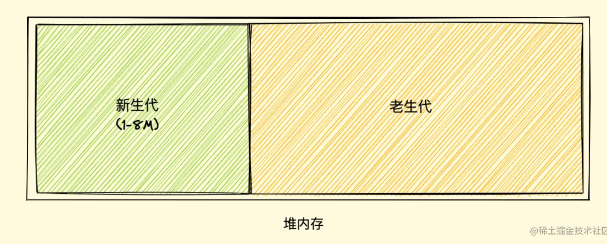

##### 新生代垃圾回收

使用`Scavenge算法`，在 `Scavenge算法`采用了一种复制式的方法 `Cheney算法`。

1. 新加入的对象放到使用区，使用区快被写满时，执行一次垃圾回收。
2. 对使用区中的活动对象做标记，标记完成之后将使用区的活动对象**复制**进空闲区并进行排序，然后将非活动对象占用空间清除掉。
3. 把原来的使用区变成空闲区，把原来的空闲区变成使用区。

新生代->老生代

当一个对象经过多次复制后依然存活，会认为是生命周期较长的对象，移动道老生代中，采用老生代垃圾回收机制。

如果复制一个对象到空闲区时，空闲区空间占用超过了 25%，那么这个对象会被直接晋升到老生代空间中。

##### 老生代垃圾回收

老生代中的对象通常比较大，如果像新生代一样复制来复制去，非常耗时，导致回收效率不高。所以老生代采用标记清除法。

标记阶段：从根元素遍历，能够达到的微活动对象，不能达到为非活动对象。

清除阶段：将非活动对象清除掉。

V8使用标记整理算法来解决内存碎化。

地址：https://juejin.cn/post/6981588276356317214

### 闭包

闭包就是能够读取其他函数内部变量的函数。

由于JavaScript只有函数内部的子函数才能读取变量，因此闭包可以理解为定义在一个函数内部的函数。本质上，闭包就是将函数内部和函数外部连接起来的一座桥梁。

作用：

1. 读取函数内部的变量
2. 让这些变量的值始终保持在内存中

### 函数声明和函数表达式

函数声明

```js
function sayHi() {
  alert( "Hello" );
}
```

函数表达式

```js
let sayHi = function() {
  alert( "Hello" );
};
```

### 立即执行函数（Immedaite Invoke function expression）

常用于第三方库，用来隔离变量作用域。

好处：IIFE中为匿名函数，不存在对这个匿名函数的引用。因此，只要函数执行完毕，其作用域链就可以被销毁。不会导致闭包相关的内存问题。

作用：

1. 模拟块级作用域。
2. 实现私有变量。
2. 避免全局污染。

#### 立即执行函数前必须要有分号

`(10)(20)` 10会看作是函数，20看作是参数。

如果没有分号，会将后面的立即执行函数，看作前一个立即执行函数的参数。

```js
var a = 10(function sayHello(message) {
  console.log(message);
})("hello world");
```

### 匿名函数和闭包没有关系

地址：https://www.jianshu.com/p/0a3150afb7ed

### 事件循环

#### 浏览器的事件循环

JavaScript引擎执行代码的时候，会遇到同步任务和异步任务（例如setTimeout回调、事件监听的回调、Ajax的回调函数），同步任务会压入到函数调用栈执行，异步任务会以某种形式保存下来（红黑树）。当异步任务的回调函数监听的事件发生，或者定时器的时间到了，把回调函数加入到事件队列中。当函数调用栈为空的时候，便把事件队列的函数加入到函数调用栈执行。

事件循环并非只维护一个队列，事实上有两个队列，宏任务队列和微任务队列。

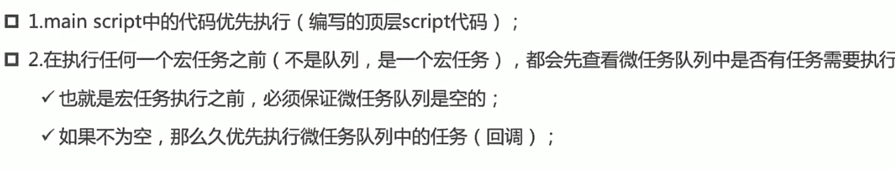

#### 宏任务marcotask

Ajax、setTimeout、setInterval、DOM监听、UI Rendering

#### 微任务microtask

Promise的then回调、Mutation Observer APi、queueMicrotask() 


### 浏览器是多进程和JavaScript单线程的理解

浏览器是多进程的，每打开一个tab页就会开启一个进程，这是为了防止一个页面卡死而导致所有页面未响应。

每个进程有多个线程，其中包括执行JavaScript代码的线程。意味着JavaScript代码同一时间只能做一个事情。

### Promise

#### Promise出现的原因

- 处理多个异步请求，回调函数嵌套回调函数，代码变得难以阅读和维护。
- 不同人编写异步代码的格式不一样，需要一个统一的规范。

```js
let fs = require('fs')

fs.readFile('./name.txt','utf8',function(err,data){
  fs.readFile(data, 'utf8',function(err,data){
    fs.readFile(data,'utf8',function(err,data){
      console.log(data);
    })
  })
})
```

```js
let fs = require('fs')

function read(filename) {
  return new Promise((resolve, reject) => {
    fs.readFile(filename, 'utf8', (err, data) => {
      if (err) reject(err);
      resolve(data);
    })
  })
}

read('./name.txt').then((data)=>{
  return read(data) 
}).then((data)=>{
  return read(data)  
}).then((data)=>{
    console.log(data);
},err=>{
    console.log(err);
})
```

#### Promise解决的问题

-  Promise 将嵌套调用改为链式调用，增加了可阅读性和可维护性。
- Promise 解决的是异步编码风格的问题。
- 解决并发异步(同一时刻内获取并发的结果);
- 链式调用

#### Promise的缺点

- 无法取消Promise，一旦新建它就会立即执行，无法中途取消。
- 如果不设置回调函数，Promise内部抛出的错误，不会反应到外部。
- 当处于Pending状态时，无法得知目前进展到哪一个阶段（刚刚开始还是即将完成）。
- Promise 真正执行回调的时候，定义 Promise 那部分实际上已经走完了，所以 Promise 的报错堆栈上下文不太友好。

#### Promise的规范

Promise的规范为Promise/A+规范

Promise是规范，业界的实现Promise的库有bluebird、Q、ES6-Promise

#### Promise的状态

- （待定）pending：初始状态，既没有兑现，也没有拒绝。当执行了Promise函数中代码
- （已兑现）fulfilled：操作成功完成 。当执行了reslove时，处于该状态，Promise已经被兑现。
- （已拒绝）rejected：操作失败。当执行了reject时，处于该状态，Promise已经被拒绝。

Promise只能从一个状态->另一个状态。因此先调用了resolve，reject就无法调用。

#### resolve不同值的区别

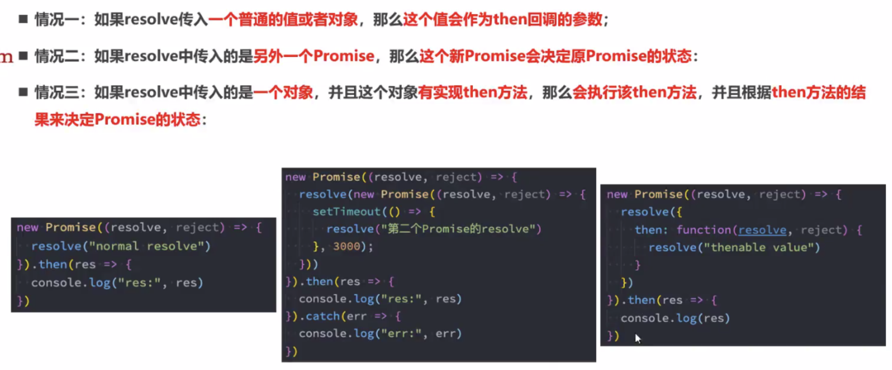

#### Executor

是创建Promise时需要传入的回调函数，回调函数会立即执行，并且传入两个参数。在Executor中确定Promise的状态

#### then函数的返回值

`promise.then().catch()`then函数放回值是promise对象，因此可以进行链式调用。

`return "bbbbbbb"`实际返回的是一个promise对象。

```js
new Promise((resolove,reject)=>{
	resolove("bbbbbbb")
})
```


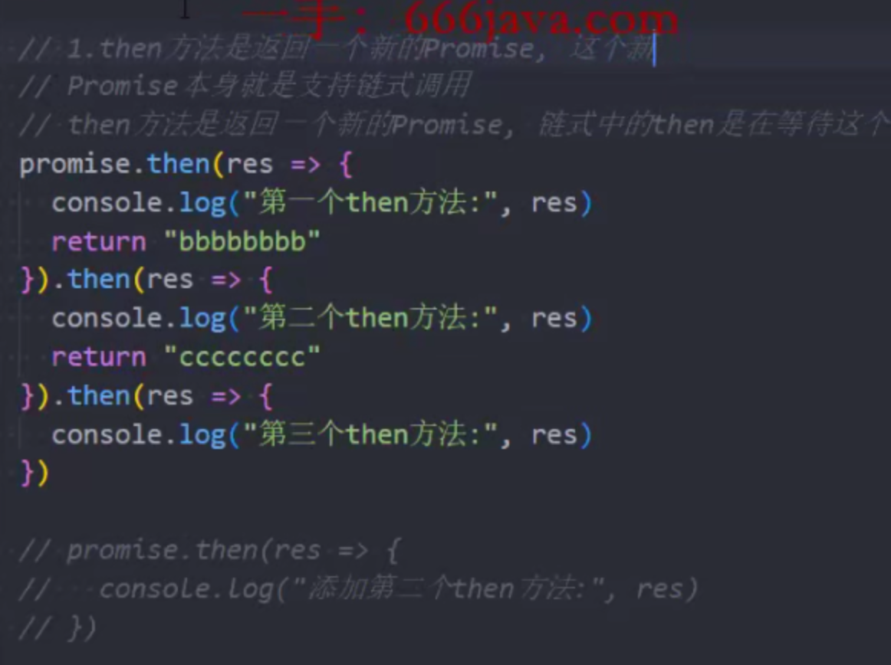

#### finally

 无论是fulfilled还是rejected，finally都会被执行。

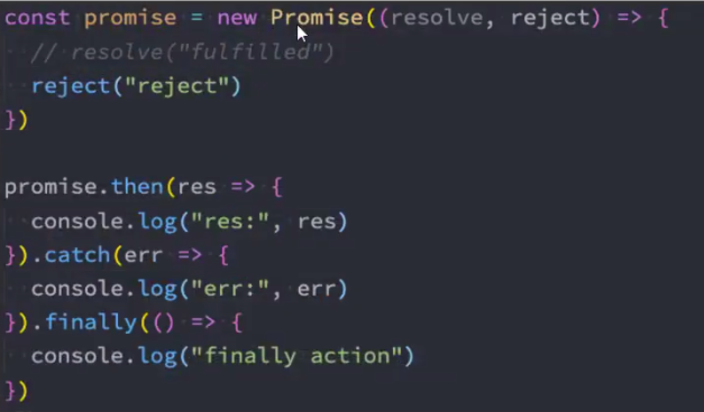

#### resolve方法

then、catch、finally都是promise实例方法，存储在Promise.protoType上。而resolve是类方法，存储在Promise这个构造函数本身上面。

```js
Promise.resolve("hello world").then(res=>console.log(res))
```

#### reject方法

和resolve方法对应。

#### all方法

将多个promise包裹起来形成一个新的promise，新的promise状态由所有promise共同决定。

- 当所有promise状态成为fulfilled状态，新的promise状态为fulfilled，并且将返回值组成一个数组。
- 当一个promis状态rejected，新的promise状态为rejected，并且将第一个reject的返回值作为参数。


#### allSettled

会等到Promise所有都有结果，无论是fulfilled，还是rejected，才有最终状态。并且这个新的Promise结果一定是fulfilled。

## 


#### race

 表示多个promise竞赛，谁先有结果，就用谁的结果。


#### any  

等到有一个fulfilled结果。如果所有promise都是rejected状态，那么就会调用catch方法。


#### promise中断

```js
			function wrap(promise) {
				// 在这里包装一个 promise，可以控制原来的promise是成功还是失败
				let abort;
				let newPromise = new Promise((resolve, reject) => {
					// defer 方法
					abort = reject;
				});
				let p = Promise.race([promise, newPromise]); // 任何一个先成功或者失败 就可以获取到结果
				p.abort = abort;
				return p;
			}

			const promise = new Promise((resolve, reject) => {
				setTimeout(() => {
					// 模拟的接口调用 ajax 肯定有超时设置
					resolve("成功");
				}, 4000);
			});

			let newPromise = wrap(promise);

			setTimeout(() => {
				// 超过3秒 就算超时 应该让 proimise 走到失败态
				newPromise.abort("超时了");
			}, 3000);

			newPromise
				.then((data) => {
					console.log("成功的结果" + data);
				})
				.catch((e) => {
					console.log("失败的结果" + e);
				});
```

#### promisify

promisify 是把一个 node 中的 api 转换成 promise 的写法。

```js
const promisify = (fn) => { // 典型的高阶函数 参数是函数 返回值是函数 
  return (...args)=>{
    return new Promise((resolve,reject)=>{
      fn(...args,function (err,data) { // node中的回调函数的参数 第一个永远是error
        if(err) return reject(err);
        resolve(data);
      })
    });
  }
}


const promisifyAll = (target) =>{
  Reflect.ownKeys(target).forEach(key=>{
    if(typeof target[key] === 'function'){
      // 默认会将原有的方法 全部增加一个 Async 后缀 变成 promise 写法
      target[key+'Async'] = promisify(target[key]);
    }
  });
  return target;
}

const fs = require('fs')
const util = require('util')
// 将 fs.readFile() 转换为一个接受相同参数但返回 Promise 的函数。
const readFile = util.promisify(fs.readFile)
// 现在可以将 readFile() 与 await 一起使用！
const buf = await readFile('./package.json')
const obj = JSON.parse(buf.toString('utf8'))
console.log(obj.name) // 'Example'
```


### Proxy

ES6中新增了Proxy类，用于创建代理的。监听一个对象的相关操作，可以创建一个代理对象，对对象的操作，都是由代理对象完成的。如何想监听某些具体的操作，可以在handler中添加对应的捕捉器。

#### set和get捕捉器

```js
			let obj = {
				name: "huyong",
				age: 18,
			};
			let objProxy = new Proxy(obj, {
				set: function (target, key, newValue, proxy) {
					console.log(`监听到${key}属性的设置值:`, newValue);
					target[key] = newValue;
				},
				get: function (target, key, proxy) {
					console.log(`监听到${key}属性的获取:`, target[key]);
					return target[key];
				},
			});
			console.log(objProxy["name"]);
			objProxy["name"] = "mayuying";
			console.log(objProxy["name"]);
```

共有13个捕捉器，其中has、get、set和deleteProperty、apply、construct用的较多。

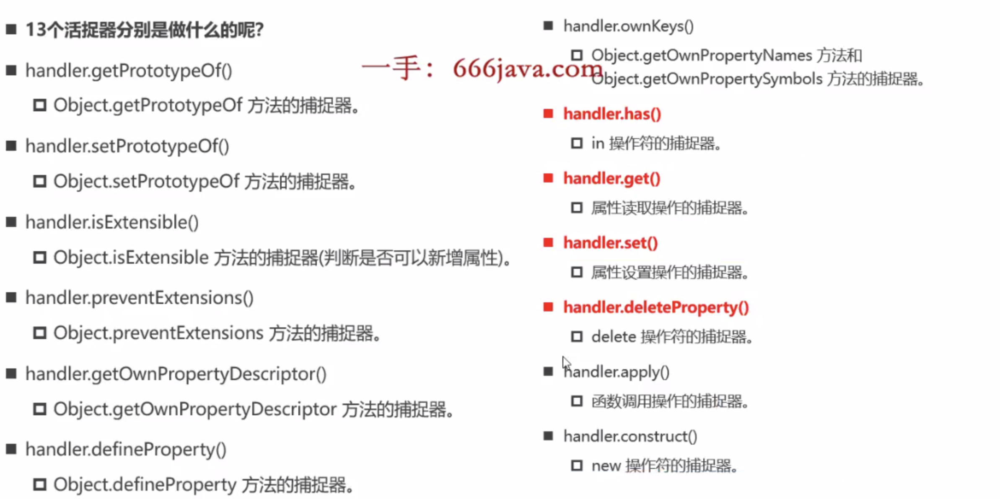

### Reflect

Reflect是ES6新增的一个api，本身就是一个对象。和Math一样，本身就是一个对象。

Reflect提供了操作JavaScript对象的方法，像Object中操作对象的方法。

例如：Reflect.getPrototypeOf(target)类似Object.getPrototypeOf()，Reflect.defineProperty(obj, key,attributes) 类似Object.defineProperty()

为什么有Object还需要Reflect？

早期ECMA规范中没有考虑到对对象本身的操作如何设计会更加规范，所以将这些Api放到Object上面，但是Object作为构造函数，这些操作放在它身上并不合适。

好处：

- 有些方法在严格模式不能使用，比如说`delete`
- Reflect方法有返回值，知道这次操作是否成功。

Reflect有13个方法，和Proxy是对应的。

VUE3中Proxy代理中，一般实用贴Reflect完成对应操作。


Reflect能够调用Person构造函数，创建一个Student对象。


### Object.defineProperty

用于给对象添加属性，修改属性，同时可以监听属性的读取和修改，还有是否可以遍历、可写等。 上述总结就是属性的描述对象。

下面是属性描述对象的例子

```js
{
  value: 123,
  writable: false,
  enumerable: true,
  configurable: false,
  get: undefined,
  set: undefined
}
```

- `value`是该属性的属性值，默认为`undefined`。
- `writable`是一个布尔值，表示属性值（`value`）是否可改变
- `enumerable`是一个布尔值，表示该属性是否可遍历。（`for...in`和Object.keys()是否跳过）
- `configurable`是否可以删除目标属性或是否可以再次修改**属性的描述对象**
- `get`
- `set`

`Object.getOwnPropertyDescriptor()`方法可以获取属性描述对象。只能用于对象自身的属性，不能用于继承。

```js
var obj = { p: 'a' };

Object.getOwnPropertyDescriptor(obj, 'p')

// Object { value: "a",
//   writable: true,
//   enumerable: true,
//   configurable: true
// }
```

`Object.defineProperties()` 定义对象多个属性的属性描述对象。

```js
var obj = Object.defineProperties({}, {
  p1: { value: 123, enumerable: true },
  p2: { value: 'abc', enumerable: true },
  p3: { get: function () { return this.p1 + this.p2 },
    enumerable:true,
    configurable:true
  }
});

obj.p1 // 123
obj.p2 // "abc"
obj.p3 // "123abc"

```

地址：https://juejin.cn/post/6844903945966452744

缺点：Object.defineProperty设计初衷就不是为了监听属性，所以很多对属性的操作都无法完成，例如对delete的删除。Vue2中响应式就是使用Object.defineProperty，但是Vue3中使用的是Proxy，Proxy就是为了监听对象而设计的。

### Proxy和defineProperty

**Proxy的优势如下**

- Proxy可以直接监听整个对象而非属性。
- Proxy可以直接监听数组的变化。
- Proxy有13中拦截方法，如`ownKeys、deleteProperty、has` 等是 `Object.defineProperty` 不具备的。
- Proxy返回的是一个新对象，我们可以只操作新的对象达到目的，而`Object.defineProperty`只能遍历对象属性直接修改;
- Proxy做为新标准将受到浏览器产商重点持续的性能优化,也就是传说中的新标准的性能红利。

**Object.defineProperty 的优势如下**

兼容性好，支持 IE9，而 Proxy 的存在浏览器兼容性问题,而且无法用 polyfill 磨平。

**Object.defineProperty 不足在于**：

- `Object.defineProperty` 只能劫持对象的属性,因此我们需要对每个对象的每个属性进行遍历。
- `Object.defineProperty`不能监听数组。是通过重写数据的那7个可以改变数据的方法来对数组进行监听的。
- `Object.defineProperty` 也不能对 `es6` 新产生的 `Map`,`Set` 这些数据结构做出监听。
- `Object.defineProperty`也不能监听新增和删除操作，通过 `Vue.set()`和 `Vue.delete`来实现响应式的。

### for in for of Object.keys

#### for in是遍历（object）键名

`for in ...`只遍历可枚举的属性，包括原型链可枚举的属性。

```js
var obj = {a:1, b:2, c:3};
    
for (let key in obj) {
  console.log(key);
}

// a
// b
// c
```

可以通过hasOwnProperty判断是否在对象上面。或者抛弃for in，用forEach。

#### for of是遍历（array）键值。

`for ...of`可以遍历`Array、Map、Set、String`等迭代对象。

```js
const array1 = ['a', 'b', 'c'];

for (const val of array1) {
  console.log(val);
}

// a
// b
// c
```

#### Object.keys

和`for in`差不多，但是不会遍历原型对象上的属性和Symbol属性。

### Object原型对象常用方法

- Object.keys

```js
// 2. 如果要遍历对象，可与 Object.keys 配合
var person = {
    name: 'June',
    age: 17,
    city: 'guangzhou'
}
for(var key of Object.keys(person)) {
    console.log(person[key]); // June, 17, guangzhou
}

```

- Object.values
- Object.entries

```js
// 3. 配合 entries 输出数组索引和值/对象的键值
var arr = ['a', 'b', 'c'];
for(let [index, value] of Object.entries(arr)) {
    console.log(index, ':', value);
    // 0:a, 1:b, 2:c
}
var obj = {name: 'June', age: 17, city: 'guangzhou'};
for(let [key, value] of Object.entries(obj)) {
    console.log(key, ':', value);
    // name:June,age:17,city:guangzhou
}
```

- Object.assign
- Object.defineProperty
- Object.defineProperties
- Object.create
- Object.assign将所有可枚举属性的值从一个或多个源对象`source`复制到目标对象(浅拷贝)

```js
const target = { a: 1, b: 2 }
const source = { b: 4, c: 5 }

const returnedTarget = Object.assign(target, source)

target // { a: 1, b: 4, c: 5 }
returnedTarget // { a: 1, b: 4, c: 5 }
```

### DOM、BOM

JS由三部分组成ECMAScript、BOM（浏览器对象模型）和DOM（文档对象模型）

BOM的核心是window对象。有location对象、navigator对象、history对象和screen对象。

#### window

- open
- close
- setInterval
- setTimeout

#### history

- 属性：length；历史列表中url数量。
- 方法：back(); 后退。
- 方法：forward(); 前进。
- 方法：go(n); 加载历史列表中某个具体页面。

#### location

- location.href = “目标网址”; 跳转到目标网址
- location.href; 获取窗口url地址
- location.search; 获取地址栏里的url参数信息。(即从 ? 开始的信息)
- location.hash; 获取地址栏的锚点信息。 (#及后面的信息)

#### navigator(浏览器相关信息)

- userAgent
- appVersion

#### screen

- window.screen.height; 屏幕分辨率高
- window.screen.availHeight; 屏幕可用高

### DOM

获取元素

- 根据 ID 获取： document.getElementById('id');
- 根据标签名获取： document.getElementsByTagName('标签名')
- 根据类名返回元素对象集合：document.getElementsByClassName(‘box’)
- document.querySelector('.box')
- document.querySelectorAll('.box')
- 获取html：document.documentElement
- 获取body标签：document.body

获取/操作元素内容

- inner.Text 获取目标标签的内容，但是不能识别标签
- inner.HTML 不仅能获取内容，而且获取其他标签（导致XSS攻击）

```js
box.innerText = '123'+'<br>'+'456';  
// 相当于把目标标签的内容修改为123<br>456
box.innerHTML = '123'+'<br>'+'456';  
// 此时就可以识别出里面的换行语句，输出结果为：132 换行  456 
```

获取/操作元素属性

- `src =目标地址; (可以通过此语句改变目标文件，比如切换图片等)`
- `href = 目标链接; (可以通过该语句改变目标网页);`
- `alt = 目标替换文本; (在图片信息改变的时候，这个同时设置)`
- `title = 目标图片提示信息;（在图片改变的时候，他的提示信息也是改变的）`

操作样式属性 

操作样式属性 

- element.style 行内样式操作
- element.className 类名样式操作

> 1. JS 里面的样式采取驼峰命名法， 比如backgroundColor
> 2. JS 修改 style 样式操作，产生的是**行内样式**，CSS 权重比较高

自定义属性

- element.getAttribute('属性')//自己定义的
- element.setAttribute('属性','值')//主要针对自定义属性
- removeAttribute('属性')

节点操作

- 父节点：node.parentNode  //最近的一个父结点
- 子节点：parentNode.childNodes、parentNode.firstElementChild、parentNode.lastElementChild
- 兄弟节点：
  - 下一个兄弟元素节点:node.nextSibling；node.nextElementSibling
  - 上一个兄弟元素节点:node.previousSibling； node.previousElementSibling
- 创建节点

1. 创建元素：document.createElement("元素名")
2. 添加元素：1.在后面追加：node.appendChild(child)；2.在前面加：node.insertBefore(child, 指定元素)

- 删除节点：node.removeChild(child); //返回删除的节点
- 复制节点：node.cloneNode(true); //复制节点(克隆节点)

> 若括号参数为 true ，则是深度拷贝，会复制节点本身以及里面所有的子节点；若为false,则是浅拷贝，只复制节点本身，不克隆里面的子节点

- 创建节点

1. document.write()

2. element.innerHTML

3. document.createElement()

- 节点常用属性和方法

属性：

attributes：返回一个与该元素相关的所有属性的集合。

classList：返回该元素包含的 class 属性的集合。

className：获取或设置指定元素的 class 属性的值。

clientHeight：获取元素内部的高度，包含内边距，但不包括水平滚动条、边框和外边距。

clientWidth：返回该元素它内部的宽度，包括内边距，但不包括垂直滚动条、边框和外边距。

clientTop：返回该元素距离它上边界的高度。

clientLeft：返回该元素距离它左边界的宽度。

innerHTML：设置或获取 HTML 语法表示的元素的后代。

tagName：返回当前元素的标签名。 `

方法：

element.innerHTML = new html content ：改变元素的 innerHTML
element.attribute = value ：修改属性的值
element.getAttribute() ：返回元素节点的指定属性值。
element.setAttribute(attribute, value) ：设置或改变 HTML 元素的属性值
element.style.property = new style ：改变 HTML 元素的样式

### DOM事件

#### 鼠标事件

1. 单击事件：onclick
2. 双击事件：ondblclick
3. 鼠标移入：onmouseover
4. 鼠标移出：onmouseout
5. 鼠标按下：onmousedown
6. 鼠标抬起：onmouseup

#### 键盘事件

1. 按键按下：onkeydown
2. 按键按下：onkeypress
3. 按键松开：onkeyup

#### 表单事件

1. 获取焦点事件：onfocus
2. 失去焦点事件：onblur
3. 表单元素内容改变事件：onchange
4. 元素获取用户输入事件：oninput

#### 剪贴板事件

1. 拷贝触发：oncopy
2. 剪切触发：oncut
3. 粘贴触发：onpaste

#### 文档加载监听事件

1. DOMContentLoaded：浏览器已完全加载 HTML，并构建了 DOM 树，但像 和样式表之类的外部资源可能尚未加载完成。
2. loaded：浏览器不仅加载完成了 HTML，还加载完成了所有外部资源：图片，样式等。

> 地址：https://juejin.cn/post/6844903623583891469#heading-12

### 浏览器的渲染过程


### HTMLCollection和NodeList

js获取元素节点通常返回都是element对象或一个元素的集合，之所以叫集合，是因为，它不是数组，但是和数组有类似的性质。

元素集合有两种形式

- 只包含元素的**HTMLcollection元素收集器**

> HTMLcollection是动态的，即一但文档结构发生了改变，HTMLcollection就会立即更新

- 包含文本节点的**Nodelist节点列表**

> nodelist一般情况下也是动态，而querySelectAll返回的是静态的nodelist，nodelist通过childNodes返回也是动态的。

返回HTMLcollection的方法

- getElementsByTagName

```js
document.getElementsByTagName('body') instanceof HTMLCollection // true

const htmlCollection = document.getElementsByTagName('body')
console.log(htmlCollection.item(0)) // <body>...</body>
console.log(htmlCollection.length()) // 1
```

返回NodeList的方法

- node.childNodes(动态)
- **querySelectorAll**(静态)

```js
const nodeList = document.querySelectorAll('body')

console.log(nodeList.item(0)) // <body>...</body>
console.log(nodeList.length) // 1
console.log(nodeList.forEach((item) => console.log(item))) // <body>...</body>

for (var key of nodeList.keys()) {
  console.log(nodeList[key]) // <body>...</body>
}

for (var value of nodeList.values()) {
  console.log(value) // <body>...</body>
}

for (var entry of nodeList.entries()) {
  console.log(entry) // [0, body]
}
```

可以将NodeList和HTMLcollection等类数组（Map、Set）转成数组。

- Array.from

```js
const nodeList = document.querySelectorAll('div')
Array.from(nodeList)
```

- ES6

```js
const nodeList = [...document.querySelectorAll('div')]
```

### Node和Element

- `document.getElementById()` 获取到的结果既是 Node 也是 Element。
- Element 一定是 Node，但 Node 不一定是 Element，也可能是文本、空格和换行符。

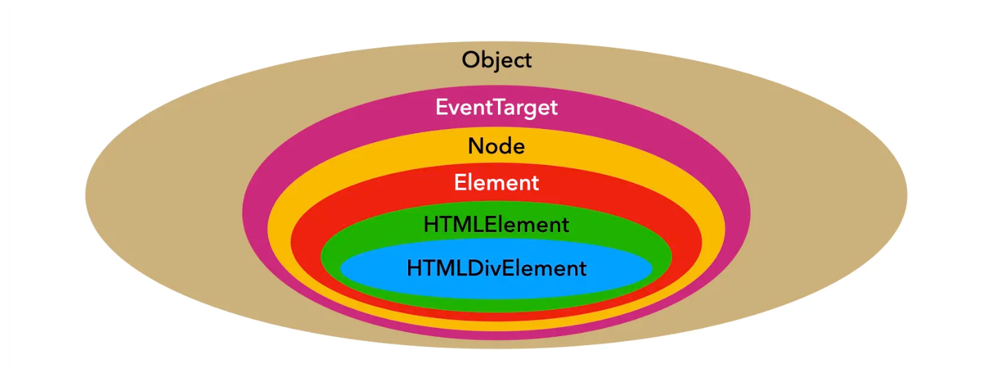


### 数组、字符串、对象、Map、Set、JSON、Math、String常用方法

#### 数组

- Array.map()
- Array.forEach()
- Array.filter()
- Array.every()
- Array.some()
- Array.reduce()

```js
const array1 = [1, 2, 3, 4];

// 0 + 1 + 2 + 3 + 4
const initialValue = 0;
const sumWithInitial = array1.reduce(
  (accumulator, currentValue) => accumulator + currentValue,
  initialValue
);
```

- push
- pop 返回删除的元素
- shift 删除第一个 
- Unshift 添加元素到开头
- Array.isArray()
- Array.concat()

```js
  let arr1 = [1, 2, 3]
  arr2 = [4, 5]
  let arr = arr1.concat(arr2)
  console.log(arr)//[1, 2, 3, 4, 5]
```

- Array.toString()
- Array.join()
- Array.slice(start,end)不改变原数组
- Array.splice(开始位置， 删除的个数，元素)

```js
     let arr = [1, 2, 3, 4, 5];
     let arr1 = arr.splice(2, 0 'haha')
     let arr2 = arr.splice(2, 3)
     let arr1 = arr.splice(2, 1 'haha')
     console.log(arr1) //[1, 2, 'haha', 3, 4, 5]新增一个元素
     console.log(arr2) //[1, 2] 删除三个元素
     console.log(arr3) //[1, 2, 'haha', 4, 5] 替换一个元素
```

- Array.from(可迭代对象)
- Array.sort((a,b)=>return a-b)

#### JSON

- JSON.stringify
- JSON.parse

#### String

String.valueOf

String.padStart()/padEnd()

```js
   a = a.padStart(maxLength , 0);//"0009007199254740991"
   b = b.padStart(maxLength , 0);//"1234567899999999999"
```

#### 类型转换

字符串：

tostring()
String()
toFixed()

数字：

Number()
[parseInt](https://so.csdn.net/so/search?q=parseInt&spm=1001.2101.3001.7020)()
parseFloat()

Boolean：

[Boolean](https://so.csdn.net/so/search?q=Boolean&spm=1001.2101.3001.7020)()

#### Math

- `Math.abs()` 返回绝对值

- `Math.ceil(),Math.floor()` 向上取整和向下取整

- `Math.max(),Math.min()` 最大值和最小值

- `Math.round()` 四舍五入

- `Math.random()` 随机数

- `Math.pow()` 指数运算

- `Math.sqrt()` 平方根

- `Math.log()` 自然对数

- `Math.exp()` e的指数
- `Math.max`
- `Math.min`

### 浅拷贝和深拷贝

#### 浅拷贝的实现方式

- `Object.assign()`
- es6展开运算符
- 通过循环遍历
- lodash.clone方法

#### 深拷贝的实现方式

- `JSON.parse(Son.stringify(obj))`
  - 无法拷贝undefind等属性
  - 无法拷贝引用类型Set、Map和函数
- 递归深拷贝
  - 解决循环引用
  - 解决函数拷贝

```js
			function deepClone(obj, map = new Map()) {
				if (typeof obj !== "object" || obj === null) {
					return obj;
				}
				const target = Array.isArray(obj) ? [] : {};
				if (map.get(obj)) {
					return map.get(obj);
				}
				map.set(obj, target);
				for (const key in obj) {
					if (Object.prototype.hasOwnProperty.call(obj, key)) {
						if (typeof obj[key] === "object") {
							target[key] = deepClone(obj[key], map);
						} else if (typeof obj[key] === "function") {
							target[key] = new Function("return " + obj[key].toString())();
							map.set(obj[key], target[key]);
						} else {
							target[key] = obj[key];
						}
					}
				}
				return target;
			}
```

### 设计模式

### 0.1+0.2!==0.3

#### 二进制->十进制


#### 十进制整数->二进制

> 除2取余，逆序排列


#### 十进制小数->二进制

> 乘2取整，顺序排列

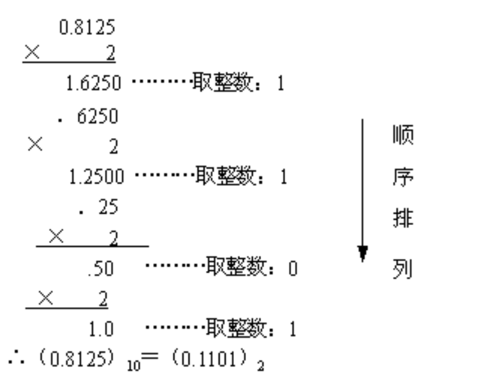

0.1转成二进制的结果：0.0001100110011001...(无限循环)

0.2转成二进制的结果：0.0011001100110011...(无限循环)

但是由于IEEE 754尾数位数限制，需要将后面多余的位截掉。在这个过程中进度就有损失。

#### 为什么**x=0.1 能得到 0.1？**

标准中规定尾数f的固定长度是52位，再加上省略的一位，这53位是JS精度范围。它最大可以表示2^53(9007199254740992), 长度是 16，所以可以使用 toPrecision(16) 来做精度运算。

0.1取16精度刚好是0.1。

#### 为什么0.1+0.2!=0.3

0.1+0.2最后的结果是:0.0100110011001100110011001100110011001100110011001100，结果转换成十进制之后就是0.30000000000000004。

**精度损失可能出现在进制转化和对阶运算过程中**

#### 解决办法

1. 将数字转成整数（但是对大数支持不好）

```js
function add(num1, num2) {
 const num1Digits = (num1.toString().split('.')[1] || '').length;
 const num2Digits = (num2.toString().split('.')[1] || '').length;
 const baseNum = Math.pow(10, Math.max(num1Digits, num2Digits));
 return (num1 * baseNum + num2 * baseNum) / baseNum;
}
```

2. 使用前端第三方库（Math.js）
3. 交给后端处理

> 地址：https://juejin.cn/post/684490368036215195

### JS MAX_VALUE MAX_SAFE_INTEGER

> 地址：http://www.paradeto.com/2020/05/28/js-max-value/

### JS大数相加

```js
let a = "9007199254740991";
let b = "1234567899999999999";

function add(a ,b){
   //取两个数字的最大长度
   let maxLength = Math.max(a.length, b.length);
   //用0去补齐长度
   a = a.padStart(maxLength , 0);//"0009007199254740991"
   b = b.padStart(maxLength , 0);//"1234567899999999999"
   //定义加法过程中需要用到的变量
   let t = 0;
   let f = 0;   //"进位"
   let sum = "";
   for(let i=maxLength-1 ; i>=0 ; i--){
      t = parseInt(a[i]) + parseInt(b[i]) + f;
      f = Math.floor(t/10);
      sum = t%10 + sum;
   }
   if(f == 1){
      sum = "1" + sum;
   }
   return sum;
}
```

### 高阶函数

> 参数或是返回值为函数的函数称为高阶函数

```js
function f1(a, b) {
  return a + b;
}
function f2(a, b, fn) {
  let value = fn(a,b);
  return function() {
    console.log(value);
  }
}
let f3 = f2(1, 2, f1);
```

### 函数柯里化

将接收多个参数的函数，转成接收部分参数，并且返回能够接受余下参数的函数的函数。

手写柯里化转换函数

```js
			// 将fn函数进行柯里化
			function curry(fn) {
				return function curryRecursion(...args) {
					if (args.length < fn.length) {
						return (...secondArgs) => {
							return curryRecursion(...args, ...secondArgs);
						};
					}
					return fn(...args);
				};
			}

			function sum(a, b, c) {
				return a + b + c;
			}
			let sumCurry = curry(sum);
			console.log(sumCurry(1, 2)(3));
```

作用：

- 参数复用：一个函数的一个参数保持不变，且作为基准值继续使用，可以将传入基准值的函数固定下来。比如说正则表达式的检验。

```js
function check(reg, txt) {
    return reg.test(txt)
}
check(/\d+/g, 'test')       //false
check(/[a-z]+/g, 'test')    //true
// Currying 后
function curryingCheck(reg) {
    return function(txt) {
        return reg.test(txt)
    }
}
var hasNumber = curryingCheck(/\d+/g)
var hasLetter = curryingCheck(/[a-z]+/g)
hasNumber('test1')      // true
hasNumber('testtest')   // false
hasLetter('21212')      // fal
```

- 延迟执行。等到所有参数传入才执行，我们平时用的bind函数。

```js
     Function.prototype.bind = function (obj, ...args1) {

         const func1 = (...args2) => {
             this.call(obj, ...args1, ...args2)
         }

         return func1;

     }
```

### 手写call、apply、bind

bind绑定的this不能再次绑定，根本原因是箭头函数this的绑定不可以改变。箭头函数的this取决于外层作用域的this。

```
			Function.prototype.call = function (obj, ...args) {
				if (obj === undefined || obj === null) {
					obj = window;
				}
				obj.tempFn = this;
				let result = obj.tempFn(...args);
				delete obj.tempFn;
				return result;
			};
			
			Function.prototype.apply = function (obj, args) {
				if (obj === undefined || obj === null) {
					obj = window;
				}
				obj.tempFn = this;
				let result = obj.tempFn(...args);
				delete obj.tempFn;
				return result;
			};
			
			Function.prototype.bind = function (obj, ...args1) {
				const fn = (...args2) => {
					return this.call(obj, ...args1, ...args2);
				};
				return fn;
			};
```

### 防抖和节流

#### 防抖

在事件被触发的n秒中，如果再次触发该事件，则重新计时。

应用

- 防止浏览器窗口大小resize调用过于频繁，导致浏览器的重绘和回流。
- 防止某些按钮被频繁的点击。

```js
			const debounce = (fn, delay) => {
				let timer = null;
				return (...args) => {
					clearTimeout(timer);
					timer = setTimeout(() => {
						fn.apply(this, args);
					}, delay);
				};
			};
```

#### 节流

规定n秒钟，事件只能触发一次。

应用

- 滚动加载，加载更多或滚到底部监听
- 谷歌搜索框，搜索联想功能

```js
			function throttle(fn, delay) {
				let timer = null;
				return (...args) => {
					if (!timer) {
						timer = setTimeout(() => {
							fn.apply(this, args);
							timer = null;
						}, delay);
					}
				};
			}
```

### 如何检测数据类型

#### js数据类型

- 基本数据类型：boolean、string、number、null、undefined、Symbol
- 引用数据类型：Object、Array、Set、Map、Function

#### js检测数据类型

- **typeof**  console.log(typeof 1)
  - 对于基本数据类型，除了null，均能返回正确的结果。
  
  - 对于引用类型，除了function，均返回Object
  
- instance 判断是否是对象的实例。

- constructor

```js
 function Person() {

}

const person = new Person()
  console.log(person.constructor === Person)
```

- Array.isArray
- toString方法

```js
Object.prototype.toString.call('') ;  // [object String]
Object.prototype.toString.call(1) ;   // [object Number]
Object.prototype.toString.call(true) ;// [object Boolean]
Object.prototype.toString.call(Symbol());//[object Symbol]
Object.prototype.toString.call(undefined) ;// [object Undefined]
Object.prototype.toString.call(null) ;// [object Null]
Object.prototype.toString.call(newFunction()) ;// [object Function]
Object.prototype.toString.call(newDate()) ;// [object Date]
Object.prototype.toString.call([]) ;// [object Array]
Object.prototype.toString.call(newRegExp()) ;// [object RegExp]
Object.prototype.toString.call(newError()) ;// [object Error]
Object.prototype.toString.call(document) ;// [object HTMLDocument]
Object.prototype.toString.call(window) ;//[object global] window 是全局对象 global 的引用
```

判断6中数据类型，又能准确区分数据类型function、array、object

```js
			//区分6中基本数据类型，同时又能区分Array、Object、Function
			var superTypeof = function (val) {
				const ans = typeof val;
				if (val === "object") {
					if (val === null) {
						ans = "null";
					} else if (Array.isArray(ans)) {
						ans = "array";
					}
				}
				return ans;
			};
```


### lodash

Lodash是一个高性能的 JavaScript 实用工具库。

#### 手写get方法

```js
function get(obj, path, defaultVal = undefined) {
				let newPath = [];
				if (Array.isArray(path)) {
					newPath = path;
				} else {
					newPath = path.replace(/\[(\d+)\]/g, ".$1").split(".");
				}
				return (
					newPath.reduce((obj, key) => {
						console.log(obj, key);
						return (obj || {})[key];
					}, obj) || defaultVal
				);
			}
			var object = { a: [{ b: { c: 3 } }] };
			console.log(get(object, ["a", 0, "b"]));
			console.log(get(object, "a[0].b.c"));
			console.log(get(object, "a[0].b.c.d"));
```

地址：https://fe-interview.wangxiaokai.vip/writing/lodash-get

地址：https://blog.csdn.net/RedaTao/article/details/108119230

### 去重

- ES6 Set  去重

```js
function unique (arr) {
  return Array.from(new Set(arr))
}
```

- indexOf 去重

```js
function unique(arr) {
    if (!Array.isArray(arr)) {
        console.log('type error!')
        return
    }
    var array = [];
    for (var i = 0; i < arr.length; i++) {
        if (array .indexOf(arr[i]) === -1) {
            array .push(arr[i])
        }
    }
    return array;
}
```

- sort去重

```js
function unique(arr) {
    if (!Array.isArray(arr)) {
        console.log('type error!')
        return;
    }
    arr = arr.sort()
    var arrry= [arr[0]];
    for (var i = 1; i < arr.length; i++) {
        if (arr[i] !== arr[i-1]) {
            arrry.push(arr[i]);
        }
    }
    return arrry;
}
```

- 对象去重

```js
function unique(arr) {
    if (!Array.isArray(arr)) {
        console.log('type error!')
        return
    }
    var arrry= [];
     var  obj = {};
    for (var i = 0; i < arr.length; i++) {
        if (!obj[arr[i]]) {
            arrry.push(arr[i])
            obj[arr[i]] = 1
        } else {
            obj[arr[i]]++
        }
    }
    return arrry;
}
```

- filter()+indexOf()

```js
function removeDuplicate(arr) {
  return arr.filter((item, index) => {
    return arr.indexOf(item) === index
  })
}

const result = removeDuplicate(arr)
console.log(result) // [ 1, 2, 'abc', true, false, undefined ]
```

- Map()

```js
function removeDuplicate(arr) {
  const map = new Map()
  const newArr = []

  arr.forEach(item => {
    if (!map.has(item)) { // has()用于判断map是否包为item的属性值
      map.set(item, true) // 使用set()将item设置到map中，并设置其属性值为true
      newArr.push(item)
    }
  })

  return newArr
}

const result = removeDuplicate(arr)
console.log(result) // [ 1, 2, 'abc', true, false, undefined, NaN ]
```

- 利用两层循环+数组的splice方法

```js
function removeDuplicate(arr) {
  let len = arr.length
  for (let i = 0; i < len; i++) {
    for (let j = i + 1; j < len; j++) {
      if (arr[i] === arr[j]) {
        arr.splice(j, 1)
        len-- // 减少循环次数提高性能
        j-- // 保证j的值自加后不变
      }
    }
  }
  return arr
}

const result = removeDuplicate(arr)
console.log(result) // [ 1, 2, 'abc', true, false, undefined, NaN, NaN ]
```


> 地址：https://segmentfault.com/a/1190000016418021

### 扁平化

> 数组扁平化就是把多维数组转化成一维数组

- es6提供的新方法 flat(depth)

```js
let a = [1,[2,3,[4,[5]]]];  
a.flat(4-1); // [1,2,3,4,5]  a是4维数组
```

其实还有一种更简单的办法，无需知道数组的维度，直接将目标数组变成1维数组。 depth的值设置为Infinity。

```js
let a = [1,[2,3,[4,[5]]]];  
a.flat(Infinity); // [1,2,3,4,5]  a是4维数组
```

- for循环

```js
var arr1 = [1, 2, 3, [1, 2, 3, 4, [2, 3, 4]]];
  function flatten(arr) {
    var res = [];
    for (let i = 0, length = arr.length; i < length; i++) {
      if (Array.isArray(arr[i])) {
        res = res.concat(flatten(arr[i])); //concat 并不会改变原数组
      //res.push(...flatten(arr[i])); //扩展运算符  
      } else {
        res.push(arr[i]);
      }
    }
    return res;
  }
  flatten(arr1); //[1, 2, 3, 1, 2, 3, 4, 2, 3, 4]
```

- while循环

```js
 var arr1 = [1, 2, [3], [1, 2, 3, [4, [2, 3, 4]]]];
 function flatten(arr) {
      while (arr.some(item => Array.isArray(item))) {
        arr = [].concat(...arr);
        //arr = Array.prototype.concat.apply([],arr);
      }
      return arr;
    }
    flatten(arr1); //[1, 2, 3, 1, 2, 3, 4, 2, 3, 4]
```

- reduce

```js
 var arr1 = [1, 2, [3], [1, 2, 3, [4, [2, 3, 4]]]];
 function flatten(arr) {
      return arr.reduce((res,next) =>{
        return res.concat(Array.isArray(next)? flatten(next) : next);
      },[]);
    }
```

- 使用 stack 无限反嵌套多层嵌套数组

```js
  var arr1 = [1, 2, [3], [1, 2, 3, [4, [2, 3, 4]]]];
  function flatten(input) {
      const stack = [...input]; //保证不会破坏原数组
      const result = [];
      while (stack.length) {
        const first = stack.shift();
        if (Array.isArray(first)) {
          stack.unshift(...first);
        } else {
          result.push(first);
        }
      }
      return result;
    }
    flatten(arr1); //[1, 2, 3, 1, 2, 3, 4, 2, 3, 4]
```

- 如果数组的项全为数字，可以使用join()，toString()

```js
 function flatten(input) {
  return input.toString().split(',').map(item => +item);
  // return input.join().split(',').map(item => +item);
  // return input.join(',').split(',').map(item => +item);
}
flatten(arr1); //[1, 2, 3, 1, 2, 3, 4, 2, 3, 4]
```

### toString和valueOf和**[Symbol.toPrimitive]**

- toString和valueOf都是操作符隐式转换被调用

- toString返回对象的字符串，当对象期望的字符串方式被引用，自动调用。判断数据类型非常好用。
- valueOf返回当前对象的原始值，和toString存在自动调用和重写方法。
- 两者并存，在**数值**运算中，优先调用了`valueOf`，**字符串**运算中，优先调用了`toString`

- [Symbol.toPrimitive]同`valueOf()`和`toString()`一样，但是**优先级要高于这两者**；

```js
class A {
    constructor(count) {
        this.count = count
    }
    valueOf() {
        return 2
    }
    toString() {
        return '哈哈哈'
    }
    // 我在这里
    [Symbol.toPrimitive](hint) {
        if (hint == "number") {
            return 10;
        }
        if (hint == "string") {
            return "Hello Libai";
        }
        return true;
    }
}

const a = new A(10)

console.log(`${a}`)     // 'Hello Libai' => (hint == "string")
console.log(String(a))  // 'Hello Libai' => (hint == "string")
console.log(+a)         // 10            => (hint == "number")
console.log(a * 20)     // 200           => (hint == "number")
console.log(a / 20)     // 0.5           => (hint == "number")
console.log(Number(a))  // 10            => (hint == "number")
console.log(a + '22')   // 'true22'      => (hint == "default")
console.log(a == 10)     // false        => (hint == "default")
```

#### **a===1&&a===2&&a===3 为 true**

```js
class A {
    constructor(value) {
        this.value = value;
    }
    valueOf() {
        return this.value++;
    }
}
const a = new A(1);
if (a == 1 && a == 2 && a == 3) {
    console.log("Hi Libai!");
}
```

```js
let value = 1;
Object.defineProperty(window, 'a', {
    get() {
        return value++
    }
})
if (a === 1 && a === 2 && a === 3) {
    console.log("Hi Libai!")
}
```

#### **实现一个无限累加函数**

```js
add(1); // 1
add(1)(2);  // 3
add(1)(2)(3)； // 6
add(1)(2)(3)(4)； // 10 

// 以此类推
function add(a) {
    function sum(b) { // 使用闭包
        a = b ? a + b : a; // 累加
        return sum;
    }
    sum.toString = function() { // 只在最后一次调用
        return a;
    }
    return sum; // 返回一个函数
}

add(1)              // 1
add(1)(2)           // 3
add(1)(2)(3)        // 6
add(1)(2)(3)(4)     // 10 
```

柯里化

```js
function add () {
    let args = [...arguments];
    let fn = function(){
        return add.apply(null, args.concat([...arguments]))
    } 
    fn.toString = () => args.reduce((a, b) => a + b)
    return fn;
}
```

地址：https://cloud.tencent.com/developer/article/1768047

### new的过程和手写

过程：

1. 创建一个新的对象
2. 继承父类原型上的方法.
3. 添加父类的属性到新的对象上并初始化. 保存方法的执行结果.
4. 如果执行结果有返回值并且是一个对象, 返回执行的结果, 否则, 返回新创建的对象。

```js
function _new(obj, ...rest){
  // 基于obj的原型创建一个新的对象
  const newObj = Object.create(obj.prototype);

  // 添加属性到新创建的newObj上, 并获取obj函数执行的结果.
  const result = obj.apply(newObj, rest);

  // 如果执行结果有返回值并且是一个对象, 返回执行的结果, 否则, 返回新创建的对象
  return typeof result === 'object' ? result : newObj;
}
```

> 地址：https://juejin.cn/post/6844903937405878280

### Object.create过程和手写

```js
			Object.mycreate = function (proto, properties) {
				function F() {}
				F.prototype = proto;
				let res = new F();
				if (properties) {
					Object.defineProperties(res, properties);
				}
				return res;
			};
```

### Object.create()、new Object()和{}的区别

- 字面量和`new`关键字创建的对象是`Object`的实例，原型指向`Object.prototype`，继承内置对象`Object`
- `Object.create(arg, pro)`创建的对象的原型取决于`arg`，`arg`为`null`，新对象是空对象，没有原型，不继承任何对象；`arg`为指定对象，新对象的原型指向指定对象，继承指定对象

地址：https://juejin.cn/post/6844903917835436045

### instanceOf手写

```js
function myInstanceof(target, origin) {
    // 非object直接返回false
    if(typeof target !== 'object' || target === null) return false;
    
    var proto = Object.getPrototypeOf(target);
    while (proto) {
      if (proto === origin.prototype) {
        return true
      }
      proto = Object.getPrototypeOf(proto);
    }
    return false
}

作者：前端小然子
链接：https://juejin.cn/post/6844903988924514318
来源：稀土掘金
著作权归作者所有。商业转载请联系作者获得授权，非商业转载请注明出处。
```

原始值：

```js
const primitive = trye => {
  return class {
    static [Symbol.hasInstance](value) {
      return typeof value === trye
    }
  }
}
const primitiveString = primitive('string')
const primitiveNumber = primitive('number')
console.log('123' instanceof primitiveString)
console.log(123 instanceof primitiveNumber)

作者：前端小然子
链接：https://juejin.cn/post/6844903988924514318
来源：稀土掘金
著作权归作者所有。商业转载请联系作者获得授权，非商业转载请注明出处。
```

理解 Symbol.hasInstance https://www.cnblogs.com/waitforyou/p/7080591.html

### 箭头函数this指向

定义**该函数时所在的作用域指向的对象**，而不是使用时所在的作用域指向的对象。

```js
		var A = {
				name: "A",
				sayHello: function () {
					var s = () => console.log(this.name);
					return s; //返回箭头函数s
				},
			};

			var B = {
				name: "B",
			};

			var sayHello = A.sayHello();
			sayHello(); // 输出A
```

```js
var A = {
  name: "A",
  sayHello: function () {
    var s = () => console.log(this.name);
    return s; //返回箭头函数s
  },
};

var B = {
  name: "B",
};

var sayHello = A.sayHello.call(B);
sayHello(); // 输出B
```


### js监听事件 (addEventListener()) 和普通事件( onclick() )的区别

- addEventListener() 允许给一个事件注册多个监听器。
- addEventListener对任何DOM元素都是有效的，而不仅仅只对 HTML 元素有效。
- addEventListener注册的事件可以通过 [`removeEventListener`](https://link.juejin.cn/?target=https%3A%2F%2Fdeveloper.mozilla.org%2Fzh-CN%2Fdocs%2FWeb%2FAPI%2FEventTarget%2FremoveEventListener)来移除。
- addEventListener `this` 的值是触发事件的元素的引用
- addEventListener 能够控制`listener` 的触发阶段（可以选择捕获或者冒泡）

```js
window.addEventListener('click', function() {
console.log('4. You click window');
}, true);默认是事件冒泡，**true是事件捕获**。
```

- onclick会替换掉这个元素上所有已存在的onclick事件，其他on事件也是类似的。
- onclick无法精细控制冒泡与否等
- onclick移除可通过直接将onclick事件替换为null
- onclick无法精细控制冒泡与否等

addEventListener

```js
	document.getElementById("div1").addEventListener("click", function (event) {
				console.log(event);
				console.log(this);
			});
//PointerEvent {isTrusted: true, pointerId: 1, width: 1, height: 1, pressure: 0, …}
//<div id="div1">按钮</div>
```

```js
			document.getElementById("div1").addEventListener("click", (event) => {
				console.log(event);
				console.log(this);
			});
//PointerEvent {isTrusted: true, pointerId: 1, width: 1, height: 1, pressure: 0, …}
// Window
```

onclick用法

```js
		<div onclick="sayHello()">按钮</div>
		<script>
			function sayHello(event) {
				console.log(event)
      	console.log(this)
			}
			//undefined
			//Window {window: Window, self: Window, document: document, name: '', location: Location, …}
		</script>
```

```js
		<div onclick="sayHello()" id="div1">按钮</div>
		<script>
			document.getElementById("div1").onclick = function (event) {
				console.log(this);
				console.log(event);
			};
			//<div onclick="sayHello()" id="div1">按钮</div>
 			//PointerEvent
		</script>
```

### DOM事件流

> 页面接受事件的顺序

种类：

- 事件冒泡**（主流）（默认）**

  事件在具体的元素发生后，会逐步向父级传播。

- 事件捕获

  事件捕获和事件冒泡完全相反。一个事件发生后，父元素更早接受到事件，逐步向具体子集元素传播。

> DOM事件流的三个阶段
>
> - 事件**捕获阶段**
>
>   >  默认是事件冒泡，**true是事件捕获**。
>   >
>   >  ```javascript
>   >  window.addEventListener('click', function() {
>   >  console.log('4. You click window');
>   >  }, true);
>   >  ```
>
> - 处于**目标阶段**
>
> - 事件冒泡阶段（阻止事件冒泡）
>
>   > ```javascript
>   > button.addEventListener('click', function(event) {
>   > // event为事件对象
>   > console.log('1. You click Button');
>   > event.stopPropagation(); 阻止事件冒泡
>   > console.log('Stop Propagation!');
>   > }, false);
>   > ```

地址：https://www.jianshu.com/p/b47537da0cf5

### event.target和this的区别

- this 指向绑定事件的对象
- e.target 指向触发事件的对象
- js中事件是会冒泡的，所以this是可以变化的，指向绑定这个事件的对象；但event.target不会变化，它永远是直接触发事件的DOM元素。

### 事件冒泡的作用

> `事件委托`也称为`事件代理`。就是利用`事件冒泡`，把子元素的事件都绑定到父元素上。如果子元素阻止了事件冒泡，那么委托就无法实现

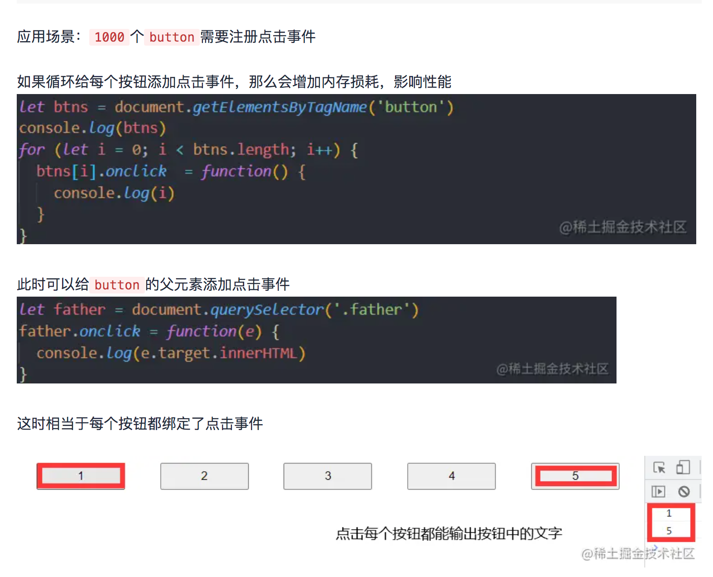

地址：https://juejin.cn/post/7192584563799883832#heading-2


### offset(偏移量) client(可视区) scroll(滚动)

**offset：**

- offsetParent()获取带有定位的父级元素
- offsetTop()返回相对于带有定位父元素上边框的偏移量
- offsetLeft()返回相对于带有定位父元素左边框的偏移量
- offsetWidth()返回边界宽度，包括边框、padding、内容 只读
- offsetHeight()返回边界长度，包括边框、padding、内容 只读

**client：**

- clientTop 返回上边框大小
- clientLeft 返回左边框大小
- clientWidth 返回不包括边框的宽度
- clientHeight 返回不包括边框的长度

**scroll：**

- scrollHeight:内容真正的大小，超出盒子的也算，而clientHeight  offsetHeight都是盒子的大小
- scrollWidth:同理
- ScrollTop：元素滚动过程中超出盒子的上度
- ScrollLeft:   同理

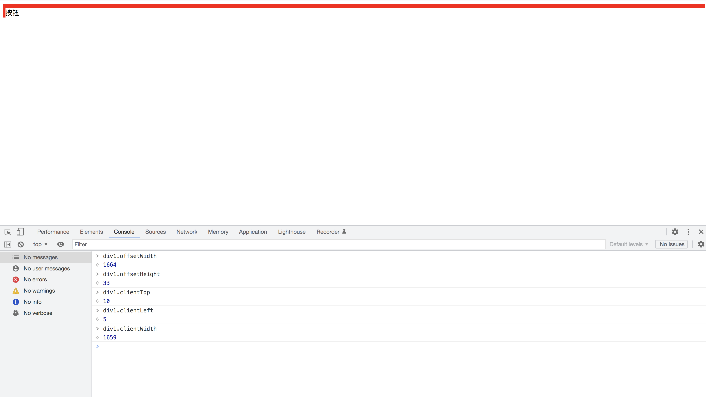

### null和undefined ==为true

> 在《JavaScript高级程序设计》(第三版)中是这么写的：
> *实际上undefined值是派生自null值的，因此ECMA-262规定对他们的相等性测试要返回true*

### Object.is()和==和===区别

Object.is也是严格相等。

```js
+0 === -0 //true
NaN === NaN // false

Object.is(+0, -0) // false
Object.is(NaN, NaN) // true
```

### 判断NaN

1. window.isNaN/Number.isNaN

```js
function  judgeNaN (value) {
         return (typeof value) === 'number' && window.isNaN(value);
}
```

2. console.log(a!==a) 如果a为NaN，ture
3. Object.is(NaN, NaN)

### 如何实现多线程

JS 是单线程模型，即所有代码都在主线程中执行的。如果某些任务计算量较大，将阻塞主线程，UI 界面轻则掉帧、重则卡死。

```js
// 在任意网页控制台执行以下代码，页面将卡住 3s
function execTask() {
    const t = performance.now()
    // 模拟耗时任务
    while(performance.now() - t < 3000){}
}
execTask()
```

通过Web Worker可以实现多线程。

### Web Worker（HTML5新标准）

JavaScript 引擎与 GUI 渲染线程是互斥的，如果 JavaScript 引擎执行了一些计算密集型或高延迟的任务，那么会导致 GUI 渲染线程被阻塞或拖慢。

1. 请说明 Web Worker 的作用？

> JavaScript是单线程模型，所有的任务都只能在一个线程上完成，一次只能做一件事情。 Web Worker的作用就是为JavaScript创建多线程环境，允许主线程创建Worker线程，将一些任务分配给后者运行，两者互不干扰。等到Worker线程完成计算任务，再把结果返回给主线程。
>
> **优点：一些计算密集型或高延迟的任务，被Worker线程负担了，主线程（通常负责UI交互）就会很流畅，不会被阻塞或拖慢。**
>
> **注意：Worker一旦新建成功，就会始终运行，不会被主线程的活动（比如按钮点击等）打断。有利于随时响应主线程的通讯，但是Worker比较耗费资源，不应该过度使用，一旦使用应该关闭**

1. 如何创建一个 Web Worker？

> 地址：https://cloud.tencent.com/developer/article/1891031

1. Web Worker 和主线程之间如何通信？

通过消息通信。通信过程中以拷贝的方式发送二进制数据。

1. Web Worker 可以访问哪些资源？

> - [`XMLHttpRequest`](https://link.segmentfault.com/?enc=fM%2BeOoei1B%2BEgUJ9642Ieg%3D%3D.hq4zHvcLSUXEPdIVC%2BddlmF4%2Btph4tJAGCVmDEdyNBhemEeDQRdaEkj0Yo1oUcvrXuQbj5rlp8gfhZ6%2FkqsbGw%3D%3D)
> - [应用缓存](https://link.segmentfault.com/?enc=U3djHvuTrWv9Fy6Sc72Qzg%3D%3D.NlpqI0xp%2BjFkWlrBLqLLTjhxSEWOc7yfVJZRJP9HOIRuyLIil4%2FVQAraX3gh%2BUvGkct4g%2FHAFiufoWSwO8BgFDZIALjznwQ2rF2%2B%2BcV0Flg%3D)
> - 创建其他网络工作者
> - [`navigator`](https://link.segmentfault.com/?enc=wvkuswdDMDewSAim%2FY1YZw%3D%3D.tcvkSEaBUdA4ghYE3gyuWCEFqWsnSoSo4CF7A7A4hZCSU2n07PTMWUBfqIrlGyzGWl1Jlfju7nSPN%2FOtaX1kgg%3D%3D) 对象
> - [`location`](https://link.segmentfault.com/?enc=oI%2FXAxtR0kBpT9hyu2enXA%3D%3D.wWXvk6XnhJhkbFlSmwNr4mXLyqmFsAIBLvB9fm405MzcQixeqey63Bm%2FXwUMP0Qc3ygMyJnjwKum5Zb7WleNQw%3D%3D) 对象
> - [`setTimeout`](https://link.segmentfault.com/?enc=mC%2F4LAl3UjVHbgjLUwerUA%3D%3D.%2FjhbMLGp6axVdP6ARGGRIcqE6fjCfXt4ayf4GBCWHyNnYxesa5D8DjeJ7oEZHmOo16SCyTurc7%2FgT9PcqEEUrKFI7TGkiU6Z1TDza2q2Lh8wqQx0tIiRR17MK%2B%2FzvMtw) 方法
> - [`clearTimeout`](https://link.segmentfault.com/?enc=sd9ZRqs7KOZyG3UEnt1SoA%3D%3D.UUWrd4wC4GVGyyCXUNIifTxkWf87c6P1M%2BRLNp8qVJH7Q0sjGyKkazVJ46LfSj12jPbpQ7QaTgi1V5Gap3A4Mg2LU4YyERN0XBxlguQFhA3e4b%2BjfdacMfhuKm3G%2FwYb) 方法
> - [`setInterval`](https://link.segmentfault.com/?enc=t%2FdGV16Un%2BjeR%2FLwJufpWw%3D%3D.IHASPw8ee0lklutPm9RFHPvcTUd3IOJ0dmyI9EwR5tF1XAJOH%2BWsYp%2BohU3V%2BrAPIdJ%2BMMsJoABqCALG7tIIe4gpaJeEWQYUymCZKYRXndrteV6njlex0GLWQxKukD7T) 方法
> - [`clearInterval`](https://link.segmentfault.com/?enc=oU2CYso9OdIuB7XvChKQfQ%3D%3D.bP%2BPY%2FBQ6XG89PnVPe6P62nCvOCrwTT%2BR%2BAiRUqKotzN%2B4Uj4mGBADx%2FwfxxLoZiBqtGdBl4rrq3mrqCOuuNCjFmzgnJ2iKalzb6VnUQd6K%2BVGVigRaH2Sr5mveoTD50) 方法
> - [`Performance`](https://link.segmentfault.com/?enc=6WMc%2Fr5wsLAPsmsbpf0ppw%3D%3D.pu8eEem5RH8Cek9acVScA%2FPDWBtyil7SYoTMBZTQb%2B6Y0h6Mvd9XQZV%2BZi6dO6xkn%2B%2Fo1RlRCCV6ftNlHGVMEg%3D%3D) object ( `mark` , `measure` , `now` methods: [*`caniuse?`*](https://link.segmentfault.com/?enc=PeCrCyg3iAy1ao96KcsGmQ%3D%3D.h0P7XFCclnZvRxWLYwvToK%2B8azNCtiljdTdTPzmjYZ61JVkHxYkZ%2BMi4JSN61UN6) )
> - [`IndexedDB`](https://link.segmentfault.com/?enc=syt3SWmuZJjaWYlvqnohTA%3D%3D.rR4zUpKZUzH8wD6pYSQa0InWayA62nXLllzBsDgWfXd%2Ft3hPENf2SKHHARQUGDFN88PB%2BfWB6vkvYh2AY4fBNQ%3D%3D) API（参见： [*`caniuse?`*](https://link.segmentfault.com/?enc=t1UyOMAaZC2rmUINyY755A%3D%3D.8vxHLusDvSjVNpLepVsIypHKKXFeKw1hn52CYkE8KHUNcR3dFqaY0iFlG%2BdsR%2BN4) ）
> - [`importScripts`](https://link.segmentfault.com/?enc=MESpkonitLLLMDhYoK9fIQ%3D%3D.bjPFy7rvV0f4H8n6GZkKj64josms2BemEaCa%2Fb4jcSTNZtyRgxDSWyBuzt6igOmKX9qHpJzn53v9pu4ujlbDAY7COmY%2FOXOV5hw2QdlB3hDLadl0U9K2z3P6rW2V%2B%2BFQ) 方法
> - [`JSON`](https://link.segmentfault.com/?enc=IDjqRBkTpZzsVNbOiuV54g%3D%3D.%2B2kK%2Bma%2BGpG04KSVAsYca9JrCTyX2S4UJlIA8FIzNaFDcndJ99dDivdHkhnMdghIhbUCoi%2FbzB6TQb4KZsA603BqA7C91vnh3A4i%2FY5Ie8kXUVAP%2F4sTLt1ZJAf3Xqmw)
> - [`Worker`](https://link.segmentfault.com/?enc=arx%2BJsq2Cgfqyal6n1QMAA%3D%3D.6p9OqqRGgYwy%2Fp5PKH0dmp%2FkEgJAbaaLOBzKND%2Bbwcq%2B%2F1vND9N35dO2LToptjx%2BsvhErzuB0b3yJMpSgXMCOQ%3D%3D)

1. Web Worker 的限制是什么(不能访问localStorage）？

（1） 同源限制：分配给Worker线程运行的脚本文件，必须与主线程的脚本文件同源

   (2)   DOM限制：Worker线程所在的全局对象，与主线程的不一样，无法读取主线程所在的网页的DOM对象，也无法使用document、windown、parent这些对象。但是，Worker线程可以获取navigator和location对象。

(3) 通信联系：Worker线程和主线程不在同一个上下文环境，它们不能直接通信，必须通过消息完成。

（4） 脚本限制：Worker线程不能执行`alert()`和`confirm()`，但可以使用XMLHttpRequest对象发出Ajax请求

(5) 文件限制：Worker线程无法读取本地文件，即不能打开本机的文件系统 (file://)，它所加载的脚本，必须来自网络。（由于 Web Worker 有同源限制，所以在进行本地调试或运行以下示例的时候，需要先启动本地服务器，直接使用 `file://` 协议打开页面的时候，会抛出以下异常。）

> 地址：https://segmentfault.com/q/1010000043017519

Worker全局方法

```js
-   self.name： Worker 的名字。该属性只读，由构造函数指定。
-   self.onmessage：指定`message`事件的监听函数。
-   self.onmessageerror：指定 messageerror 事件的监听函数。发送的数据无法序列化成字符串时，会触发这个事件。
-   self.close()：关闭 Worker 线程。
-   self.postMessage()：向产生这个 Worker 线程发送消息。
-   self.importScripts()：加载 JS 脚本。
```

地址：https://cloud.tencent.com/developer/article/1891031

### WebWorker种类

Web Workers 的分类：**Dedicated Worker、Shared Worker 和Service Workers**

[Web Worker](https://link.segmentfault.com/?enc=6T2TQxHdgqFpiSky9zLodA%3D%3D.FzNWAe2UmHN0yZmXyrP2naAoGuEOqTW9qVREsjcMwCU%3D) 规范中定义了两类工作线程，分别是专用线程 Dedicated Worker 和共享线程 Shared Worker

#### 专用线程 Dedicated Worker 

一个专用 Worker 仅仅能被生成它的脚本所使用。

#### 共享Shared Worker（常用于页面通信）

一个共享 Worker 是一种特殊类型的 Worker，可以被多个浏览上下文访问，比如多个 windows，iframes 和 workers，但这些浏览上下文必须同源。

当前我们用到的是shared worker，shared worker是webworker的一种，由同源的所有页面共享。 shared worker普通 Worker 区别：

1、 同一个js脚本会创建一个 sharedWorker，其他页面再使用同样的脚本创建sharedWorker，会复用已创建的 worker，这个worker由几个页面共享，顾名思义叫shared worker。

2、 sharedWorker通过port来发送和接收消息

### Service Wroker（主要是PWA使用)

Service workers 本质上充当 Web 应用程序与浏览器之间的代理服务器,拦截网络请求并基于网络是否可用以及更新的资源是否驻留在服务器上来采取适当的动作。

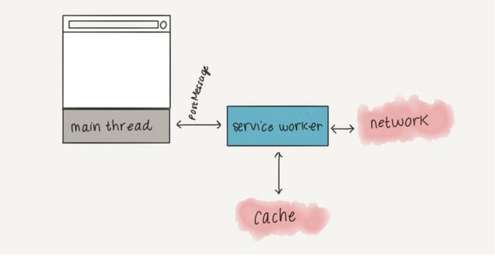

地址：https://segmentfault.com/a/1190000023011282

地址：https://juejin.cn/post/7064486575916187656#heading-5

### 线程和进程

进程是资源分配的最小单位，线程是CPU调度的最小单位。

可以认为启动程序，就是默认启动一个进程，每一个进程都会启动一个线程执行代码，称为主线程。可以认为进程是线程的容器。

进程是一个工厂，它有独立的资源，线程是工厂中的工人，多个工人协作完成任务，工人之间共享工厂内的资源，比如工厂内的食堂或餐厅。

### src引入资源，加协议和不加协议的区别

缺省协议的时候，默认使用访问页面url中的协议。

好处：

1. 省略自己字节。
2. 全站升级到https的时候，省去很多麻烦。

地址：https://www.zhihu.com/question/67961957

### url、src、href


### setTimeout 不准时

### option使用

### 判断字符串为数字

### 常见网络攻击

#### XSS跨站脚本攻击

攻击者在`web`页面恶意插入`HTML`或`script`标签，当用户浏览该页面时，恶意代码就会被执行，从而达到攻击的目的。dom的属性innerHTML就会导致XSS攻击。

反射型:

1.攻击者构造出特殊的 URL，其中包含恶意代码（多作为参数出现）

2.用户打开带有恶意代码的 URL 时，网站服务端将恶意代码从 URL 中取出，拼接在 HTML 中返回给浏览器

3.用户浏览器接收到响应后解析执行，混在其中的恶意代码也被执行

存储型:

1.攻击者将恶意代码提交到目标网站的数据库中

2.用户打开目标网站时，网站服务端将恶意代码从数据库取出，拼接在 HTML 中返回给浏览器

3.用户浏览器接收到响应后解析执行，混在其中的恶意代码也被执行

4.恶意代码窃取用户数据并发送到攻击者的网站，或者冒充用户的行为，调用目标网站接口执行攻击者指定的操作
DOM-Based型（前端的事情不涉及后端）

1.攻击者构造出特殊的 URL，其中包含恶意代码

2.用户打开带有恶意代码的 URL

3.用户浏览器接收到响应后解析执行，前端 JavaScript 取出 URL 中的恶意代码并执行

4.恶意代码窃取用户数据并发送到攻击者的网站，或者冒充用户的行为，调用目标网站接口执行攻击者指定的操作

#### xss危害

- 盗取网页浏览中的`cookie`值，盗用`cookie`实现无密码登录，盗取用户信息。
- 劫持访问，实现恶意跳转。
- 配合CSRF攻击完成恶意请求。

#### xss防范

1. 对输入的参数进行过滤。标签过滤，如`<script>`、``、`<a>`标签等
2. Cookie设置HTTPonly

#### CSRF攻击（跨站请求伪造）

> 顾名思义就是通过伪造连接请求，在用户不知情的情况下，让用户以自己的身份来完成非本意操作的攻击方法。`CSRF`利用的是**网站对浏览器的信任**。

用户`C`浏览并登录信任网站`A`,产生`cookie`

用户`C`未退出网站`A`，在同一个浏览器危险访问网站`B`

网站`B`的页面存有一些攻击性的代码，会发出访问`A`的请求

浏览器收到请求后，在用户不知情的情况下携带`cookie`访问网站`A`

`A`不知道请求是谁发的，浏览器会带上用户的`cookie`，所以`A`会根据用户的权限处理`B`发出的请求。这样就达到了攻击的目的。


#### CSRF攻击防范

- 验证码：对敏感操作加入验证码，强制用户与网站进行交互
- 对`Cookie`设置`SameSite`属性。该属性表示`Cookie`不随着跨域请求发送，可以很大程度减少`CSRF`的攻击，但是该属性目前并不是所有浏览器都兼容。
- 使用`POST`请求，避免使用`GET`，降低攻击风险，`post`请求攻击方需要构造一个`form`表单才可以发起请求，比`get`请求（`img`的`src`，`a`标签的`href`等等）的攻击方式复杂了一些，相对来说能降低风险，但不能阻止。
- 检查`HTTP`中的`referer`字段，该字段记录了`HTTP`请求的来源地址
- 在请求头中加入`token`验证字段，浏览器并不会自动携带`Token`去请求，且`Token`可以携带一段加密的`jwt`用作身份认证，这样进行`CSRF`的时候仅传递了`cookie`，并不能表明用户身份，网站即拒绝攻击请求。
- 在`http`中自定义属性并验证。

#### 点击挟持

ClickJacking点击劫持

当访问某网站时，利用`CSS`将攻击者实际想让你点击的页面进行透明化隐藏，然后在页面后显示 一些东西诱导让你点击，点击后则会在用户毫不知情的情况下做了某些操作，这就是点击劫持`ClickJacking`。
 案例：当我们点击弹窗右上角的`"X"`想关闭弹窗事，跳转到其他页面。

iframe覆盖

第三方网站通过`iframe`内嵌某一个网站，并且将`iframe`设置为透明不可见，将其覆盖在其他经过伪装的`DOM`上，伪装的可点击`DOM`（按钮等）与实际内嵌网站的可点击`DOM`位置相同，当用户点击伪装的`DOM`时，实际上点击的是`iframe`中内嵌的网页的`DOM`从而触发请求操作。

防御：

1. Javascript禁止内嵌：当网页没有被使用iframe内嵌时，top和window是相等的；当网页被内嵌时，top和window是不相等的；可以在本网站的页面中添加如下判断：

```js
<script>
    if (top.location != window.location) {
        //如果不相等，说明使用了iframe，可进行相关的操作
    }
</script>
```

2. 设置`http`响应头`X-FRAME-OPTIONS`是目前最可靠的方法。`X-FRAME-OPTIONS`是微软提出的一个`HTTP`头，专门用来防御利用`iframe`嵌套的点击劫持攻击。

```js
DENY // 禁止内嵌
SAMEORIGIN // 只允许同域名内嵌
ALLOW-FROM // 指定可以内嵌的地址
```

#### Https中间人攻击

中间人攻击(man-in-the-middle attack, abbreviated to MITM)，简单的讲，就是黑客悄悄的躲在通信双方之间，窃听甚至篡改通信信息。而通信双方的对方已经变成中间人了，不是原本的通信对方，但它们并不知道消息已经被截获甚至篡改了。


#### **SQL注入**

> 将查询条件拼接一个恒为真的语句，最终生成一个欺骗服务器的SQL的命令.
>
> ```sql
> String sql = “select * from user_table where username=’ “+userName+” ’ and password=’ “+password+” ‘
> SELECT * FROM user_table WHERE username=’’or 1 = 1 –- and password=’’
> -- 后面是注释
> ```
>
> 解决办法：使用预编译手段,绑定参数，Java中jdbc就实现了该功能.

**HTTP劫持**

> 在用户浏览器和目标服务器之间建立的网络数据传输通道中的任何环节，比如，网关，防火墙等，发生的恶意劫持。从而在用户浏览器上展示了广告或其他内容（常见插入iframe）
>
> 解决方案：HTTPS

**半连接攻击**（DOS攻击）

> 客户端和服务端进行两次握手后,不发送第三次确认包.导致服务器白白的浪费内存资源和CPU
>
> - 网关超时设置
>
>   > 防火墙计数器到时，还没收到第3次握手包，则往服务器发送RST包，以使服务器从对列中删除该半连接。
>
> - SYN网关
>
>   > SYN网关以客户端名义给服务器发第3次握手包。 这会增加连接队列数目，一般服务器所承受的连接数量比半连接数量大得多。可以减轻SYN攻击。
>
> - SYN代理
>
>   > SYN代理不转发SYN包，而是以服务器名字主动回复SYN/ACK包给客户。SYN代理代替了服务器去处理SYN攻击，此时要求过滤网关自身有很强的防范SYN攻击能力。

**全连接攻击**

>客户端仅仅“连接”到服务器，然后再也不发送任何数据，直到服务器超时处理或者耗尽服务器的处理进程。
>
>为何不发送任何数据呢？ 因为一旦发送了数据，服务器检测到数据不合法后就可能断开此次连接；如果不发送数据的话，很多服务器只能阻塞在recv或者read调用上。
>
>半连接攻击是耗尽全局的内存；全连接攻击耗尽的是主机的处理进程和连接数量。

**RST攻击**

> 假设一个合法用户(1.1.1.1)已经同服务器建立的正常的连接，攻击者构造攻击的TCP数据，伪装自己的IP为1.1.1.1，并向服务器发送一个带有RST位的TCP数据包。
>
> TCP收到这样的数据后，认为从1.1.1.1发送的连接有错误，就会清空缓冲区中建立好的连接。
>
> 这时，如果合法用户1.1.1.1再发送合法数据，服务器就已经没有这样的连接了，该用户必须重新开始建立连接。

**IP欺骗**

> ​	IP数据包为伪造的源IP地址，以便冒充其他系统或发件人的身份。

**DNS欺骗**

> ​    攻击者冒充域名服务器的一种欺骗行为。

**DOS攻击、DDOS攻击**

**DOS拒绝服务**(半连接攻击)

> 一种利用TCP协议缺陷，发送大量伪造的TCP连接请求，常用假冒的IP或IP号段发来海量的请求连接的第一个握手包（SYN包），被攻击服务器回应第二个握手包（SYN+ACK包），因为对方是假冒IP，对方永远收不到包且不会回应第三个握手包。 
>
> 塞满TCP等待连接队列，资源耗尽（CPU满负荷或内存不足），让正常的业务请求连接不进来。

**DDOS 分布式拒绝服务**

> 攻击者发起DDoS攻击的第一步，就是**寻找在Internet上有漏洞的主机**，进入系统后在其上面安装后门程序，攻击者入侵的主机越多，他的攻击队伍就越壮大。第二步在**入侵主机上安装攻击程序**，其中一部分主机充当攻击的主控端，一部分主机充当攻击的代理端。最后各部分主机各司其职，在攻击者的调遣下对攻击对象发起攻击。由于攻击者在幕后操纵，所以在攻击时不会受到监控系统的跟踪，身份不容易被发现。

区别：

> DoS攻击，是利用自己的计算机攻击目标，是一对一的关系；而DDoS攻击是在DoS攻击的基础之上，产生的一种新的攻击方式。DDoS攻击，利用控制成百上千台“肉鸡”（傀儡机），组成一个DDoS攻击群，在同一时刻对目标主机发起攻击。

> 地址：https://juejin.cn/post/6981348663298064397#heading-2

### Cookie、Session、Token、JWT

#### Cookie

- **Cookie存储在客户端。**cookie 是服务器发送到用户浏览器并保存在本地的一小块数据，它会在浏览器下次向同一服务器再发起请求时被携带并发送到服务器上。
- **cookie 是不可跨域的**。每个 cookie 都会绑定单一的域名，无法在别的域名下获取使用，**一级域名和二级域名之间是允许共享使用的**（**靠的是 domain）**。

Cookie常用属性


#### Session

- **session 是另一种记录服务器和客户端会话状态的机制**
- **ession 是基于 cookie 实现的，session 存储在服务器端，sessionId 会被存储到客户端的cookie 中**

#### Cookie和Session的区别

**安全性：** Session 比 Cookie 安全，Session 是存储在服务器端的，Cookie 是存储在客户端的。

**存取值的类型不同**：Cookie 只支持存字符串数据，想要设置其他类型的数据，需要将其转换成字符串，Session 可以存任意数据类型。

**有效期不同：** Cookie 可设置为长时间保持，比如我们经常使用的默认登录功能，Session 一般失效时间较短，客户端关闭（默认情况下）或者 Session 超时都会失效。

**存储大小不同：** 单个 Cookie 保存的数据不能超过 4K，Session 可存储数据远高于 Cookie，但是当访问量过多，会占用过多的服务器资源。

#### Token

客户端使用用户名跟密码请求登录

服务端收到请求，去验证用户名与密码

验证成功后，服务端会签发一个 token 并把这个 token 发送给客户端

客户端收到 token 以后，会把它存储起来，比如放在 cookie 里或者 localStorage 里

客户端每次向服务端请求资源的时候需要带着服务端签发的 token

服务端收到请求，然后去验证客户端请求里面带着的 token ，如果验证成功，就向客户端返回请求的数据

用户登录成功后，服务端生成一个随机token给用户，并且在服务端(数据库或缓存)中保存一份token，以后用户再来访问时需携带token，服务端接收到token之后，去数据库或缓存中进行校验token的是否超时、是否合法。

中心化的 redis token / memory session等       

 优点：服务端可以主动让token失效       

 缺点：           1. 依赖内存或redis存储。           

​					2. 分布式系统的话，需要redis查询/接口调用增加系统复杂性。


#### JWT

用户登录成功后，服务端通过jwt生成一个随机token给用户（服务端无需保留token），以后用户再来访问时需携带token，服务端接收到token之后，通过jwt对token进行校验是否超时、是否合法。

 去中心化的JWT token       

 优点：           

1. 去中心化，便于分布式系统使用            

2.  基本信息可以直接放在token中。 username，nickname，role            

3. 功能权限较少的话，可以直接放在token中。用bit位表示用户所具有的功能权限        

   缺点：服务端不能主动让token失效

> https://cnodejs.org/topic/5b0c4a7b8a4f51e140d942fc

> https://blog.csdn.net/weixin_46204056/article/details/123136511

### Cookie、LocalStroage和Sessionage

Cookie是服务器发送到客户端并保存在本地的一小块数据，它会在客户端下次向同一服务器再发起请求时被携带并发送到服务器上。

作用：

比如服务端要想记录用户的状态，就使用response向浏览器发送一个Cookie。客户端浏览器会将这个cookie保存起来。浏览器再次请求服务端时，浏览器会把这个cookie带上。服务端检查这个cookie来获取用户状态。

常用的属性：

- name cookie的名字，Cookie一旦创建，名称便不可更改

- value cookie的值

- domain 可以访问该cookie的域名。如果设置为“.baidu.com”，则所有以“baidu.com”结尾的域名都可以访问该Cookie；第一个字符必须为“.”

- maxAge Cookie失效的时间，单位秒。 正数，则超过maxAge秒之后失效。 负数，该Cookie为临时Cookie，关闭浏览器即失效，浏览器也不会以任何形式保存该Cookie。 为0，表示删除该Cookie。

- isHttpOnly HttpOnly属性是用来限制非HTTP协议程序接口对客户端Cookie进行访问，将取Cookie的操作放到服务端，这样能有效的防止XSS攻击。

  

- localStorage和sessionStorage一样都是用来存储客户端临时信息的对象。
- 他们均只能存储字符串类型的对象（虽然规范中可以存储其他原生类型的对象，但是目前为止没有浏览器对其进行实现）。
- localStorage生命周期是永久，这意味着除非用户显示在浏览器提供的UI上清除localStorage信息，否则这些信息将永远存在。
- sessionStorage生命周期为当前窗口或标签页，一旦窗口或标签页被永久关闭了，那么所有通过sessionStorage存储的数据也就被清空了。
- 不同浏览器无法共享localStorage或sessionStorage中的信息。相同浏览器的不同页面间可以共享相同的 localStorage（页面属于相同域名和端口），但是不同页面或标签页间无法共享sessionStorage的信息。
- 均不与服务器进行通信。


### 缓存


### ES6、ES7等等特性

### HTML5 CSS3 新特性

### 正则表达式

### 迭代器和yield

### Async 和 await

### 设计模式

### mutationObserver queueMicrotask process.nextTick

### webpack如何es6转成es5

### script标签defer

### 提前下载一个图片

### Promise链式调用的优化

### ES6和CommonJS的区别

### unzipstring

### 盛水最多的容器

### 对前端新技术的了解：serverless、微服务、uniapp、nodeJS、跨端、flutter、webassembly等等

### 浏览器渲染流程

#### 浏览器内核

Chrome：统称为Chromium内核或Chrome内核，以前是Webkit内核，现在是Blink内核；

Safari：Webkit内核；

FireFox：Gecko内核

IE：Trident内核

#### 浏览器进程

浏览器最核心的浏览器内核，即渲染引擎，渲染引擎有一个渲染进程。

- GUI渲染线程

GUI 渲染线程负责渲染浏览器界面，解析 HTML，CSS，构建 DOM 树和 RenderObject 树，布局和绘制等。当界面需要重绘（Repaint）或由于某种操作引发回流（Reflow）时，该线程就会执行。

- JavaScript引擎线程

JavaScript 引擎线程负责解析 JavaScript 脚本并运行相关代码。 JavaScript 引擎一直等待着任务队列中任务的到来，然后进行处理，一个Tab页（Renderer 进程）中无论什么时候都只有一个 JavaScript 线程在运行 JavaScript 程序。

需要注意的是，GUI 渲染线程与 JavaScript 引擎线程是互斥的，所以如果 JavaScript 执行的时间过长，这样就会造成页面的渲染不连贯，导致页面渲染被阻塞。

- 事件触发器线程

当一个事件被触发时该线程会把事件添加到待处理队列的队尾，等待 JavaScript 引擎的处理。这些事件可以是当前执行的代码块如定时任务、也可来自浏览器内核的其他线程如鼠标点击、AJAX 异步请求等，但由于 JavaScript 引擎是单线程的，所有这些事件都得排队等待 JavaScript 引擎处理。

- 定时触发器线程

浏览器定时计数器并不是由 JavaScript 引擎计数的，这是因为 JavaScript 引擎是单线程的，如果处于阻塞线程状态就会影响记计时的准确，所以通过单独线程来计时并触发定时是更为合理的方案。我们日常开发中常用的 setInterval 和 setTimeout 就在该线程中。

- Http异步请求线程

在 XMLHttpRequest 在连接后是通过浏览器新开一个线程请求， 将检测到状态变更时，如果设置有回调函数，异步线程就产生状态变更事件放到 JavaScript 引擎的处理队列中等待处理。

### 浏览器渲染流程、重绘、回流

#### 页面渲染的流程


1. 解析HTML，生成**DOM树**，解析CSS，生成**CSSOM树**

> 字节流（编码）->字符串（词法分析）->Token（语法分析）->Node->DOM树/CSSOM树
>
> DOM树生成过程中，一边消耗Token来生成节点对象。
>
> 浏览器确定每个节点的样式是很需要消耗资源的，因为样式可以设置某个节点，也可以通过继承获得，这个过程，需要递归CSSOM树。
>
> CSS匹配HTML元素是一个相当复杂和有性能问题的事情。所以，DOM树要小，CSS尽量用id和class，千万不要过渡层叠下去。

1. 将DOM树和CSSOM树结合，生成**渲染树(Render Tree)**

> 这一过程不是简单的合并。渲染树只会包括需要显示的节点和这些节点的样式信息，如果某个节点是 `display: none` 的，那么就不会在渲染树中显示。

1. 根据生成的渲染树，进行回流(Layout)，得到节点的几何信息（位置，大小）
2. 根据渲染树以及回流得到的几何信息，得到节点的绝对像素
3. 将像素发送给GPU，最后通过调用操作系统Native GUI的API绘制，展示在页面上。

浏览器渲染的过程需要JS文件怎么处理？

渲染过程中，如果遇到`<script>`就停止渲染，执行 JS 代码。因为浏览器有**GUI渲染线程**与**JS引擎线程**，为了防止渲染出现不可预期的结果，这**两个线程是互斥的关系**。JavaScript的加载、解析与执行会`阻塞DOM的构建`，也就是说，在构建DOM时，HTML解析器若遇到了JavaScript，那么它会暂停构建DOM，将控制权移交给JavaScript引擎，等JavaScript引擎运行完毕，浏览器再从中断的地方恢复DOM构建。

如果你想首屏渲染的越快，就越不应该在首屏就加载 JS 文件，这也是都建议将 script 标签放在 body 标签底部的原因。当然在当下，并不是说 script 标签必须放在底部，因为你可以给 script 标签添加 `defer(延迟)` 或者 `async(异步)` 属性

**JS文件不只是阻塞DOM的构建，它会导致CSSOM也阻塞DOM的构建。**

原本DOM和CSSOM的构建是互不影响，井水不犯河水，但是一旦引入了JavaScript，CSSOM也开始阻塞DOM的构建，只有CSSOM构建完毕后，DOM再恢复DOM构建。

这是因为JavaScript不只是可以改DOM，它还可以更改样式，也就是它可以更改CSSOM。因为不完整的CSSOM是无法使用的，如果JavaScript想访问CSSOM并更改它，那么在执行JavaScript时，必须要能拿到完整的CSSOM。所以就导致了一个现象，如果浏览器尚未完成CSSOM的下载和构建，而我们却想在此时运行脚本，那么浏览器将延迟脚本执行和DOM构建，直至其完成CSSOM的下载和构建。**也就是说，在这种情况下，浏览器会先下载和构建CSSOM，然后再执行JavaScript，最后在继续构建DOM。**

#### 回流与重绘

回流：通过构造渲染树，我们将可见DOM节点以及它对应的样式结合起来，可是我们还需要计算它们在设备视口(viewport)内的确切位置和大小，这个计算的阶段就是回流。

重绘：过构造渲染树和回流阶段，我们知道了哪些节点是可见的，以及可见节点的样式和具体的几何信息(位置、大小)，那么我们就可以将渲染树的每个节点都转换为屏幕上的实际像素，这个阶段就叫做**重绘节点**。

#### 何时发生回流重绘

回流这一阶段主要是计算节点的位置和几何信息，那么当页面布局和几何信息发生变化的时候，就需要回流

- 页面一开始渲染的时候（这肯定避免不了）
- 浏览器的窗口尺寸变化（因为回流是根据视口的大小来计算元素的位置和大小的）
- 添加或删除可见的DOM元素
- 元素的位置发生变化
- 元素的尺寸发生变化（包括外边距、内边框、边框大小、高度和宽度等）
- 内容发生变化，比如文本变化或图片被另一个不同尺寸的图片所替代。
- 元素字体大小变化
- 激活CSS伪类（例如：:hover）

一些常用且会导致回流的属性和方法：

**因为这些属性要获取到元素最新的位置信息。**

```js
clientWidth、clientHeight、clientTop、clientLeft
offsetWidth、offsetHeight、offsetTop、offsetLeft
scrollWidth、scrollHeight、scrollTop、scrollLeft
scrollIntoView()、scrollIntoViewIfNeeded()
getComputedStyle()
getBoundingClientRect()
scrollTo()
```

**当页面中元素样式的改变并不影响它在文档流中的位置时**（例如：color、background-color、visibility等），浏览器会将新样式赋予给元素并重新绘制它，这个过程重绘而不回流。

**注意：回流一定会触发重绘，而重绘不一定会回流**

#### 性能影响

**回流比重绘的代价要更高。**

有时即使仅仅回流一个单一的元素，它的父元素以及任何跟随它的元素也会产生回流。

#### 浏览器的优化机制

现代浏览器会对频繁的回流或重绘操作进行优化：

浏览器会维护一个队列，把所有引起回流和重绘的操作放入队列中，如果队列中的任务数量或者时间间隔达到一个阈值的，浏览器就会将队列清空，进行一次批处理，**这样可以把多次回流和重绘变成一次**。

当你访问以下属性或方法时，浏览器会立刻清空队列：

```js
clientWidth、clientHeight、clientTop、clientLeft
offsetWidth、offsetHeight、offsetTop、offsetLeft
scrollWidth、scrollHeight、scrollTop、scrollLeft
width、height
getComputedStyle()
getBoundingClientRect()
```

因为队列中可能会有影响到这些属性或方法返回值的操作，即使你希望获取的信息与队列中操作引发的改变无关，浏览器也会强行清空队列，确保你拿到的值是最精确的。

以上属性和方法都需要返回最新的布局信息，因此浏览器不得不清空队列，触发回流重绘来返回正确的值。因此，我们在修改样式的时候，最好避免使用上面列出的属性，他们都会刷新渲染队列。如果要使用它们，最好将值缓存起来。

#### 减少回流和重绘

- 使用 transform 替代 top
- 使用 visibility 替换 display: none ，因为前者只会引起重绘，后者会引发回流（改变了布局）
- 不要把节点的属性值放在一个循环里当成循环里的变量。
- 不要使用 table 布局，可能很小的一个小改动会造成整个 table 的重新布局
- 动画实现的速度的选择，动画速度越快，回流次数越多，也可以选择使用 requestAnimationFrame
- CSS 选择符从右往左匹配查找，避免节点层级过多
- 将频繁重绘或者回流的节点设置为图层，图层能够阻止该节点的渲染行为影响别的节点。比如对于 video 标签来说，浏览器会自动将该节点变为图层。

#### async和defer

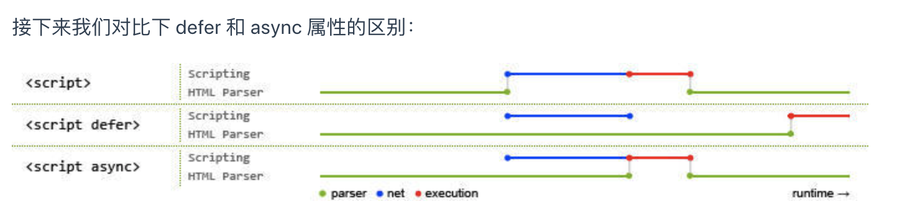

**1）情况1<script src="script.js"></script>**

没有 defer 或 async，浏览器会立即加载并执行指定的脚本，也就是说不等待后续载入的文档元素，读到就加载并执行。

**2）情况2 <script defer src="script.js"></script>(延迟执行)**

defer 属性表示延迟执行引入的 JavaScript，即这段 JavaScript 加载时 HTML 并未停止解析，这两个过程是并行的。整个 document 解析完毕且 defer-script 也加载完成之后（这两件事情的顺序无关），会执行所有由 defer-script 加载的 JavaScript 代码，然后触发 DOMContentLoaded 事件。

**3）情况3<script async src="script.js"></script> (异步下载)**

async 属性表示异步执行引入的 JavaScript，与 defer 的区别在于，如果已经加载好，就会开始执行——无论此刻是 HTML 解析阶段还是 DOMContentLoaded 触发之后。需要注意的是，这种方式加载的 JavaScript 依然会阻塞 load 事件。换句话说，async-script 可能在 DOMContentLoaded 触发之前或之后执行，但一定在 load 触发之前执行。

defer 与相比普通 script，有两点区别：载入 JavaScript 文件时不阻塞 HTML 的解析，执行阶段被放到 HTML 标签解析完成之后。 在加载多个JS脚本的时候，async是无顺序的加载，而defer是有顺序的加载。

https://347830076.github.io/myBlog/javascript/%E6%B5%8F%E8%A7%88%E5%99%A8%E6%B8%B2%E6%9F%93%E5%8E%9F%E7%90%86%E6%B5%81%E7%A8%8B.html#%E5%87%A0%E7%82%B9%E8%A1%A5%E5%85%85%E8%AF%B4%E6%98%8E

### 页面通讯的方式

### 前端性能优化

浏览器：CSS硬件加速、重绘、回流等

使用//，而不是https或http开头，节省字节。

基于上面介绍的浏览器渲染原理，DOM 和 CSSOM 结构构建顺序，初始化可以对页面渲染做些优化，提升页面性能。

- JS优化： `<script>`标签加上 defer属性 和 async属性 用于在不阻塞页面文档解析的前提下，控制脚本的下载和执行。 defer属性： 用于开启新的线程下载脚本文件，并使脚本在文档解析完成后执行。 async属性： HTML5新增属性，用于异步下载脚本文件，下载完毕立即解释执行代码。
- CSS优化：`<link>`标签的 rel属性 中的属性值设置为 preload 能够让你在你的HTML页面中可以指明哪些资源是在页面加载完成后即刻需要的,最优的配置加载顺序，提高渲染性能

浏览器对同一域名下的资源并发下载线程数，chrome为6个。将资源放在不同的域名

> 浏览器对**同一域名**下的下载并发不超过 6 个。超过 6 个的话，剩余的将会在队列中等待，这就是为什么我们要将资源收敛到不同的域名下，也是为了充分利用该机制，最大程度的并发下载所需资源，尽快的完成页面的渲染。
>
> 这里要注意关键词：**同一域名**。如果 n 个不同域名的话，在浏览器设置的最大并发上限以内(默认是10个)，是可以达到 n * 6 个的最大并发的下载的。

https://juejin.cn/post/7058973466610892836

### Fetch和XMLHttpRequest和Ajax

### load和DOMContentLoad

load

> **load** 应该仅用于检测一个完全加载的页面 当一个资源及其依赖资源已完成加载时，将触发load事件。
>
> 当页面 DOM 结构中的 js、css、图片，以及 js 异步加载的 js、css 、图片都加载完成之后，才会触发 load 事件。
>
> - 页面中引用的js 代码如果有异步加载的 js、css、图片，是会影响 load 事件触发的。
> - video、audio、flash 不会影响 load 事件触发。

DOMContentLoaded

> 当初始的 HTML 文档被完全加载和解析完成之后，DOMContentLoaded 事件被触发，而无需等待样式表、图像和子框架的完成加载。
>
> DOMContentLoaded 事件在 **html文档加载完毕，并且 html 所引用的内联 js、以及外链 js 的同步代码都执行完毕后触发**。

> 地址：https://juejin.cn/post/6844903623583891469#heading-12

### 手写消息总线

```js
class EventBus {
    constructor() {
        this.tasks = []
    }

    on(eventName, callback) {
        this.tasks[eventName] = this.tasks[eventName] || []
        this.tasks[eventName].push(callback)
    }

    emit(eventName, ...args) {
        // 如果事件没有注册
        if (!this.tasks[eventName]) {
            return
        }
        this.tasks[eventName].forEach(fn => fn(...args))
    }

    off(eventName, callback) {
        // 如果事件没有注册
        if (!this.tasks[eventName]) {
            return
        }
        this.tasks[eventName] = this.tasks[eventName].filter(fn => fn !== callback)
    }

    once(eventName, callback,) {
        this.tasks[eventName] = this.tasks[eventName] || []
        const onceCallback = (...args) => {
            callback(...args)
            this.off(eventName, onceCallback)
        }
        this.tasks[eventName].push(onceCallback)
    }
}
```

### SPA单页面应用和MPA多页面应用

SPA是单页面应用，是一种网站类型，只有一个主页面。是通过页面动态重写来修改页面的内容，用户始终在同一个主页面上。

MPA是多页面应用，是传统的一个网站模型。

区别：

1. SPA只有一个主页面，多个页面片段；MPA每个页面都是个主页面。
2. 刷新页面时，SPA采用局部刷新，MPA则是整页刷新。
3. SPA SEO不友好（因为爬虫抓取的是静态资源，而SPA内容是通过js生产的，但是爬虫不会执行js代码），MPA有利于SEO。

SPA优缺点

优点：

1. SPA页面页面切换快，流畅，不会重新加载整个页面，用户体验好
2. 有利于前后端分离开发

缺点：

1. 不利于SEO搜索引擎优化
2. 首屏渲染较慢

原理：

监听地址栏的hash变化跳转路由。


### 前端两种路由模式

#### Hash 路由

用#拼接在真实URL后面。当井号 `#` 后面的路径发生变化时，浏览器并不会重新发起请求，而是会触发 `onhashchange` 事件。

获取：location.hash

1. hash变化会触发网页跳转(但是页面不会刷新），即浏览器的前进和后退。
2. `hash` 通过 `window.onhashchange` 的方式，来监听 `hash` 的改变。

优点：

(1) 只需要前端配置路由表, 不需要后端的参与
(2) 兼容性好, 浏览器都能支持
(3) hash值改变不会向后端发送请求, 完全属于前端路由

缺点：

(1) hash值前面需要加#, 不符合url规范,也不美观

#### History 路由

history 是H5新特性。

可以在不刷新页面的前提下动态改变浏览器地址栏中的URL地址，动态修改页面上所显示资源。

由于改变了地址（页面不会刷新），主动刷新时会按照修改后的地址请求后端, **需要后端配置处理, 将地址访问做映射**, 否则会404

在 history 路由中，我们一定会使用`window.history`中的方法，常见的操作有：

- back()：后退到上一个路由；（刷新页面）
- forward()：前进到下一个路由，如果有的话；（刷新页面）
- go(number)：进入到任意一个路由，正数为前进，负数为后退；（刷新页面）
- pushState(obj, title, url)：前进到指定的 URL，不刷新页面；
- replaceState(obj, title, url)：用 url 替换当前的路由，不刷新页面；

优点：

(1)符合url地址规范, 不需要#, 使用起来比较美观

缺点:

(1)在用户手动输入地址或刷新页面时会发起url请求, 后端需要配置index.html页面用户匹配不到静态资源的情况, 否则会出现404错误

(2)兼容性比较差, 是利用了 HTML5 History对象中新增的 pushState() 和 replaceState() 方法,需要特定浏览器的支持.

### 锚点定位及跳转

1. 在href属性写入要跳转元素的id。(url会发生改变，但是不刷新)
2. 在js中通过 `window.location.hash="divId"`(url会发生改变，但是不刷新)
3. 用animate属性，当点击锚点后，页面滚动到相应的跳转元素。（url不发生改变）
4. js的srollIntoView方法。

```js
document.getElementById("divId").scrollIntoView();

比如：

document.querySelector("#roll1").onclick = function(){
      document.querySelector("#roll1_top").scrollIntoView(true);
}  
```

### Blob


### 提前下载图片到内存


### 下划线转驼峰


### 图片懒加载原理

### Cookie跨域

### node nexttick

### node 事件循环


### fetch和axios和xhr（XMLHttpRequest）


### mixi

### postcss常用插件、Webpack常用plugin load

### 性能优化

### class实际

ES6 class实际就是构造函数的语法糖。

- ES6添加实例属性是通过constructor方法，相当于构造函数通过this添加属性。
- ES6添加方法，相当于给构造函数的原型对象添加方法。
- ES6的静态方法和属性，相当于直接给构造函数添加方法和属性，因为构造函数其实也是对象。
- ES6继承是通过extends关键字，而ES5直接构造函数是通过组合继承或寄生组合继承来实现继承的。(我认为ES6class关键字本质就是寄生组合继承的语法糖)
- ES6extends关键字，可以继承父类的静态方法。其实就是子类的构造函数`__proto__`指向父类的构造函数。
- ES6 class 不支持多继承。

```js
function Cat(name){
Animal.call(this);
this.name = name || 'Tom';
}
Cat.prototype = new Animal();

// 感谢 @学无止境c 的提醒，组合继承也是需要修复构造函数指向的。

Cat.prototype.constructor = Cat;

// Test Code
var cat = new Cat();
console.log(cat.name);
console.log(cat.sleep());
console.log(cat instanceof Animal); // true
console.log(cat instanceof Cat); // true

function Cat(name){
Animal.call(this);
this.name = name || 'Tom';
}
(function(){
// 创建一个没有实例方法的类
var Super = function(){};
Super.prototype = Animal.prototype;
//将实例作为子类的原型
Cat.prototype = new Super();
})();

// Test Code
var cat = new Cat();
console.log(cat.name);
console.log(cat.sleep());
console.log(cat instanceof Animal); // true
console.log(cat instanceof Cat); //true

感谢 @bluedrink 提醒，该实现没有修复constructor。

Cat.prototype.constructor = Cat; // 需要修复下构造函数
```


### instanceof 手写

```js
function myInstanceOf(target, origin) {
  while (target) {
    if (target.__proto__ === origin.protoType) {
      return true;
    }
    target = target.__proto__;
  }
  return false;
}
```

### flat手写

```js
		function flat1(arr) {
				let res = [];
				const flatRecur = (arr) => {
					arr.forEach((item) => {
						if (Array.isArray(item)) {
							flatRecur(item);
						} else {
							res.push(item);
						}
					});
				};
				flatRecur(arr);
				return res;
			}

			function flat2(arr) {
				let res = [];
				arr.forEach((item) => {
					if (Array.isArray(item)) {
						res = res.concat(flat2(item));
					} else {
						res = res.concat(item);
					}
				});
				return res;
			}

			function flat3(arr, dep = 2) {
				let res = [];
				arr.forEach((item) => {
					if (Array.isArray(item) && dep > 1) {
						res = res.concat(flat3(item, dep - 1));
					} else {
						res = res.concat(item);
					}
				});
				return res;
			}
			console.log(flat3([1, [2, 3], [4, [5, [6, [8]]], 7]], 2));
```


### setTimeOut经典循环面试题

1. 使用立即执行函数，setTimeOut内部回调函数使用了外部立即执行函数的i变量，形成闭包，所以保存了立即执行函数的上下文。

```js
for (var i = 0; i < 5; i++) {
  ((i) => {
    setTimeout(() => console.log(i), 5000);
  })(i);
}
```

2. 使用let。let每一次都产生一个块级作用域。

```js
			for (let i = 0; i < 5; i++) {
				setTimeout(() => {
					console.log(i);
				}, 1000);
			}
```

### SetTimeOut不准时

> 不准时原因： JS 引擎会先执行同步的代码之后才会执行异步的代码，如果同步的代码执行时间过久，是会导致异步代码延迟执行的。
>
> 浏览器通过维护一个延迟队列来实现 `setTimeout`，有一个 `ProcessDelayTask` 函数来检查到期的任务然后依次执行。（setTimeout回调函数是按照顺序加入到延迟队列，有可能前一个回调函数定时长，后一个回调函数定时短，但是前一个函数先执行，因为同步代码耗时太长。）
>
> `setTimeout` 不宜用于对于时间精度要求较高的场景，可以用 `requestAnimationFrame `去替代执行。
>
> 解决办法：
>
> - 方案1:补偿时间
>
> ```js
> 			// 定时器
> 			//fun 函数
> 			//speed 间隔时间
> 			function timer(myfun, speed) {
> 				var counter = 1;
> 				var start = new Date().getTime();
> 				function instance() {
> 					myfun();
> 					var ideal = counter * speed,
> 						real = new Date().getTime() - start;
> 					counter++;
> 					var diff = real - ideal;
> 					window.setTimeout(function () {
> 						instance();
> 					}, speed - diff); // 通过系统时间进行修复
> 				}
> 				window.setTimeout(function () {
> 					instance();
> 				}, speed);
> 			}
> 
> 			// 需要定时执行的函数
> 			function printDate() {
> 				console.log(new Date());
> 			}
> 
> 			// 开启定时
> 			timer(printDate, 5000);
> ```
>
> - 方案1:补偿时间
> - 方案2:requestAnimationFrame，理想状态下回调函数执行次数通常是每秒60次（也就是我们所说的60fsp）也就是每16.7ms 执行一次，但是并不一定保证为 16.7 ms。
>
> ```js
> const t = Date.now()
> function mySetTimeout (cb, delay) {
>   let startTime = Date.now()
>   loop()
>   function loop () {
>     if (Date.now() - startTime >= delay) {
>       cb();
>       return;
>     }
>     requestAnimationFrame(loop)
>   }
> }
> mySetTimeout(()=>console.log('mySetTimeout' ,Date.now()-t),2000) //2005
> setTimeout(()=>console.log('SetTimeout' ,Date.now()-t),2000) // 2002
> ```
>
> 方案3:使用WebWorker另开一个线程执行定时器。
>
> ```js
> // index.js
> let count = 0;
> //耗时任务
> setInterval(function(){
>   let i = 0;
>   while(i++ < 100000000);
> }, 0);
> 
> // worker 
> let worker = new Worker('./worker.js')
> 
> // worker.js
> let startTime = new Date().getTime();
> let count = 0;
> setInterval(function(){
>     count++;
>     console.log(count + ' --- ' + (new Date().getTime() - (startTime + count * 1000)));
> }, 1000);
> ```

### commonjs和es6 module

#### commonjs

- Commonjs模块第一次被引用的时候，模块中js代码会被执行一遍。
- Commonjs模块被多次引用，会缓存，最终只加载一次。module对象load属性代表是否被加载。
- Commonjs模块循环引用采用的是深度优先遍历。
- Commonjs加载模块是同步的，在服务端没有问题，因为文件都是保存在本地加载速度非常快。但是在浏览器端就有问题，因为加载如果是同步的会阻塞渲染进程。

下面输出：

1. main
2. aaa
3. ccc
4. ddd
5. eee
6. bbb


#### AMD


#### CMD


### ESmodule


1. 两者的模块导入导出语法不同：commonjs是module.exports，exports导出，require导入；ES6则是export导出，import导入。
2. commonjs是运行时加载模块，ES6是在静态编译期间就确定模块的依赖。
3. ES6在编译期间会将所有import提升到顶部，commonjs不会提升require。
4. commonjs导出的是一个值拷贝，会对加载结果进行缓存，一旦内部再修改这个值，则不会同步到外部。ES6是导出的一个引用，内部修改可以同步到外部。
5. commonjs中顶层的this指向这个模块本身，而ES6中顶层this指向undefined。
6. 两者的循环导入的实现原理不同，commonjs是当模块遇到循环加载时，返回的是当前已经执行的部分的值，而不是代码全部执行后的值，两者可能会有差异。所以，输入变量的时候，必须非常小心。ES6 模块是动态引用，如果使用`import`从一个模块加载变量（即`import foo from 'foo'`），那些变量不会被缓存，而是成为一个指向被加载模块的引用，需要开发者自己保证，真正取值的时候能够取到值。

### 一次发送多个请求

```js
			const delay = function delay(interval) {
				return new Promise((resolve, reject) => {
					setTimeout(() => {
						resolve(interval);
					}, interval);
				});
			};

			const delayErr = function delay(interval) {
				return new Promise((resolve, reject) => {
					setTimeout(() => {
						reject(interval);
					}, interval);
				});
			};

			let tasks = [
				() => {
					return delay(1000);
				},
				() => {
					return delayErr(1003);
				},
				() => {
					return delay(1005);
				},
				() => {
					return delay(1002);
				},
				() => {
					return delay(1004);
				},
				() => {
					return delay(1006);
				},
			];

			function createRequest(tasks, pool) {
				pool = pool || 5;
				let results = [];
				let together = new Array(pool).fill(null);
				let index = 0;
				together = together.map((item, i) => {
					return new Promise((resolve, reject) => {
						const run = function run() {
							if (index >= tasks.length) {
								resolve();
								return;
							}
							console.log(`第${i}个pool 第${index}task`);
							let old_index = index;
							// 从任务池拿任务，由于index是升级作用域的变量，所以多个Promise共享一个index
							//这样可以让一个数组里面的任务一次执行
							let task = tasks[index++];
							task()
								.then((result) => {
									// 将返回的结果放置在results里面，实现请求数据的集中存储。
									results[old_index] = {
										status: "fulfilled",
										value: result,
									};
									// 只有在上一个任务执行成功后才会执行一个异步任务
									run();
								})
								.catch((reason) => {
									results[old_index] = {
										status: "rejected",
										reason: reason,
									};
									run();
								});
						};
						run();
					});
				});
				// 多个promise同时处理，根据pool来限制同一时刻并发请求的个数
				return Promise.all(together).then(() => results);
			}

			createRequest(tasks, 3)
				.then((results) => {
					console.log("success->", results);
				})
				.catch((reason) => {
					console.log("fail->", reason);
				});
```


### 轮播图


### js时间格式化

```js
function dateFormat(fmt, date) {
    let ret;
    const opt = {
        "Y+": date.getFullYear().toString(),        // 年
        "m+": (date.getMonth() + 1).toString(),     // 月
        "d+": date.getDate().toString(),            // 日
        "H+": date.getHours().toString(),           // 时
        "M+": date.getMinutes().toString(),         // 分
        "S+": date.getSeconds().toString()          // 秒
        // 有其他格式化字符需求可以继续添加，必须转化成字符串
    };
    for (let k in opt) {
        ret = new RegExp("(" + k + ")").exec(fmt);
        if (ret) {
            fmt = fmt.replace(ret[1], (ret[1].length == 1) ? (opt[k]) : (opt[k].padStart(ret[1].length, "0")))
        };
    };
    return fmt;
}

let date = new Date()
dateFormat("YYYY-mm-dd HH:MM", date)
```

moment.js

```js
let today = moment().format('YYYY-MM-DD');
moment(new Date()).format('YYYY/MM/DD HH:mm:ss');
```

### requestAnimationFrame和requestIdleCallback

页面是一帧一帧绘制出来的，当每秒绘制的帧数（FPS）达到 60 时，页面是流畅的，小于这个值时，用户会感觉到卡顿。所以均下来一帧分到时间：16ms。

requestAnimationFrame是每一帧都会执行，而requestIdleCallback是每一帧完成其他工作，并且有剩余时间才会执行的，React18 Concurrent Mode就是基于requestIdleCallback实现的。

### setTimeOut和SetImmediate谁先执行

- 如果两者都在主模块中调用，那么执行先后取决于进程性能，也就是随机。

```js
setTimeout(() => {
    console.log('setTimeout');
}, 0);
setImmediate(() => {
    console.log('setImmediate');
})
```

- 如果两者都不在主模块调用（被一个异步操作包裹），那么`setImmediate`的回调永远先执行。

```js
var fs = require('fs')

fs.readFile(__filename, () => {
    setTimeout(() => {
        console.log('timeout');
    }, 0);
    setImmediate(() => {
        console.log('immediate');
    });
});
```

```js
setTimeout(() => {
    setImmediate(() => {
        console.log('setImmediate');
    });
    setTimeout(() => {
        console.log('setTimeout');
    }, 0);
}, 0);
```


### process.nextTick和promise

两者都属于Node.js微任务，但是process.nextTick优先级高于promise。


### CSS常见布局

#### 两栏布局

**浮动**

```js
<!DOCTYPE html>
<html lang="en">
<head>
    <meta charset="UTF-8">
    <title>两栏布局——float</title>
    <style>
            div{
                    height:300px;
            }
            .left{
                    width:200px;
                    background-color:gray;
                    float:left;
            }
            .main{
                    background-color:pink;
                    /* margin-left:200px; */
                    /* 或者overflow:hidden; */(BFC 区域不会与浮动元素重叠)
            }
    </style>
</head>
<body>
    <div class = 'left'></div>
    <div class = 'main'></div>
</body>
</html>

```

**绝对定位和相对定位**

```js
<!DOCTYPE html>
<html lang="en">
<head>
    <meta charset="UTF-8">
    <title>两栏布局——absolue</title>
    <style>
            .outer{
                    position:relative;
                    height:300px;
            }
            .left{
                    position:absolute;
                    width:300px;
                    background-color:blue;
                    height:100%;
            }
            .main{
                    background-color:yellow;
                    position:absolute;
                    left:300px;
                    right:0;
                    height:100%;

            }
    </style>
</head>
<body>
    <div class = 'outer'>
            <div class = 'left'></div>
            <div class = 'main'></div>
    <div>
</body>
</html>
```

flex布局

```js
div{
  height:300px;
}
.parent{
  display:flex;
}
.left{
  flex:0 0 100px;
}
.right{
  flex:1 1 auto;
}
```

#### 三栏布局

浮动：

```js
<!DOCTYPE html>
<html lang="en">
<head>
    <meta charset="UTF-8">
    <title>三栏布局——float</title>
    <style>
        div {
            height: 200px;
        }

        .left {
            float: left;
            width: 100px;
        }

        .right {
            float: right;
            width: 100px;
        }

        .center {
            margin-left: 100px;
            margin-right: 100px;
        }
    </style>
</head>

<body>
    <div class="left" style="background-color:rgb(6, 235, 44)"></div>
    <div class="right" style="background-color:rgb(9, 134, 236)"></div>
    <div class="center" style="background-color:red"></div>
</body>

</html>

```

```js
<!DOCTYPE html>
<html lang="en">
<head>
    <meta charset="UTF-8">
    <title>三栏布局——BFC</title>
    <style>
        div {
            height: 200px;
        }

        .left {
            float: left;
            width: 100px;
        }

        .right {
            float: right;
            width: 100px;
        }

        .center {
            overflow: hidden;
        }
    </style>
</head>

<body>
    <div class="left" style="background-color:rgb(6, 235, 44)"></div>
    <div class="right" style="background-color:rgb(9, 134, 236)"></div>
    <div class="center" style="background-color:red"></div>
</body>

</html>

```


**圣杯布局**是通过`float`搭建布局+`margin`使三列布局到一行上+`relative`相对定位调整位置。

**双飞翼布局**是通过`float`+`margin`，**没有使用相对定位**。

**圣杯布局相对于双飞翼布局的的优缺点**

**优点**：不需要添加dom节点

**缺点**：正常情况下没有问题，但是特殊情况下就会暴漏此方案的弊端，如果浏览器无限放大时，圣杯将会破坏掉。当center部分的宽小于right部分时就会发生布局混乱。（center<right即会变形）

**双飞翼布局相对于圣杯布局的优缺点**

**优点：** 不会像神杯布局那样变形

**缺点** ：多加了一层dom 节点


### filter、reduce、map、sort、forEach手写

forEach

```js
Array.prototype.myForEach = function(callback, _this) {
  // 判断是否是数组调用，并且传入的是回调函数
  if (this == null) {
    throw new TypeError('this is null or not defined');
  }
  if (typeof callback !== "function") {
    throw new TypeError(callback + ' is not a function');
  }
  for (let i = 0; i < this.length; i++) {
    callback.call(_this, this[i], i, this)
  }
}
```

map

```js
Array.prototype.myMap = function(callback, _this) {
  // 判断是否是数组调用，并且传入的是回调函数
  if (this == null) {
    throw new TypeError('this is null or not defined');
  }
  if (typeof callback !== "function") {
    throw new TypeError(callback + ' is not a function');
  }
  const arr = []
  for (let i = 0; i < this.length; i++) {
    arr.push(callback.call(_this,this[i], i, this))
  }
  return arr
}
```

Filter

```js
Array.prototype.myFilter = function(callback, _this) {
  // 判断是否是数组调用，并且传入的是回调函数
  if (this == null) {
    throw new TypeError('this is null or not defined');
  }
  if (typeof callback !== "function") {
    throw new TypeError(callback + ' is not a function');
  }
  const arr = []
  for (let i = 0; i < this.length; i++) {
    if (callback.call(_this,this[i], i, this)) {
      arr.push(this[i])
    }
  }
  return arr
}
```

Reduce

```js
Array.prototype.myReducer = function (callback, acc) {
  // 判断是否是数组调用，并且传入的是回调函数
  if (this == null) {
    throw new TypeError("this is null or not defined");
  }
  if (typeof callback !== "function") {
    throw new TypeError(callback + " is not a function");
  }
  let startIndex = 0;
  // 没有传递初始值
  // acc => 数组的第 1 项，cur => 数组的第 2 项
  if (acc === undefined) {
    startIndex = 1;
    acc = this[0];
  }
  // 传递了初始值
  for (let i = startIndex; i < this.length; i++) {
    acc = callback(acc, this[i], i, this);
  }
  return acc;
};
```

Sort

```js
Array.prototype.customSort = function (fn) {
  let arr = this  // this就是原数组
  let len = arr.length
  let cur, preIndex
  // 采用插入排序的方式
  for (let i = 1; i < len; i++) {
    cur = arr[i]
    preIndex = i - 1
    // fn不存在，将数字会转换为字符串，对比unicode位
    // fn 存在，执行fn，将结果与0做比较
    while (preIndex >= 0 && (fn ? fn(cur, arr[preIndex]) < 0 : 
                                cur.toString() < arr[preIndex].toString())) {
      arr[preIndex + 1] = arr[preIndex]
      preIndex--
    }
    arr[preIndex + 1] = cur
  }
  return arr
}
```

### async pool


### 页面通信的方式

**同源页面通信：**

1.  BroadCast Channel

[BroadCast Channel](https://link.juejin.cn/?target=https%3A%2F%2Fdeveloper.mozilla.org%2Fen-US%2Fdocs%2FWeb%2FAPI%2FBroadcastChannel) 可以帮我们创建一个用于广播的通信频道。当所有页面都监听同一频道的消息时，其中某一个页面通过它发送的消息就会被其他所有页面收到。

`它允许同源的不同浏览器窗口`，Tab页，frame或者 [iframe](https://so.csdn.net/so/search?q=iframe&spm=1001.2101.3001.7020) 下的不同文档之间`相互通信`。

2. Service Worker

多页面共享间的 Service Worker 可以共享，将 Service Worker 作为消息的处理中心（中央站）即可实现广播效果。

3. LocalStorage

当 LocalStorage 变化时，会触发`storage`事件。利用这个特性，我们可以在发送消息时，把消息写入到某个 LocalStorage 中；然后在各个页面内，通过监听`storage`事件即可收到通知。

4. Shared Worker

而多个 Tab 注册的 Shared Worker 则可以实现数据共享。Shared Worker 在实现跨页面通信时的问题在于，它无法主动通知所有页面，因此，我们会使用轮询的方式，来拉取最新的数据。

5. IndexedDB（同源）

IndexedDB 是一种低级API，**用于客户端存储大量结构化数据(包括文件和blobs)**。该API使用索引来实现对该数据的高性能搜索。IndexedDB 是一个运行在浏览器上的非关系型数据库。理论上来说，IndexedDB 是没有存储上限的（一般来说不会小于 250M）。它不仅可以存储字符串，还可以存储二进制数据。

 Shared Worker 方案类似，消息发送方将消息存至 IndexedDB 中；接收方（例如所有页面）则通过轮询去获取最新的信息。

**非同源页面通信：**

使用一个不可见的iframe作为桥，由于iframe 与父页面间可以通过指定`origin`来忽略同源限制。父页面和子iframe页面进行通信，而iframe子页面可以通过上述的同源页面通信手段与其他页面通信，因此父页面就可以和其他页面进行通信。

> https://juejin.cn/post/6844903811232825357#heading-7

### 页面常见优化手段

加载时：

1. 减少HTTP请求。

2. 使用服务端渲染。

   客户端渲染经历流程：获取HTML文件 – 按需要再获取JS文件 – 运行文件 – 生成DOM – 将DOM插入HTML中 – 最后再渲染页面。

   服务端渲染流程：只要获取识别解析HTML文件即可。而且服务端渲染还能有效增强站点的SEO。

3. 静态资源使用CDN。

4. CSS写头部，JS写底部。

5. 使用HTTP缓存

6. 图片优化

   1. 图片懒加载。原理是先不给图片设置路径，只有当图片进入可视区域内才去设置。（IntersectionObserver）
   2. 图片压缩质量。其实60%~100%质量的图片通常是看不出来区别的。
   3. 用CSS3里样式、动画替换一些图片效果。如小三角形、小箭头、一些简单的gif动画，因为通常代码的质量是图片质量的几分之一或者几十分之一。
   4. 一些图标可以使用雪碧图。

7. 路由懒加载。利用webpack分割代码，提取公共文件，防止主文件过于庞大，导致首屏加载过慢。

8. `Tree shaking` 是一种通过清除多余代码方式来优化项目打包体积的技术。CommonJS是允许时加载，只有运行时才能知道哪些模块被引用。`ES6 Module`引入进行静态分析，故而编译的时候正确判断到底加载了那些模块，进而删除对应代码。

9. 组件库的按需引用。本质：babel转化代码的时候，去除没有使用的组件。

10. 压缩JS与CSS代码。

11. Nginx开启Brotli压缩。

12. 路由懒加载。

运行时

1. 避免大量DOM元素与深层镶嵌。（diff慢一点，解析时生成CSSOM树也会慢
2. 减少回流和重绘。
3. 使用事件委托。
4. 用transform等新属性来实现动画。

> 使用transform、opacity、filter、will-change等属性来实现动画效果，它们不会触发回流和重绘，它们由单独的合成器单独处理，会启动硬件加速，也就是GPU加速。

5. 防抖和节流。

> https://juejin.cn/post/7023251615364677646

### 数据库事务四大特性和隔离级别

原子性：原子性是指事务包含的所有操作要么全部成功，要么全部失败回滚。

一致性：一致性状态变换到另一个一致性状态。A和用户B两者的钱加起来一共是5000，那么不管A和B之间如何转账，转几次账，事务结束后两个用户的钱相加起来应该还得是5000

隔离性：指的是不同事务在提交的时候，最终呈现出来的效果是串行的。

持久性：持久性是指一个事务一旦被提交了，那么对数据库中的数据的改变就是永久性的。

**读未提交：写数据时加上X锁，直到事务结束，读的时候不加锁**

**读已提交：写数据的时候加上X锁，直到事务结束，读的时候加上S锁，读完数据立刻释放**

**可重复读：写数据的时候加上X锁，直到事务结束，读数据的时候加S锁，直到事务结束**

**串行化：以上方法都无法解决幻读（Innodb可以解决），唯有加上串行化**

### 英语自我介绍

```js
Good morning, my name is huyong. It’s really a great honor to have this opportunity for a interview, I would like to answer whatever you may raise, and I hope I can make a good performance today. Now I will introduce myself briefly. 

I am graduated from China University of Geosciences，and my major is software engineering. Now，I am a graduate student at Beijing University of Posts and Telecommunications, majoring in software engineering. 

I have been an intern at ByteDance for half a year, and I am mainly responsible for the research and development of ByteTech business and the reconstruction of the BootCamp system.

I am now a graduate student, and I have more free time, hoping to find a front-end internship.So I also sincerely hope your company can choose me. I will try my best and not let you down.
```


### 接雨水


### git workflow


  **Workspace**： 工作区，就是你平时存放项目代码的地方

**Index / Stage**： 暂存区，用于临时存放你的改动，事实上它只是一个文件，保存即将提交到文件列表信息

  **Repository**： 仓库区（或版本库），就是安全存放数据的位置，这里面有你提交到所有版本的数据。其中HEAD指向最新放入仓库的版本

​    **Remote**： 远程仓库，托管代码的服务器，可以简单的认为是你项目组中的一台电脑用于远程数据交换


**Untracked:**  未跟踪, 此文件在文件夹中, 但并没有加入到git库, 不参与版本控制. 通过git add 状态变为Staged.

 **Unmodify:**  文件已经入库, 未修改, 即版本库中的文件快照内容与文件夹中完全一致. 这种类型的文件有两种去处, 如果它被修改, 而变为Modified。如果使用git rm移出版本库, 则成为Untracked文件

 **Modified:** 文件已修改, 仅仅是修改, 并没有进行其他的操作. 这个文件也有两个去处, 通过git add可进入暂存staged状态, 使用git checkout 则丢弃修改过, 返回到unmodify状态, 这个git checkout即从库中取出文件, 覆盖当前修改

  **Staged:** 暂存状态. 执行git commit则将修改同步到库中, 这时库中的文件和本地文件又变为一致, 文件为Unmodify状态. 执行git reset HEAD filename取消暂存,文件状态为Modified

> https://www.cnblogs.com/qdhxhz/p/9757390.html


git stash

`git stash`是把工作区修改的内容存储在栈区。

- 切换分支时，当前工作空间内容**不能提交**时，会先执行`git stash`再进行分支切换；
- 遇到紧急开发任务但目前任务**不能提交**时，会先执行`git stash`，然后进行紧急任务的开发，然后通过git stash pop取出栈区的内容继续开发；

git merge 和 `git rebase`

- `merge` 会把`master`分支和`feature` 合并在一起，在`master`分支提交一个新的 `commit` 。
-   `rebase` 会把`feature` 分支合并到`master`分支里面，但会舍弃掉`feature`分支。

git cherry-pick将commit移动到当前分支。


> https://juejin.cn/post/7038161208716836895


### 红灯绿灯黄灯交错打印

### 数组对象-》树形对象

### 最长无重复子串

### 青蛙跳台阶

### 遍历dom的所有节点名字


