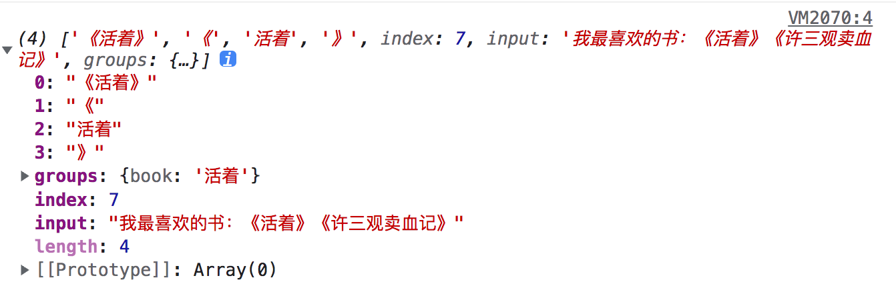
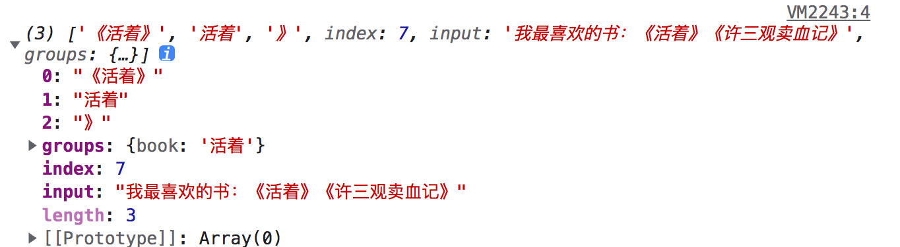

正则表达式：Regular Expression，简写regex。

### 创建

1. `const reg = new RegExp("abc","ig")`
   1. 第一个参数：匹配的规则
   2. 第二个参数；匹配的修饰符
2. `const reg = /abc/ig`

### 使用

1. **使用正则表达式对象的实例方法。**

   1. RegExp.exec() 执行字符串的正则表达式匹配。

   ```js
   const message = "1abc234ABc5aaa"
   const reg = /abc/ig
   console.log(reg.exec(message))
   [ 'abc', index: 1, input: '1abc234ABc5aaa', groups: undefined ]
   ```

   2. RegExp.test() 判断字符串是否匹配正则表达式。

   匹配字符串中是否有符合规则子串：

   ```js
   const message = "1abc234ABc5aaa"
   const reg = /abc/
   console.log(reg.test(message)) true
   ```

   匹配字符串是否完全符合正则表达式

   ```js
   const message = "1abc234ABc5aaa"
   const reg = /^abc$/
   console.log(reg.test(message)) false
   ```

2. **使用字符串的方法，传入正则表达式对象。**

   1. String.match
   
   ```js
   const message = "123abc456Abc789ABC"
   const reg = /abc/ig
   console.log(message.match(reg))
   
   [ 'abc', 'Abc', 'ABC' ]
   ```

   ```js
   const message = "123abc456Abc789ABC"
   const reg = /abc/i
   console.log(message.match(reg))
   
   [ 'abc', index: 3, input: '123abc456Abc789ABC', groups: undefined ]
   ```
   
   2. String.matchAll（传入的正则必须加g）)(返回值为迭代器)
   
   ```js
   const message = "123abc456Abc789ABC"
   const reg = /abc/ig
   console.log(message.matchAll(reg))
   
   Object [RegExp String Iterator] {}
   ```
   
   3. String.search
   
   4. String.replace
   
   5. String.replaceAll（传入的正则必须加g）
   
   删除所有数字：
   
   ```js
   const message = "abc1234ABc5aaa"
   console.log(message.replaceAll(/\d+/g, ""))
   ```
   
   6. String.split

 

### 修饰符

- `g` 全局查找
- `i` 忽略大小写
- m(multiple) `多行匹配`

### 规则

#### 字符类

- `\d`匹配  0-9数字 `[0-9]` (digit)
- `\s`匹配 空格符号、换行符、制表符等其他字符   (space)
- `\w`匹配 单词、数字和下划线`[0-9a-zA-Z]`（word）
- `.` 匹配 换行符之外任意字符

#### 反向类

- `\D`匹配`\d`任意字符。
- `\S匹配`\s`任意字符。`
- `\W匹配`\w `任意字符。`

#### 锚点

- `^` 匹配开头
- `$`匹配结尾

#### 词边界(了解即可)

 匹配的词语左右两边没有其他字符。例如匹配在字符串`my name is huyong`中匹配hu，而hu旁边没有其他单词。

正则表达式：`const reg = /\bhu\b/`

#### 转义

如果需要将特殊字符作为常规字符使用，需要进行转义。

常见需要转义的字符：`[] \ ^ $ . | ? * + ( ) /`

#### 集合和范围

- 集合：`[aeo]`匹配多个字符其中之一。
- 范围：`[0-9A-F]`匹配两个范围字符。
- 排除集合和范围：`[^aeo]`排除aeo字符和`[^0-9]`排除0-9字符。

手机号正则表达式：`/^1[3456789]\d{9}$/`

#### 量词

- 确切个数：{5}
- 范围：{5,9}
- 大于等于：{9,}
- 小于等于：{,5}

- `+` 相当于{1,}
- ?相当于{0,1}
- *相当于{0,}

html标签匹配：`/<\/?[a-z][a-z0-9]*>/g`

#### 贪婪和惰性

- 惰性模式（匹配最少的字符串）

  匹配书名：

   ```js
   const message = "我最喜欢的书：《活着》《许三观卖血记》"
   message.match(/《.+?》/g)
   ```

- 贪婪模式（匹配最多的字符串）

### 捕获组和非捕获组

#### 捕获组

模式的一部分可以用括号括起来，称为捕获组。

作用：

1. 提取匹配的部分结果。

​	提取书名：

```js
const message = "我最喜欢的书：《活着》《许三观卖血记》"
let res = message.matchAll(/(《)(.+?)(》)/g)
for(let r of res){
    console.log(r[2])
}
活着
许三观卖血记

//['《活着》', '《', '活着', '》', index: 7, input: '我最喜欢的书：《活着》《许三观卖血记》', groups: undefined]
//['《许三观卖血记》', '《', '许三观卖血记', '》', index: 11, input: '我最喜欢的书：《活着》《许三观卖血记》', groups: undefined]
```

​	定义group名字

```js
const message = "我最喜欢的书：《活着》《许三观卖血记》"
let res = message.matchAll(/(《)(?<book>.+?)(》)/g)
for(let r of res){
    console.log(r.groups.book)
}

活着
许三观卖血记
```



2. 将括号视为一个整体。(整体使用量词)

​	匹配连续两个abc

```js
let message = "123abcabc"
message.match(/(abc){2}/g)
```

#### 非捕获组

有时候需要括号视为一个整体，但是不希望内容出现在结果中。可以在开头添加`?:`来排除。

```js
const message = "我最喜欢的书：《活着》《许三观卖血记》"
let res = message.matchAll(/(?:《)(?<book>.+?)(》)/g)
for(let r of res){
    console.log(r)
}
```

结果没有匹配到`《`。



### or

 匹配abc|cba|cab

```js
let message = "13abccbacab"
message.match(/(abc|cba|cab)/)

['abc', 'cba', 'cab']
```

### 案例

#### 手机号

```js
let number = "13627223892"
let reg = /^1[3-9]\d{9}$/
reg.test(number)
```

#### ip解析和query参数解析

```js
let url = "https://harttle.land:80/tags.html?simple=true#HTML"
let reg = /^(?:([a-zA-Z]+):)?(\/{0,3})?([0-9.\-A-Za-z]+)(?::(\d+))?(?:\/([^?#]*))?(?:\?([^#]*))?(?:\#(.*))?$/
let res = url.match(reg)
let obj = {}
let fields = ["url","protocol","slash","host","port","path","query","hash"]
res.forEach((item,index)=>{
  obj[fields[index]] = item
})
if(obj.query){
  let queryParams = obj.query
  obj.query = {}
	queryParams.split("&").forEach(item=>{
    let key = item.split("=")[0]
    let value = item.split("=")[1]
    obj.query[key] = value
  })
}
console.log(obj)
```


